# Current Sudoku Solution Architecture

## Solution Overview

The solution is a multi-layered application with both legacy components and a new Clean Architecture implementation. It consists of 9 main projects:

```
Sudoku.sln
├── Sudoku.Domain/                    # New: Core Domain Library (Clean Architecture)
├── Sudoku.Application/               # New: Application Layer (Clean Architecture)
├── Sudoku.Infrastructure/            # New: Infrastructure Layer (Clean Architecture)
├── Sudoku.Api/                       # New: REST API (.NET 9.0)
├── Sudoku.AppHost/                   # New: Application Orchestration (.NET 9.0)
├── Sudoku.ServiceDefaults/           # New: Shared Service Configuration (.NET 9.0)
├── Sudoku/                           # Legacy: Core Domain Library (.NET 9.0)
├── Sudoku.Web.Server/                # Legacy: Blazor Server Web Application (.NET 9.0)
├── Sudoku.Storage.Azure/             # Legacy: Azure Storage Implementation (.NET 9.0)
└── Tests/                           # Unit Tests (.NET 9.0)
```

## Architectural Diagram

```mermaid
graph TB
    %% External Dependencies
    Azure[Azure Cloud Services]
    Browser[Web Browser]
    KeyVault[Azure Key Vault]

    %% New Clean Architecture Projects
    subgraph "Sudoku.AppHost (Orchestration)"
        AppHost[Application Host]
        ServiceDefaults[Service Defaults]
    end

    subgraph "Sudoku.Api (REST API)"
        ApiControllers[API Controllers]
        ApiServices[API Services]
        Swagger[Swagger Documentation]
    end

    subgraph "Sudoku.Domain (New Domain Layer)"
        DomainEntities[Domain Entities]
        DomainValueObjects[Value Objects]
        DomainEvents[Domain Events]
        DomainServices[Domain Services]
        DomainExceptions[Domain Exceptions]
        DomainRepositories[Repository Interfaces]
    end

    subgraph "Sudoku.Application (Application Layer)"
        ApplicationCommands[Commands]
        ApplicationQueries[Queries]
        ApplicationHandlers[Command/Query Handlers]
        ApplicationServices[Application Services]
        ApplicationDTOs[DTOs]
        ApplicationInterfaces[Service Interfaces]
    end

    subgraph "Sudoku.Infrastructure (Infrastructure Layer)"
        InfrastructureRepositories[Repository Implementations]
        InfrastructureServices[External Services]
        InfrastructureConfig[Configuration]
        InfrastructureEvents[Event Handlers]
    end

    %% Legacy Projects
    subgraph "Sudoku.Web.Server (Legacy Blazor Server)"
        BlazorApp[Blazor Application]
        BlazorHub[SignalR Hub]
        WebServices[Web Services Layer]
        WebPages[Blazor Pages]
        WebComponents[Blazor Components]
    end

    subgraph "Sudoku (Legacy Core Domain)"
        LegacySudokuGame[SudokuGame]
        LegacySudokuPuzzle[SudokuPuzzle]
        LegacyCell[Cell Model]
        LegacyLevel[Level Enum]
        LegacyGameState[Game State Management]
        LegacyPuzzleGenerator[Puzzle Generation]
        LegacyPuzzleSolver[Puzzle Solving]
        LegacyStrategies[Solver Strategies]
    end

    subgraph "Sudoku.Storage.Azure (Legacy Storage)"
        AzureStorage[Azure Storage Service]
        AzureBlobStorage[Azure Blob Game State Storage]
        CachingDecorator[Caching Decorator]
        LegacyStorageInterfaces[Legacy Storage Interfaces]
    end

    subgraph "Tests"
        UnitTests[Unit Tests]
        WebTests[Web Tests]
        StorageTests[Storage Tests]
    end

    %% New Architecture Dependencies
    AppHost --> ApiControllers
    AppHost --> BlazorApp
    AppHost --> KeyVault

    ApiControllers --> ApplicationServices
    ApiControllers --> LegacyGameState
    ApplicationServices --> DomainEntities
    ApplicationServices --> InfrastructureRepositories
    ApplicationHandlers --> DomainEntities
    ApplicationHandlers --> InfrastructureRepositories

    DomainEntities --> DomainValueObjects
    DomainEntities --> DomainEvents
    DomainEntities --> DomainServices
    DomainEntities --> DomainExceptions

    InfrastructureRepositories --> DomainRepositories
    InfrastructureRepositories --> AzureStorage
    InfrastructureServices --> Azure

    %% Legacy Architecture Dependencies
    Browser --> BlazorApp
    BlazorApp --> BlazorHub
    BlazorHub --> WebServices
    WebServices --> LegacySudokuGame
    WebServices --> LegacyGameState

    LegacySudokuGame --> LegacyPuzzleGenerator
    LegacySudokuGame --> LegacyGameState
    LegacyPuzzleSolver --> LegacyStrategies

    LegacyGameState --> LegacyStorageInterfaces
    LegacyStorageInterfaces --> AzureBlobStorage
    AzureBlobStorage --> CachingDecorator
    AzureBlobStorage --> AzureStorage
    AzureStorage --> Azure

    %% Test Dependencies
    UnitTests --> DomainEntities
    UnitTests --> ApplicationServices
    UnitTests --> LegacySudokuGame
    WebTests --> BlazorApp
    WebTests --> ApiControllers
    StorageTests --> InfrastructureRepositories
    StorageTests --> AzureBlobStorage

    %% Styling
    classDef newArch fill:#28A745,stroke:#333,stroke-width:2px,color:#fff
    classDef legacy fill:#DC3545,stroke:#333,stroke-width:2px,color:#fff
    classDef orchestration fill:#17A2B8,stroke:#333,stroke-width:2px,color:#fff
    classDef test fill:#6F42C1,stroke:#333,stroke-width:2px,color:#fff
    classDef external fill:#6C757D,stroke:#333,stroke-width:2px,color:#fff

    class AppHost,ServiceDefaults orchestration
    class ApiControllers,ApiServices,Swagger,DomainEntities,DomainValueObjects,DomainEvents,DomainServices,DomainExceptions,DomainRepositories,ApplicationCommands,ApplicationQueries,ApplicationHandlers,ApplicationServices,ApplicationDTOs,ApplicationInterfaces,InfrastructureRepositories,InfrastructureServices,InfrastructureConfig,InfrastructureEvents newArch
    class BlazorApp,BlazorHub,WebServices,WebPages,WebComponents,LegacySudokuGame,LegacySudokuPuzzle,LegacyCell,LegacyLevel,LegacyGameState,LegacyPuzzleGenerator,LegacyPuzzleSolver,LegacyStrategies,AzureStorage,AzureBlobStorage,CachingDecorator,LegacyStorageInterfaces legacy
    class UnitTests,WebTests,StorageTests test
    class Azure,Browser,KeyVault external
```



## Key Components

### 1. **New Clean Architecture Components**

#### **Sudoku.Domain (New Domain Layer)**

- **Purpose**: Core business logic and domain models following DDD principles
- **Key Components**:
  - `SudokuGame`: Rich domain entity with business rules
  - `SudokuPuzzle`: Puzzle entity with validation
  - Value Objects: `GameId`, `PlayerAlias`, `GameDifficulty`, `Cell`, `GameStatistics`
  - Domain Events: `GameCreatedEvent`, `MoveMadeEvent`, `GameCompletedEvent`
  - Domain Services: `PuzzleValidator`
  - Repository Interfaces: `IGameRepository`, `IPuzzleRepository`

#### **Sudoku.Application (Application Layer)**

- **Purpose**: Application use cases and orchestration
- **Key Components**:
  - Commands: `CreateGameCommand`, `MakeMoveCommand`, `SaveGameCommand`
  - Queries: `GetGameQuery`, `GetPlayerGamesQuery`
  - Handlers: Command and Query handlers implementing CQRS pattern
  - Application Services: Business use case orchestration
  - DTOs: Request/Response models
  - Service Interfaces: Application service contracts

#### **Sudoku.Infrastructure (Infrastructure Layer)**

- **Purpose**: External concerns and data persistence
- **Key Components**:
  - Repository Implementations: `AzureBlobGameRepository`, `InMemoryGameRepository`
  - External Services: Azure Storage integration
  - Configuration: Service registration and configuration
  - Event Handlers: Domain event processing

#### **Sudoku.Api (REST API)**

- **Purpose**: REST API presentation layer
- **Key Components**:
  - Controllers: `GamesController`, `PlayersController`
  - Swagger Documentation: API documentation
  - Service Integration: Uses both new and legacy services

#### **Sudoku.AppHost (Application Orchestration)**

- **Purpose**: Application orchestration and service coordination
- **Key Components**:
  - Service Coordination: Manages multiple services
  - Configuration: Centralized configuration management
  - Azure Key Vault Integration: Secure configuration

#### **Sudoku.ServiceDefaults (Shared Configuration)**

- **Purpose**: Shared service configuration and defaults
- **Key Components**:
  - Service Extensions: Common service registration patterns
  - Configuration Helpers: Shared configuration utilities

### 2. **Legacy Components**

#### **Sudoku (Legacy Core Domain)**

- **Purpose**: Original domain logic (being replaced by new Domain layer)
- **Key Classes**:
  - `SudokuGame`: Original game orchestrator
  - `SudokuPuzzle`: Original puzzle model
  - `Cell`: Original cell representation
  - `GameStateMemory`: Original game state persistence model
- **Services**:
  - `IPuzzleGenerator`: Original puzzle generation interface
  - `IPuzzleSolver`: Original puzzle solving interface
  - `IGameStateStorage`: Original game state storage interface

#### **Sudoku.Web.Server (Legacy Blazor Server)**

- **Purpose**: Original web-based user interface
- **Key Components**:
  - Blazor Pages (Index, Game)
  - Blazor Components (GameBoard, CellInput)
  - SignalR for real-time communication
  - Dependency injection for services

#### **Sudoku.Storage.Azure (Legacy Storage)**

- **Purpose**: Original Azure cloud storage implementation
- **Key Components**:
  - `AzureBlobGameStateStorage`: Original Azure Blob Storage implementation
  - `CachingAzureBlobGameStateStorageDecorator`: Original caching layer
  - `AzureStorageService`: Original Azure storage service

## Data Flow

### New Architecture Flow

1. **API Requests**: Browser/Client → Sudoku.Api → Application Layer → Domain Layer
2. **Domain Logic**: Domain Layer processes business rules and raises events
3. **Data Persistence**: Infrastructure Layer handles data storage
4. **Event Processing**: Domain events are handled by infrastructure event handlers

### Legacy Flow

1. **User Interaction**: Browser → Blazor Server → SignalR Hub
2. **Game Logic**: Web Services → Legacy Core Domain
3. **State Management**: Legacy Game State → Azure Storage
4. **Persistence**: Azure Blob Storage with caching decorator

## Technology Stack

- **.NET 9.0**: All projects target .NET 9.0
- **Clean Architecture**: New implementation following DDD and CQRS patterns
- **Blazor Server**: Legacy web framework for real-time UI
- **SignalR**: Real-time communication (legacy)
- **Azure Storage**: Cloud persistence
- **Azure Key Vault**: Secure configuration management
- **Dependency Injection**: Service management
- **Swagger**: API documentation
- **Application Insights**: Monitoring and telemetry

## Current Architecture Benefits

### New Architecture Benefits

1. **Clean Separation**: Clear separation between domain, application, and infrastructure
2. **Domain-Driven Design**: Rich domain models with business rules
3. **CQRS Pattern**: Command/Query separation for better performance
4. **Event-Driven**: Loose coupling through domain events
5. **Testability**: Easy to unit test each layer independently
6. **Maintainability**: Clear responsibilities and dependencies

### Legacy Architecture Benefits

1. **Proven Functionality**: Working implementation with real-time features
2. **SignalR Integration**: Real-time game updates
3. **Azure Integration**: Mature cloud storage implementation

## Migration Status

The application is currently in a **transitional state**:

- ✅ **New Domain Layer**: Complete and ready for use
- ✅ **New Application Layer**: Complete with CQRS implementation
- ✅ **New Infrastructure Layer**: Complete with repository implementations
- ✅ **New API Layer**: Complete with REST endpoints
- ✅ **Application Orchestration**: Complete with AppHost
- 🔄 **Legacy Integration**: API currently uses both new and legacy services
- ⏳ **Blazor Migration**: Legacy Blazor Server still in use
- ⏳ **Storage Migration**: Legacy Azure storage still in use

## API Integration Points

The current architecture provides multiple integration points:

### New API Endpoints (Sudoku.Api)

1. **Game Management**: Create, load, save, delete games
2. **Player Management**: Player-related operations
3. **RESTful Design**: Standard REST API patterns
4. **Swagger Documentation**: Complete API documentation

### Legacy Integration Points

1. **Game State Management**: Save/load game states via legacy services
2. **Real-time Updates**: SignalR integration for live game updates
3. **Azure Storage**: Mature cloud persistence implementation

## Next Steps for Complete Migration

1. **Update API Controllers**: Migrate from legacy services to new application services
2. **Migrate Blazor Server**: Update to use new domain and application layers
3. **Consolidate Storage**: Migrate from legacy storage to new infrastructure layer
4. **Remove Legacy Components**: Clean up old projects once migration is complete
5. **Update Tests**: Ensure comprehensive test coverage for new architecture
