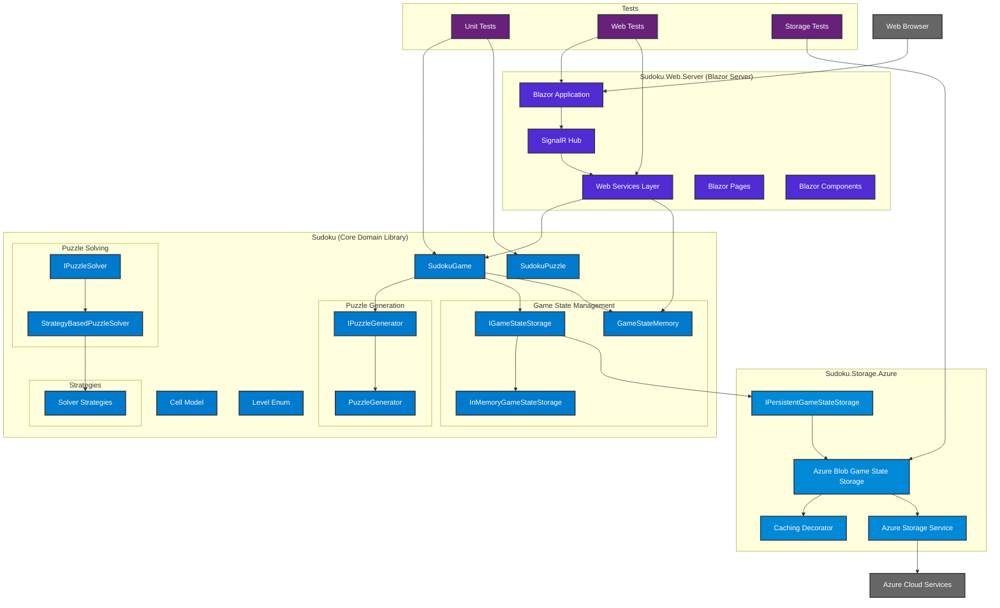

# Current Sudoku Solution Architecture

## Solution Overview

The solution is a Blazor Server application with a modular architecture consisting of 4 main projects:

```
Sudoku.sln
├── Sudoku/                           # Core Domain Library (.NET 9.0)
├── Sudoku.Web.Server/                # Blazor Server Web Application (.NET 9.0)
├── Sudoku.Storage.Azure/             # Azure Storage Implementation (.NET 9.0)
└── Tests/                           # Unit Tests (.NET 9.0)
```

## Architectural Diagram



## Key Components

### 1. **Sudoku (Core Domain Library)**

- **Purpose**: Contains all business logic and domain models
- **Key Classes**:
  - `SudokuGame`: Main game orchestrator
  - `SudokuPuzzle`: Core puzzle model
  - `Cell`: Individual cell representation
  - `GameStateMemory`: Game state persistence model
- **Services**:
  - `IPuzzleGenerator`: Puzzle generation interface
  - `IPuzzleSolver`: Puzzle solving interface
  - `IGameStateStorage`: Game state storage interface

### 2. **Sudoku.Web.Server (Blazor Server Application)**

- **Purpose**: Web-based user interface using Blazor Server
- **Key Components**:
  - Blazor Pages (Index, Game)
  - Blazor Components (GameBoard, CellInput)
  - SignalR for real-time communication
  - Dependency injection for services
- **Services**:
  - `GameSessionManager`: Manages game sessions
  - `GameStateManager`: Manages game state persistence
  - `LocalStorageService`: Browser local storage
  - `GameTimer`: Game timing functionality

### 3. **Sudoku.Storage.Azure**

- **Purpose**: Azure cloud storage implementation
- **Key Components**:
  - `AzureBlobGameStateStorage`: Azure Blob Storage implementation
  - `CachingAzureBlobGameStateStorageDecorator`: Caching layer
  - `AzureStorageService`: General Azure storage service

### 4. **Tests**

- **Purpose**: Comprehensive unit testing
- **Coverage**:
  - Core domain logic
  - Web application components
  - Storage implementations

## Data Flow

1. **User Interaction**: Browser → Blazor Server → SignalR Hub
2. **Game Logic**: Web Services → Sudoku Core Library
3. **State Management**: Game State → Local Storage + Azure Storage
4. **Persistence**: Azure Blob Storage with caching decorator

## Technology Stack

- **.NET 9.0**: All projects target .NET 9.0
- **Blazor Server**: Web framework for real-time UI
- **SignalR**: Real-time communication
- **Azure Storage**: Cloud persistence
- **Dependency Injection**: Service management
- **Application Insights**: Monitoring and telemetry

## Current Architecture Benefits

1. **Separation of Concerns**: Clear separation between domain logic, UI, and storage
2. **Testability**: Comprehensive unit test coverage
3. **Scalability**: Azure cloud storage for persistence
4. **Real-time**: SignalR for live game updates
5. **Modularity**: Easy to extend and modify individual components

## API Integration Points

The current architecture has several integration points that could be exposed as API endpoints:

1. **Game Management**: Create, load, save, delete games
2. **Puzzle Operations**: Generate puzzles, validate moves, solve puzzles
3. **State Management**: Save/load game states
4. **Session Management**: Start, pause, resume game sessions
