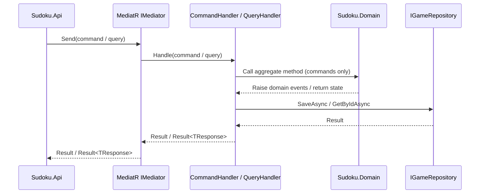

# ADR-002 — CQRS in the Application Layer

| Field        | Value               |
| ------------ | ------------------- |
| **Date**     | 2026-04-15          |
| **Status**   | Accepted            |
| **Deciders** | Project maintainers |

---

## Context

As the Sudoku application grew, a single `IGameApplicationService` interface was accumulating both state-mutating operations (create game, make move, abandon game) and read operations (get game, get player games, validate game). This conflation caused several problems:

- **Concurrency and consistency**: Write paths require domain invariant enforcement and event raising; read paths benefit from lighter-weight execution paths that do not touch the domain model.
- **Testability**: A monolithic service interface forces all handler tests to configure a large dependency surface even when testing a single operation.
- **Extensibility**: Adding a new query or command to a shared service contract requires touching a single growing interface, increasing merge friction.
- **Auditability**: Without separation, it is unclear which operations mutate state and which are safe to cache or replay.

A pattern was needed that would enforce the separation of intent between reads and writes at the application boundary.

---

## Decision

The Application layer (`Sudoku.Application`) adopts **CQRS (Command Query Responsibility Segregation)** implemented via **MediatR** as the in-process mediator.

### Core Abstractions

| Abstraction                        | Contract                                             | Return Type                |
| ---------------------------------- | ---------------------------------------------------- | -------------------------- |
| `ICommand`                         | Extends `IRequest<Result>`                           | `Result` (success/failure) |
| `ICommandHandler<TCommand>`        | Extends `IRequestHandler<TCommand, Result>`          | `Result`                   |
| `IQuery<TResponse>`                | Extends `IRequest<Result<TResponse>>`                | `Result<TResponse>`        |
| `IQueryHandler<TQuery, TResponse>` | Extends `IRequestHandler<TQuery, Result<TResponse>>` | `Result<TResponse>`        |

All commands and queries are dispatched through MediatR's `IMediator` interface. Handlers are registered automatically via MediatR's assembly scanning at startup.

### Registered Commands (14)

`AbandonGameCommand`, `AddPossibleValueCommand`, `ClearPossibleValuesCommand`, `CompleteGameCommand`, `CreateGameCommand`, `DeleteGameCommand`, `DeletePlayerGamesCommand`, `MakeMoveCommand`, `PauseGameCommand`, `RemovePossibleValueCommand`, `ResetGameCommand`, `ResumeGameCommand`, `StartGameCommand`, `UndoLastMoveCommand`

### Registered Queries (4)

`GetGameQuery`, `GetPlayerGamesQuery`, `GetPlayerGamesByStatusQuery`, `ValidateGameQuery`

### Interaction Flow

### Rules

1. **Commands never return domain objects.** They return `Result` (success/failure with optional error detail). If the caller needs updated state, it issues a subsequent query.
2. **Queries never mutate state.** A query handler must not call any repository `SaveAsync`, `DeleteAsync`, or domain method that raises events.
3. **Handlers are the only consumers of repository interfaces and domain aggregates.** Controllers call `IMediator.Send()`; they do not touch `IGameRepository` directly.
4. **MediatR pipeline behaviors** (e.g., validation, logging) may be registered globally and apply to all commands and queries without modifying individual handlers.

---

## Consequences

### Positive

- **Separation of concerns**: Write and read paths are independently testable and independently evolvable.
- **Handler isolation**: Each handler has a narrow dependency surface. Tests configure only the dependencies relevant to that operation.
- **Pipeline extensibility**: Cross-cutting concerns (validation, logging, timing) are added via MediatR pipeline behaviors without modifying any handler.
- **Explicit intent**: The presence of a command communicates mutation intent; the presence of a query communicates read intent — both at compile time.
- **Scalability path**: The pattern leaves the door open to separate read and write models (e.g., a denormalized read projection backed by a separate Cosmos DB container) without requiring structural refactoring.

### Tradeoffs

- **MediatR coupling**: All application orchestration is coupled to MediatR as an in-process mediator. Replacing MediatR would require changing all handler registrations and call sites in the API layer.
- **Indirection**: A simple operation (e.g., `GetGame`) passes through `IMediator → GetGameQueryHandler → IGameRepository` rather than a direct service call. This is an intentional tradeoff for consistency and testability.
- **No out-of-process messaging**: The current CQRS implementation is in-process only. Distributing commands or queries to a message bus (e.g., Azure Service Bus) would require introducing a separate messaging infrastructure layer.

### Rules Enforced by This Decision

1. **All new application operations must be expressed as a command or query**, not as a method added to `IGameApplicationService` or `IPlayerApplicationService`.
2. **Never inject `IGameRepository` into a controller.** Repository access belongs exclusively in handlers.
3. **Command handlers raise domain events; query handlers do not.**
4. **Never return domain entities from a handler.** Commands return `Result`; queries return `Result<TDto>`.

---

## Related ADRs

- [ADR-001 — Adoption of Clean Architecture](ADR-001-clean-architecture.md)
- [ADR-003 — Specification Pattern for Repository Queries](ADR-003-specification-pattern.md)
- [ADR-004 — Azure Cosmos DB as the Primary Game Persistence Backend](ADR-004-cosmosdb.md)
