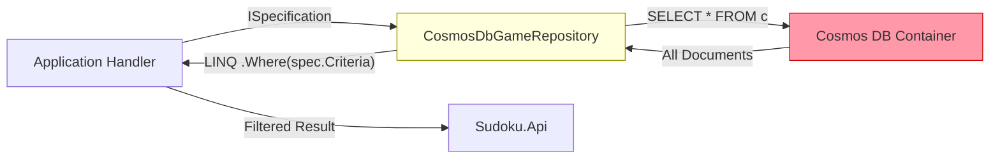

# ADR-003 — Specification Pattern for Repository Queries

| Field        | Value               |
|--------------|---------------------|
| **Date**     | 2026-04-15          |
| **Status**   | Accepted            |
| **Deciders** | Project maintainers |

---

## Context

`IGameRepository` exposes a set of query methods for filtered access to game data. Without a structured approach, every new filtering requirement would add a new method to `IGameRepository` and require implementation in every concrete repository (`CosmosDbGameRepository`, `AzureBlobGameRepository`). This leads to interface proliferation and duplicated filter logic.

Additionally, the Application layer must remain free of persistence-specific query syntax (e.g., SQL, OData, Cosmos DB query API). It must express query intent in a persistence-agnostic way that can be evaluated by any `IGameRepository` implementation.

---

## Decision

The Application layer (`Sudoku.Application`) defines an `ISpecification<T>` interface that encapsulates filter criteria, ordering, and paging as LINQ expressions. Concrete specifications live in `Sudoku.Application.Specifications`. Repositories consume `ISpecification<T>` through the `GetBySpecificationAsync`, `GetSingleBySpecificationAsync`, and `CountBySpecificationAsync` methods on `IGameRepository`.

### ISpecification<T> Contract

```
ISpecification<T>
├── Criteria            : Expression<Func<T, bool>>
├── Includes            : List<Expression<Func<T, object>>>
├── IncludeStrings      : List<string>
├── OrderBy             : Expression<Func<T, object>>?
├── OrderByDescending   : Expression<Func<T, object>>?
├── Take                : int
├── Skip                : int
└── IsPagingEnabled     : bool
```

### Concrete Specifications (Sudoku.Application.Specifications)

- `GameByPlayerAndStatusSpecification`
- `GameByDifficultySpecification`
- `GameByStatusSpecification`
- `CompletedGamesSpecification`
- `RecentGamesSpecification`

### Current Evaluation Strategy — Known Technical Debt

Both repository implementations currently evaluate specifications **in-memory**:

| Repository | Evaluation strategy | Impact |
|---|---|---|
| `CosmosDbGameRepository.GetBySpecificationAsync` | Fetches `SELECT * FROM c`, then filters in-process via LINQ | Full container scan on every specification-based query |
| `AzureBlobGameRepository.GetBySpecificationAsync` | Calls `GetAllGamesAsync()` (enumerates all blobs), then filters in-process | Full blob enumeration on every specification-based query |

> **Note:** The majority of `CosmosDbGameRepository` query methods (`GetByPlayerAsync`, `GetByPlayerAndStatusAsync`, `GetGamesByDifficultyAsync`, etc.) already use direct SQL parameterized queries against Cosmos DB and do **not** go through the specification path. The in-memory fallback applies only to `GetBySpecificationAsync` and its callers.



This is acceptable at the current scale but is flagged as technical debt for the Cosmos DB path.

---

## Consequences

### Positive

- **Interface stability**: New filter requirements are satisfied by adding a new `ISpecification<T>` implementation rather than adding a new method to `IGameRepository`.
- **Persistence agnosticism**: Handlers express query intent in LINQ — no SQL or Cosmos DB SDK concepts leak into the Application layer.
- **Reusability**: Specifications are composable and reusable across handlers without code duplication.

### Tradeoffs and Technical Debt

- **`GetBySpecificationAsync` performs a full container scan** in `CosmosDbGameRepository`. This is a known performance limitation. At low game volumes, the impact is negligible; at production scale, it will become unacceptable.
- **Resolution path**: `GetBySpecificationAsync` in `CosmosDbGameRepository` should be refactored to translate `ISpecification<SudokuGame>` criteria into a parameterized Cosmos DB SQL query rather than fetching all documents. This may require an expression tree visitor or a dedicated query builder. This work is tracked as technical debt and should be addressed before the Cosmos DB store reaches production load.
- **`AzureBlobGameRepository` is no longer the active `IGameRepository` for games** (see [ADR-004](ADR-004-cosmosdb.md)). Its in-memory specification evaluation is not a production concern.

### Rules Enforced by This Decision

1. **Do not add new bare query methods to `IGameRepository`** for filtering scenarios. Express filtering as a new `ISpecification<SudokuGame>` in `Sudoku.Application.Specifications`.
2. **Do not evaluate `GetBySpecificationAsync` for high-frequency or high-volume queries** until predicate pushdown to Cosmos DB SQL is implemented.
3. **Prefer the direct SQL query methods** (`GetByPlayerAsync`, `GetByPlayerAndStatusAsync`, etc.) over `GetBySpecificationAsync` for common, well-known access patterns until the Cosmos DB specification translator is in place.

---

## Related ADRs

- [ADR-002 — CQRS in the Application Layer](ADR-002-cqrs.md)
- [ADR-004 — Azure Cosmos DB as the Primary Game Persistence Backend](ADR-004-cosmosdb.md)
