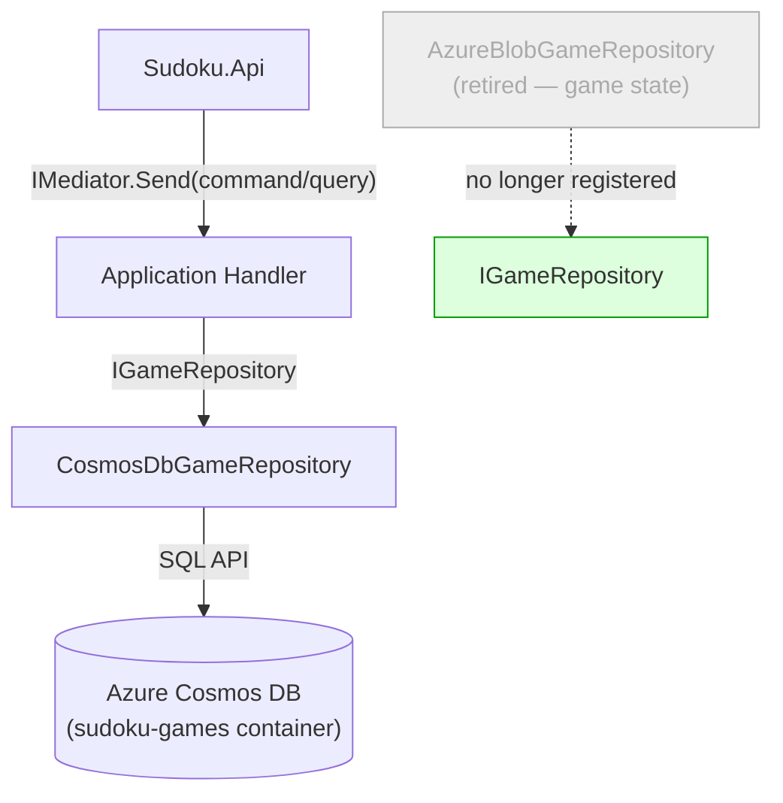

# ADR-004 — Azure Cosmos DB as the Primary Game Persistence Backend

| Field        | Value               |
|--------------|---------------------|
| **Date**     | 2026-04-15          |
| **Status**   | Accepted            |
| **Deciders** | Project maintainers |

---

## Context

Two concrete implementations of `IGameRepository` exist in `Sudoku.Infrastructure`:

| Implementation | Backend | Status |
|---|---|---|
| `CosmosDbGameRepository` | Azure Cosmos DB (NoSQL) | **Active — production target** |
| `AzureBlobGameRepository` | Azure Blob Storage | **Retired from game persistence** |

The blob storage implementation used a padded numeric revision naming scheme (`{playerAlias}/{gameId}/00001.json`) that provided an implicit audit trail at the cost of:

- **No structured querying**: All filtering required enumerating every blob and applying in-memory predicates — a full-scan on every read.
- **No indexing**: Player-based or status-based lookups required iterating all player blobs.
- **Concurrency hazard**: Revision number generation required a `SemaphoreSlim` to prevent concurrent write races.
- **Operational overhead**: Deletion required identifying and removing all revision blobs for a given game.

Azure Cosmos DB resolves all of these concerns while remaining within the Azure-native ecosystem already used by the project.

A `UseCosmosDb` environment variable was previously used to toggle between the two implementations at runtime. This toggle is now hardcoded to `true` in `Sudoku.AppHost` and is being phased out.

---

## Decision

**Azure Cosmos DB (NoSQL API) is the canonical and exclusive persistence backend for `SudokuGame` aggregates.** `CosmosDbGameRepository` is the active `IGameRepository` implementation registered in the DI container. `AzureBlobGameRepository` is retired from game persistence and must not be re-registered as `IGameRepository`.

### Rationale for Cosmos DB

| Requirement | Cosmos DB | Blob Storage |
|---|---|---|
| Structured querying (by player, status, difficulty) | SQL API with parameterized queries | Full scan required |
| Document model fit | Native JSON document store; maps directly to `SudokuGameDocument` | JSON blobs with manual naming convention |
| Indexing | Automatic indexing on all properties | None |
| Upsert semantics | Native `UpsertItemAsync` | Sequential revision file creation |
| Scalability | Horizontal partitioning, RU-based throughput model | Scales on storage, not on query throughput |
| Azure integration | First-class Aspire support via `AddConnectionString("CosmosDb")` | First-class but no query advantage |

### Persistence Architecture

### Partition Key Strategy

`SudokuGame` documents are partitioned by `GameId` (`id` field). This enables efficient point reads (`GetByIdAsync`) — the most frequent access pattern — without cross-partition fan-out.

> **Open consideration**: If player-scoped queries (e.g., `GetByPlayerAsync`) become the dominant read pattern at scale, re-evaluating the partition key to `playerAlias` may reduce RU consumption by eliminating cross-partition scans. This does not require an ADR change; it is an operational tuning decision.

### `UseCosmosDb` Environment Variable

The `UseCosmosDb` environment variable is currently set to `"true"` in `Sudoku.AppHost` and injected into `sudoku-api`. Once the variable is removed from the conditional DI registration in `Sudoku.Infrastructure`, this environment variable should be removed from `Sudoku.AppHost/Program.cs` entirely. This cleanup is tracked as a follow-up task.

---

## Consequences

### Positive

- **Structured queries**: Player, status, and difficulty filters are expressed as parameterized SQL queries evaluated server-side — no full-scan reads.
- **Upsert semantics**: Saving a game state is a single `UpsertItemAsync` call. No revision numbering, semaphores, or blob enumeration.
- **Operational simplicity**: Deletion is a single `DeleteItemAsync` by `id` and partition key. No multi-blob cleanup.
- **Automatic indexing**: New filter dimensions (e.g., filter by `difficulty` + `status`) require no manual index management.

### Tradeoffs

- **Audit trail loss**: The blob revision strategy provided an implicit append-only game history. Cosmos DB upsert overwrites the document; point-in-time history is not preserved. If audit history is required in the future, it must be added explicitly (e.g., via a separate event log container or Cosmos DB Change Feed to a history container).
- **Azure dependency**: Cosmos DB is an Azure-exclusive managed service. Non-Azure deployments require the Cosmos DB emulator or a compatibility layer.
- **Cost model**: Cosmos DB is billed per Request Unit (RU). Specification-based queries that trigger full container scans (see [ADR-003](ADR-003-specification-pattern.md)) will consume disproportionate RUs until predicate pushdown is implemented.

### Rules Enforced by This Decision

1. **`CosmosDbGameRepository` is the only `IGameRepository` registered in the DI container for game persistence.**
2. **`AzureBlobGameRepository` must not be re-registered as `IGameRepository`.** The class is retained in `Sudoku.Infrastructure` for potential repurposing (see [ADR-006](ADR-006-blob-storage-repurpose.md)).
3. **The `UseCosmosDb` toggle is deprecated.** New code must not branch on this value. It will be removed in a follow-up cleanup.
4. **New query methods added to `IGameRepository` must use parameterized Cosmos DB SQL** rather than in-memory filtering.

---

## Related ADRs

- [ADR-001 — Adoption of Clean Architecture](ADR-001-clean-architecture.md)
- [ADR-003 — Specification Pattern for Repository Queries](ADR-003-specification-pattern.md)
- [ADR-005 — In-Memory Repository Scoped to Puzzle Generation](ADR-005-in-memory-puzzle-repository.md)
- [ADR-006 — Azure Blob Storage Repurposed Away from Game State](ADR-006-blob-storage-repurpose.md)
