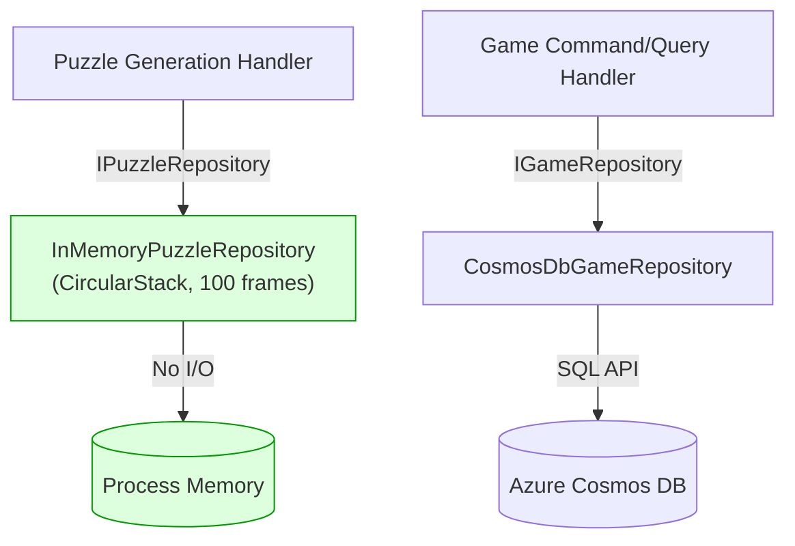

# ADR-005 — In-Memory Repository Scoped to Puzzle Generation

| Field        | Value               |
|--------------|---------------------|
| **Date**     | 2026-04-15          |
| **Status**   | Accepted            |
| **Deciders** | Project maintainers |

---

## Context

Sudoku puzzle generation involves a compute-intensive, iterative process of constructing a valid puzzle grid and removing cells to the target difficulty. During this process, intermediate puzzle states are frequently read and written as the generator evaluates candidate boards.

If each intermediate state were persisted to an external store (e.g., Cosmos DB or Blob Storage), the I/O round-trip cost would dominate generation time. At the scale of a single puzzle generation request, this latency is unacceptable.

Additionally, puzzle generation is a **transient, per-request operation**. There is no requirement for intermediate states to survive the lifecycle of the generation request. The only state that matters at the end of the process is the completed puzzle, which is returned to the caller.

---

## Decision

`InMemoryPuzzleRepository` is the exclusive implementation of `IPuzzleRepository` and is **intentionally scoped to the puzzle generation path**. It has no persistent backing store. All puzzle state exists in memory for the lifetime of the generation request.

### Implementation

`InMemoryPuzzleRepository` maintains puzzle state in a `CircularStack<SudokuPuzzle>` with a fixed capacity of 100 frames. This supports:

- **Save**: Push the current puzzle state onto the stack (deduplication: identical consecutive states are not re-pushed).
- **Load**: Peek the top of the stack (returns the most recent state).
- **Undo**: Pop the top state, reverting to the previous frame.
- **Reset**: Unwind the stack to the initial state (frame 0).
- **Delete**: Clear the entire stack.

### Interface Boundary

`InMemoryPuzzleRepository` implements `IPuzzleRepository`, **not** `IGameRepository`. These are distinct interfaces with distinct lifecycles and consumers:

| Interface | Implementor | Consumer | Lifecycle |
|---|---|---|---|
| `IPuzzleRepository` | `InMemoryPuzzleRepository` | Puzzle generation handlers | Per HTTP request (Scoped DI) |
| `IGameRepository` | `CosmosDbGameRepository` | Game command/query handlers | Per HTTP request (Scoped DI), durable state |

### What Is Not Supported

`CreateAsync` and `LoadAllAsync` throw `NotSupportedException`. These operations have no meaning in the puzzle generation context:

- `CreateAsync` is not needed because puzzle generation starts from a generator, not from a persisted record.
- `LoadAllAsync` is not needed because there is only ever one puzzle in-flight per generation request.

---

## Consequences

### Positive

- **Zero I/O latency**: Puzzle generation operates entirely in process memory. There are no network round-trips, no serialization overhead, and no storage costs during generation.
- **Undo support**: The `CircularStack` enables iterative backtracking during generation without re-generating from scratch.
- **Simplicity**: The repository implementation is trivial — no connection management, no retry logic, no authentication.
- **Correct scoping**: Puzzle generation state is inherently transient and per-request. In-memory storage matches this lifecycle exactly.

### Tradeoffs

- **No durability**: If the generation request fails mid-generation (e.g., process crash), intermediate states are lost. This is acceptable because generation is cheap to retry.
- **Single-request scope**: `InMemoryPuzzleRepository` cannot be shared across requests or processes. It is not suitable for any use case that requires cross-request state.
- **Stack capacity**: The `CircularStack` has a fixed capacity of 100 frames. If puzzle generation requires more than 100 state frames, older frames will be evicted. This is a known constraint and should be revisited if more complex puzzle algorithms are introduced.

### Rules Enforced by This Decision

1. **Do not wire `InMemoryPuzzleRepository` to `IGameRepository`.** It implements `IPuzzleRepository` only. Game state must always be persisted via `IGameRepository` → `CosmosDbGameRepository`.
2. **Do not add persistent storage** to `InMemoryPuzzleRepository` for the puzzle generation path. If puzzle persistence is needed (e.g., saving a generated puzzle for reuse), that is a separate concern addressed by a separate repository implementation.
3. **Do not call `CreateAsync` or `LoadAllAsync`** on `IPuzzleRepository`. These operations are explicitly unsupported and will throw `NotSupportedException`.
4. **Do not increase the `CircularStack` capacity without analysis.** The 100-frame limit is intentional. If generation algorithms require more frames, evaluate whether the algorithm should be restructured rather than expanding the stack.

---

## Related ADRs

- [ADR-001 — Adoption of Clean Architecture](ADR-001-clean-architecture.md)
- [ADR-004 — Azure Cosmos DB as the Primary Game Persistence Backend](ADR-004-cosmosdb.md)
