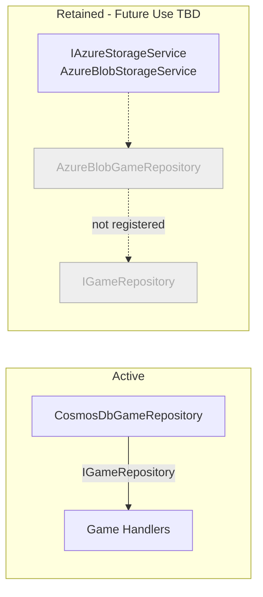

# ADR-006 — Azure Blob Storage Repurposed Away from Game State

| Field        | Value               |
|--------------|---------------------|
| **Date**     | 2026-04-15          |
| **Status**   | Accepted            |
| **Deciders** | Project maintainers |

---

## Context

`Sudoku.Storage.Azure` was originally developed to implement `IGameRepository` via `AzureBlobGameRepository`, storing `SudokuGame` state as versioned JSON blobs under the path `{playerAlias}/{gameId}/{revisionNumber:D5}.json`. This approach served as an early persistence mechanism before a structured database was adopted.

With the adoption of Azure Cosmos DB as the canonical game persistence backend (see [ADR-004](ADR-004-cosmosdb.md)), `AzureBlobGameRepository` is no longer the active `IGameRepository` implementation. However, the `Sudoku.Storage.Azure` project and the underlying `IAzureStorageService` infrastructure are retained because Azure Blob Storage remains a viable and cost-effective medium for other use cases within the system.

The specific repurposing use case has not yet been defined. This ADR serves as an authoritative record of the transition: blob storage is no longer used for game state, the project is intentionally retained, and its future use will be documented in a follow-up ADR once the new use case is finalized.

---

## Decision

1. **`AzureBlobGameRepository` is retired from game persistence.** It must not be registered as `IGameRepository` in any DI configuration.
2. **`Sudoku.Storage.Azure` is retained.** The project, `IAzureStorageService`, and `AzureBlobStorageService` remain in the solution for future use.
3. **The future use case for blob storage is deferred.** A follow-up ADR will document the new purpose once it is defined.

### What Changes

| Component | Before | After |
|---|---|---|
| `AzureBlobGameRepository` | Registered as `IGameRepository` | **Not registered** — present in codebase but inactive |
| `Sudoku.Storage.Azure` | Game state persistence | **Retained** — future use TBD |
| `IAzureStorageService` | Used by `AzureBlobGameRepository` | Retained for future use |

### What Does Not Change

- The `Sudoku.Storage.Azure` project remains in the solution.
- `IAzureStorageService` and `AzureBlobStorageService` are not deleted.
- The blob storage infrastructure in Azure (containers, access policies) may be preserved at the operator's discretion pending the new use case.

### Candidate Future Use Cases

The following are candidate repurposing scenarios. None are committed. A follow-up ADR is required before any of these is implemented:

- **Static asset storage**: Storing generated puzzle images, player avatars, or other binary assets.
- **Audit / event log archival**: Appending domain events or game history snapshots to blob storage for long-term retention or compliance.
- **Puzzle template library**: Storing pre-generated puzzle templates as blobs for fast retrieval during game creation.
- **Export artifacts**: Storing player-requested game exports (e.g., PDF or image of a completed puzzle).

---

## Consequences

### Positive

- **No accidental reactivation**: This ADR explicitly documents that `AzureBlobGameRepository` is retired, preventing a future contributor from re-registering it under the impression it is an alternative or fallback game store.
- **Infrastructure preserved**: The blob storage project and service abstractions are available when the new use case is defined, avoiding the cost of rebuilding the infrastructure layer.
- **Cost transparency**: Blob storage is significantly cheaper than Cosmos DB for high-volume, low-query workloads (e.g., asset storage, log archival). Retaining the project preserves the option to use it where it is cost-appropriate.

### Tradeoffs

- **Ambiguity**: Until the follow-up ADR is written, the presence of `AzureBlobGameRepository` in the codebase may confuse contributors unfamiliar with this decision. Inline code comments referencing this ADR mitigate this.
- **Maintenance burden**: A retained but unused implementation may fall out of sync with interface changes to `IGameRepository`. If `IGameRepository` is updated, `AzureBlobGameRepository` must be updated in tandem to maintain compile-time correctness, even if it is not registered.

### Rules Enforced by This Decision

1. **`AzureBlobGameRepository` must not be registered as `IGameRepository`** in any environment, including development, staging, or local testing.
2. **The `Sudoku.Storage.Azure` project must not be removed** until the follow-up ADR has been written and a migration plan has been executed.
3. **Any new use of blob storage must be documented in a follow-up ADR** before implementation begins.

---

## Open Questions

- What is the intended repurposing of Azure Blob Storage within this system? *(To be resolved in follow-up ADR)*
- Should the `sudoku-games` blob container be archived or deleted once the Cosmos DB migration is confirmed complete?

---

## Related ADRs

- [ADR-004 — Azure Cosmos DB as the Primary Game Persistence Backend](ADR-004-cosmosdb.md)
- [ADR-008 — Azure Aspire for Service Orchestration](ADR-008-aspire.md) *(forthcoming)*
- Follow-up ADR: Azure Blob Storage — Repurposed Use Case *(TBD)*
