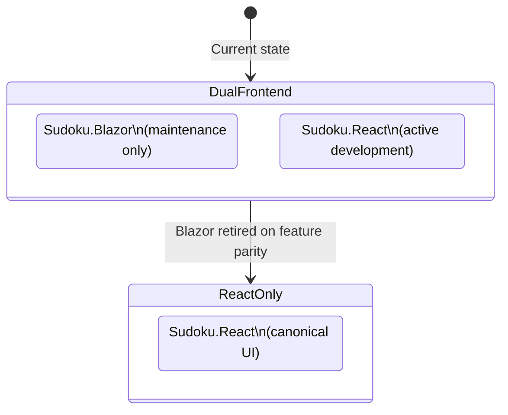

# ADR-007 — React/Vite as the Strategic UI Target

| Field        | Value               |
|--------------|---------------------|
| **Date**     | 2026-04-15          |
| **Status**   | Accepted            |
| **Deciders** | Project maintainers |

---

## Context

The Sudoku project currently maintains two frontend implementations:

| Project | Technology | Deployment | Role |
|---|---|---|---|
| `Sudoku.Blazor` | Blazor Server (.NET) | Direct Aspire service reference | Active, maintenance-only |
| `Sudoku.React` | React + Vite (TypeScript) | `PublishAsDockerFile()` | **Strategic long-term target** |

Both frontends communicate exclusively with `Sudoku.Api` over HTTP and carry no direct references to backend project assemblies. Both are registered and orchestrated through `Sudoku.AppHost`.

The dual-frontend state is transitional, not permanent. The presence of two frontends without a documented direction creates risk:

- **Duplicated effort**: New features built in Blazor require equivalent investment in React to maintain parity, or React falls behind.
- **Unclear investment signal**: Contributors have no guidance on which frontend to prioritize for new work.
- **Divergent UX**: Without a single canonical UI, user experience consistency degrades over time.

The intent of the project owner is to make React/Vite the exclusive long-term UI. This decision must be documented to align all future contribution effort.

---

## Decision

**React/Vite (`Sudoku.React`) is the strategic and long-term UI target for the Sudoku application.**

`Sudoku.Blazor` is retained during the transition period but receives **maintenance investment only**. No new features are to be built in Blazor. All new UI development occurs in `Sudoku.React`.

### Rationale

| Factor | React/Vite | Blazor Server |
|---|---|---|
| Deployment model | Containerized via `PublishAsDockerFile()` — portable across Azure Container Apps, AKS, Docker | Requires .NET runtime host; tightly coupled to Aspire |
| UI ecosystem | Rich component ecosystem (shadcn/ui, Radix, Tailwind, etc.) | Microsoft component ecosystem only |
| Separation from backend | Pure frontend; decoupled from .NET runtime lifecycle | Co-hosted in the .NET process; harder to scale independently |
| Long-term investment signal | Active in this project; aligned with modern web standards | Transitional only |
| API consumption pattern | Fetches from `Sudoku.Api` via `VITE_API_BASE_URL` injected at runtime | Fetches from `Sudoku.Api` via Aspire service reference |

### Transition State

### Exit Criteria for Retiring `Sudoku.Blazor`

`Sudoku.Blazor` is retired when the following conditions are met:

1. `Sudoku.React` implements feature parity with `Sudoku.Blazor` across all user-facing workflows (game creation, gameplay, player history, settings).
2. All active users of the Blazor frontend have been migrated or notified.
3. The Blazor project has been removed from `Sudoku.AppHost` without breaking any remaining functionality.

> **Open question**: Is there a specific milestone or release version at which Blazor retirement is targeted? This should be added to the project roadmap once confirmed.

---

## Consequences

### Positive

- **Focused investment**: All new feature development targets a single frontend. Effort is not split across two UI codebases.
- **Portability**: The React/Vite frontend is containerized and deployable to any container runtime — not exclusively to Azure Aspire-hosted .NET environments.
- **Ecosystem breadth**: React's component and tooling ecosystem (Vite, TypeScript, testing with Vitest/Testing Library) is broader and more independently scalable than Blazor Server.
- **Clear contributor guidance**: New contributors know immediately where to build new UI features.

### Tradeoffs

- **Blazor investment amortization**: Investment in `Sudoku.Blazor` (components, state management, service integration) is not directly transferable to React. This is a sunk cost that must be accepted.
- **Transition period risk**: During the dual-frontend period, API contract changes must remain backward compatible for both consumers. This creates a short-term constraint on API evolution.
- **Blazor Server advantages foregone**: Blazor Server's real-time SignalR connection and server-side rendering without a separate API layer are not replicated in the React model. This is acceptable given the API-first architecture already in place.

### Rules Enforced by This Decision

1. **All new UI features are implemented in `Sudoku.React` only.**
2. **`Sudoku.Blazor` receives bug fixes and dependency updates only** — no new components, no new pages, no new workflows.
3. **API contracts must remain stable** for both frontend consumers until `Sudoku.Blazor` is removed from `Sudoku.AppHost`.
4. **`Sudoku.Blazor` must not be removed** until the exit criteria above are fully satisfied and documented.

---

## Related ADRs

- [ADR-001 — Adoption of Clean Architecture](ADR-001-clean-architecture.md)
- [ADR-008 — Azure Aspire for Service Orchestration](ADR-008-aspire.md) *(forthcoming)*
