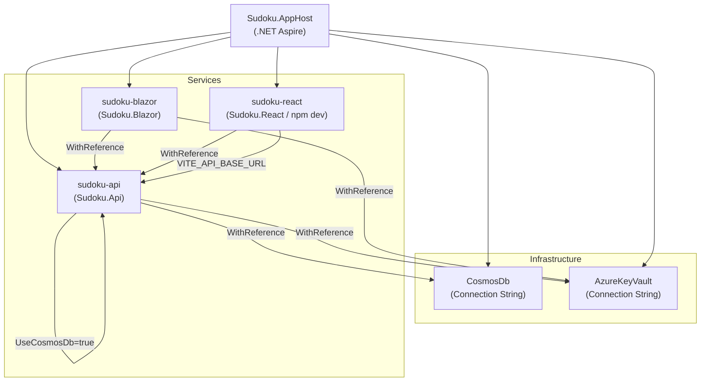

# ADR-008 — Azure Aspire for Service Orchestration

| Field        | Value               |
|--------------|---------------------|
| **Date**     | 2026-04-15          |
| **Status**   | Accepted            |
| **Deciders** | Project maintainers |

---

## Context

The Sudoku system is a distributed application composed of multiple independently-runnable services: a REST API (`Sudoku.Api`), a Blazor Server frontend (`Sudoku.Blazor`), a React/Vite frontend (`Sudoku.React`), and shared infrastructure dependencies (Azure Cosmos DB, Azure Key Vault). Running this stack locally for development previously required:

- Manually starting each process in the correct order.
- Manually configuring connection strings, API base URLs, and port assignments.
- Separately managing infrastructure dependency simulation (Cosmos DB emulator, etc.).
- No unified observability dashboard across all services during local development.

Alternatives considered for orchestration included:

| Option | Considered | Reason not chosen |
|---|---|---|
| **Docker Compose** | Yes | Requires containerizing all services; poor debugger integration for .NET; no native service discovery |
| **Manual launch profiles** | Yes | Does not solve connection string injection or inter-service endpoint wiring |
| **Kubernetes (local via minikube)** | No | Excessive operational complexity for a development-scale project |
| **.NET Aspire** | **Chosen** | Native .NET integration, automatic service discovery, built-in dashboard, first-class Azure resource support |

---

## Decision

**`Sudoku.AppHost` uses .NET Aspire as the service orchestrator** for composing the distributed Sudoku application during local development and for defining the deployment topology for cloud environments.

### Orchestrated Components

### Service Configuration Contract

| Service | Exposed Endpoint | External? | Notes |
|---|---|---|---|
| `sudoku-api` | HTTP + HTTPS | Yes | Swagger at `/swagger` on both |
| `sudoku-blazor` | HTTP + HTTPS | Yes | Direct Aspire service reference |
| `sudoku-react` | HTTP port 5173 | Yes | npm dev server; `PublishAsDockerFile()` |

### Environment Variable Injection

Aspire injects service endpoint URLs into dependent services at startup:

- `sudoku-react` receives `VITE_API_BASE_URL` pointing to the `sudoku-api` HTTPS endpoint.
- `sudoku-blazor` receives the `sudoku-api` service reference via Aspire's built-in service discovery.
- `sudoku-api` receives `ConnectionStrings__CosmosDb` and `ConnectionStrings__AzureKeyVault` via `WithReference`.

This eliminates manual `appsettings.json` editing for local development.

---

## Consequences

### Positive

- **Zero-configuration local development**: Running `Sudoku.AppHost` starts the entire stack with correct wiring — no manual port coordination or connection string editing.
- **Unified observability**: The Aspire dashboard provides real-time logs, traces, and metrics for all services in a single view during local development.
- **Consistent deployment topology**: The same `AppHost` composition defines both local and cloud deployment intent, reducing environment-specific drift.
- **Azure resource integration**: Cosmos DB and Key Vault connection strings are injected as first-class Aspire resources, not hardcoded values.
- **npm app support**: `AddNpmApp()` integrates the React/Vite dev server into the Aspire lifecycle, eliminating the need to separately manage the frontend process.

### Tradeoffs

- **Aspire is still maturing**: As a relatively new framework (GA in .NET 9), Aspire's tooling, deployment manifests, and Azure Container Apps integration are subject to change. Upgrades may require adjustments to `Sudoku.AppHost`.
- **Local development dependency**: Developers who do not use Aspire (e.g., running services individually) must manually replicate the environment variable injection that Aspire handles automatically.
- **npm app integration constraint**: The React project is integrated as an npm development server only (`"dev"` script). Production deployments use the `PublishAsDockerFile()` path, which is independent of Aspire's npm runner.

### Rules Enforced by This Decision

1. **All new services added to the stack must be registered in `Sudoku.AppHost`** with appropriate `WithReference` connections and environment variable injection.
2. **Connection strings and endpoint URLs must not be hardcoded in `appsettings.json`** for inter-service communication. Use Aspire `WithReference` or `WithEnvironment` instead.
3. **The local development contract is `Sudoku.AppHost`**. Documentation for running the project locally must reference Aspire, not manual launch instructions.
4. **Aspire version upgrades must be validated** against the `AppHost` composition to ensure no breaking changes to resource or service references.

---

## Related ADRs

- [ADR-009 — Azure App Configuration for Centralized Configuration Management](ADR-009-azure-app-configuration.md) *(forthcoming)*
- [ADR-010 — Azure Key Vault for Secret Management](ADR-010-azure-key-vault.md) *(forthcoming)*
- [ADR-007 — React/Vite as the Strategic UI Target](ADR-007-react-vite-strategic-ui.md)
