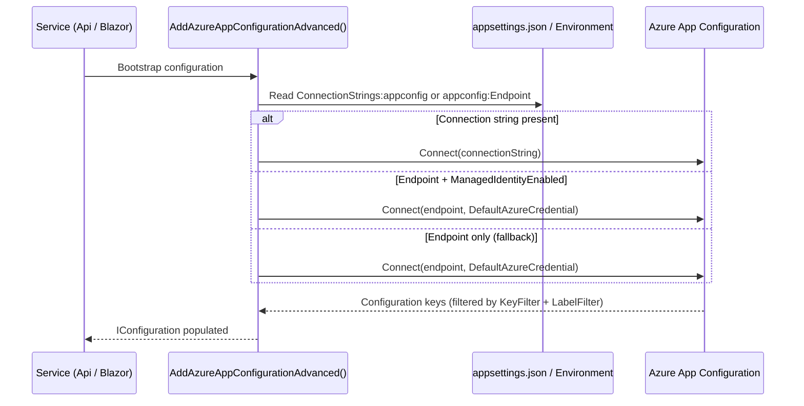

# ADR-009 — Azure App Configuration for Centralized Configuration Management

| Field        | Value               |
|--------------|---------------------|
| **Date**     | 2026-04-15          |
| **Status**   | Accepted            |
| **Deciders** | Project maintainers |

---

## Context

As the Sudoku system grew to include multiple services (`Sudoku.Api`, `Sudoku.Blazor`, `Sudoku.React` via API), managing configuration across services and environments (Development, Staging, Production) became increasingly complex:

- **Duplication**: The same configuration key (e.g., CORS allowed origins, feature flags) had to be maintained in multiple `appsettings.json` files.
- **Drift risk**: Per-service config files diverge over time. Environment-specific overrides are fragile and error-prone.
- **Secret adjacency**: Mixing non-secret configuration with secret references in `appsettings.json` blurs the boundary between configuration and secrets.
- **Dynamic refresh**: Redeploying services to pick up configuration changes is expensive. A centralized store with push-based refresh eliminates this cost.

Azure App Configuration addresses all of these concerns as a managed, versioned, label-aware configuration service that integrates natively with the .NET configuration pipeline.

---

## Decision

**Azure App Configuration is the authoritative configuration source for all backend services.** All services bootstrap via `AddAzureAppConfigurationAdvanced()` defined in `Sudoku.ServiceDefaults`.

### Bootstrap Flow

### Connection Modes

| Mode | Config Required | Use Case |
|---|---|---|
| Connection string | `ConnectionStrings:appconfig` | Local development, non-identity environments |
| Managed Identity | `appconfig:Endpoint` + `appconfig:ManagedIdentityEnabled=true` | Azure-hosted production environments |
| Endpoint only (fallback) | `appconfig:Endpoint` | DefaultAzureCredential chain (developer identity in local Azure CLI login) |

### Key/Label Filtering

Configuration keys are filtered by:

- **Key filter**: Defaults to `*` (all keys). Configurable via `AzureAppConfiguration:KeyFilter`.
- **Label filter**: Defaults to the current `IHostEnvironment.EnvironmentName` (e.g., `Development`, `Production`). Configurable via `AzureAppConfiguration:LabelFilter`.

This enables environment-specific configuration without maintaining separate App Configuration stores.

### Dynamic Refresh

If `AzureAppConfiguration:RefreshInterval` is set (in seconds), the configuration pipeline registers a refresh trigger with the specified cache expiration. Configuration changes in App Configuration propagate to running services without redeployment.

### Feature Flags

Feature flag support is optional and enabled via `AzureAppConfiguration:FeatureFlags:Enabled=true`. When enabled, feature flags are loaded from App Configuration and refreshed at the interval specified by `AzureAppConfiguration:FeatureFlags:RefreshInterval`.

---

## Consequences

### Positive

- **Single source of truth**: All services read configuration from one place. Updating a key in App Configuration propagates to all services at their next refresh interval.
- **Environment isolation**: Label-based filtering provides clean environment separation without multiple App Configuration instances.
- **Dynamic refresh**: Configuration changes do not require service redeployment.
- **Managed Identity support**: Production environments use passwordless Managed Identity authentication — no connection string rotation required.
- **Feature flag integration**: App Configuration's native feature flag support enables progressive rollout without code changes.

### Tradeoffs

- **Azure dependency**: App Configuration is an Azure-managed service. Running outside of Azure (e.g., CI/CD pipelines without Azure connectivity, air-gapped environments) requires either a local emulator, a connection string to a real instance, or a fallback configuration provider.
- **Bootstrap ordering**: The App Configuration connection must be available before services start. Failures during bootstrap (e.g., misconfigured connection string) will cause the service to fail to start rather than falling back to local config. This is intentional — silent fallback to stale local config in production is more dangerous than a hard startup failure.
- **Local development overhead**: Developers must have access to either an App Configuration instance or a valid local configuration fallback. The `appsettings.Development.json` file provides local overrides where App Configuration is unavailable.

### Rules Enforced by This Decision

1. **All backend services must bootstrap via `AddAzureAppConfigurationAdvanced()`** as part of their startup configuration pipeline.
2. **Non-secret configuration must be stored in App Configuration**, not in `appsettings.json`. The `appsettings.json` files are reserved for bootstrap-time configuration (connection string to App Configuration itself) and local development overrides.
3. **Secrets must not be stored in App Configuration.** App Configuration holds configuration values only. Secrets are managed exclusively via Azure Key Vault (see [ADR-010](ADR-010-azure-key-vault.md)).
4. **New configuration keys must be added to App Configuration under the appropriate label** (e.g., `Development`, `Production`), not added directly to `appsettings.json`.
5. **The `appconfig` connection string must be provided via Aspire `WithReference` or environment injection** — never hardcoded in source files.

---

## Open Questions

- Should a local Azure App Configuration emulator be documented for fully offline development scenarios?
- Is the current default key filter (`*`) appropriate, or should namespaced key prefixes per service be adopted (e.g., `Sudoku.Api:*`, `Sudoku.Blazor:*`)?

---

## Related ADRs

- [ADR-008 — Azure Aspire for Service Orchestration](ADR-008-aspire.md)
- [ADR-010 — Azure Key Vault for Secret Management](ADR-010-azure-key-vault.md)
