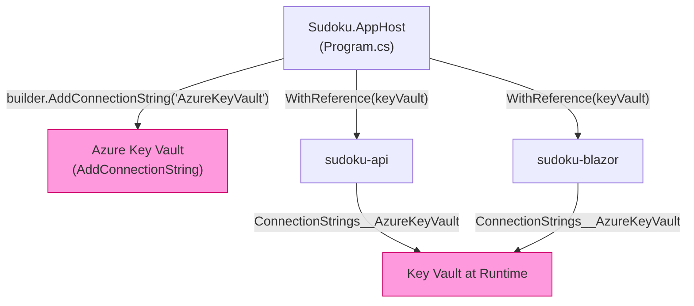

# ADR-010 — Azure Key Vault for Secret Management

| Field        | Value               |
|--------------|---------------------|
| **Date**     | 2026-04-15          |
| **Status**   | Accepted            |
| **Deciders** | Project maintainers |

---

## Context

The Sudoku system requires secrets at runtime, including:

- The Cosmos DB connection string (account endpoint + key, or Managed Identity reference).
- The Azure App Configuration connection string.
- Any future secrets (API keys, signing keys, third-party service credentials).

Without a dedicated secret store, these values would need to live in one of the following places — all of which are unacceptable:

| Location | Risk |
|---|---|
| `appsettings.json` | Committed to source control; visible to all repository contributors |
| Environment variables (unmanaged) | No audit trail; difficult to rotate; scattered across deployment configurations |
| Azure App Configuration | Not a secret store; values are not encrypted at rest with secret-grade protections |
| CI/CD pipeline secrets only | Not accessible at runtime to locally-running services; inconsistent between environments |

Azure Key Vault provides secret storage with encryption at rest, role-based access control, audit logging, automatic rotation support, and native integration with both .NET Aspire and `DefaultAzureCredential`.

---

## Decision

**Azure Key Vault is the exclusive secret store for all runtime secrets.** Key Vault is injected into backend services as a named connection string reference via `Sudoku.AppHost`, and secrets are resolved at runtime using the .NET Aspire Key Vault integration.

### Injection Architecture

### What Is Stored in Key Vault

| Secret | Used By | Notes |
|---|---|---|
| Cosmos DB connection string / key | `sudoku-api` | Injected via `ConnectionStrings__CosmosDb` reference |
| App Configuration connection string | All backend services | Bootstrap-time secret for Azure App Configuration |
| Future secrets | TBD | Any third-party credentials or signing keys |

### What Is Not Stored in Key Vault

| Item | Location | Reason |
|---|---|---|
| Non-secret configuration (CORS origins, feature flags) | Azure App Configuration | Not a secret; does not require Key Vault protection |
| Local development overrides | `appsettings.Development.json` | Developer-only; not deployed to production |
| Service endpoint URLs | Aspire `WithReference` / `WithEnvironment` | Injected by the Aspire orchestrator; not secrets |

### Authentication Model

| Environment | Authentication |
|---|---|
| Local development | Developer identity via `DefaultAzureCredential` (Azure CLI login) |
| Azure-hosted (production) | Managed Identity assigned to the hosting compute resource (Container App, App Service, etc.) |

No application credential (client secret or certificate) is used. The passwordless Managed Identity model eliminates secret rotation for the Key Vault authentication itself.

---

## Consequences

### Positive

- **No secrets in source control**: Key Vault is the exclusive runtime secret source. `appsettings.json` and `appsettings.Development.json` contain no secret values — only bootstrap pointers (e.g., Key Vault URI, App Config connection string in local dev).
- **Centralised rotation**: Secrets are rotated in Key Vault without redeployment. Services pick up the updated value at their next Key Vault resolution.
- **Audit trail**: All Key Vault accesses are logged in Azure Monitor / Diagnostic Logs, providing a complete audit trail of secret reads.
- **RBAC control**: Access to specific secrets is controlled per-service via Azure RBAC, scoped to the minimum required secrets.
- **Passwordless auth in production**: Managed Identity eliminates the need to manage a client secret for Key Vault access itself.

### Tradeoffs

- **Local development dependency**: Developers must be logged in via `az login` (or have appropriate `DefaultAzureCredential` chain configured) to access Key Vault locally. Offline or restricted environments require a manual workaround (e.g., `secrets.json` via `dotnet user-secrets`).
- **Latency on cold start**: Key Vault secret resolution adds a small latency to service cold start. This is typically sub-second and is negligible in practice.
- **Azure dependency**: Key Vault is an Azure-exclusive managed service. Non-Azure deployments require an alternative secret source (e.g., HashiCorp Vault, environment variable injection at the platform level).

### Rules Enforced by This Decision

1. **Secrets must never be committed to source control** — not in `appsettings.json`, not in `.env` files, not in `appsettings.Development.json`.
2. **Secrets must not be stored in Azure App Configuration.** App Configuration holds non-secret configuration values only.
3. **All backend services that require secrets must receive them via the Key Vault `WithReference` injection** from `Sudoku.AppHost`. Direct injection via environment variables is not permitted in production.
4. **The Key Vault URI must not be hardcoded in source files.** It must be provided via Aspire connection string injection or environment configuration.
5. **Managed Identity is the required authentication model for Azure-hosted environments.** Client secret or certificate-based authentication to Key Vault is not permitted.

---

## Related ADRs

- [ADR-008 — Azure Aspire for Service Orchestration](ADR-008-aspire.md)
- [ADR-009 — Azure App Configuration for Centralized Configuration Management](ADR-009-azure-app-configuration.md)
