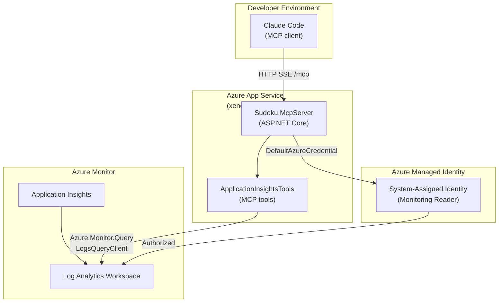

# ADR-011 — Azure Application Insights MCP Server

| Field        | Value               |
| ------------ | ------------------- |
| **Date**     | 2026-04-26          |
| **Status**   | Accepted            |
| **Deciders** | Project maintainers |

---

## Context

The Sudoku production environment emits telemetry (HTTP requests, exceptions, dependencies, domain events, user sessions) to Azure Application Insights via a shared Log Analytics workspace. Investigating incidents or monitoring game health historically required a developer to open the Azure portal, navigate to the workspace, and author KQL queries by hand — a process that was slow, context-switching, and inaccessible directly from an AI-assisted development workflow.

The Model Context Protocol (MCP) is an emerging standard for exposing tool-callable capabilities to AI systems. It defines a transport-agnostic, JSON-based protocol through which an AI agent can discover and invoke named tools hosted on an external server. Claude Code and other MCP-capable clients can therefore call these tools directly from a development session, without any bespoke plugin integration.

Alternatives considered:

| Option | Considered | Reason not chosen |
| --- | --- | --- |
| **Azure portal / Log Analytics UI** | Yes | Requires leaving the development workflow; no AI-invocable interface |
| **Pre-built Azure MCP server (microsoft/azure-mcp)** | Yes | Broad scope with write permissions to Azure resources; unnecessarily wide attack surface for a read-only observability use case |
| **Application Insights REST API (direct HTTP)** | Yes | Requires managing API keys and writing bespoke HTTP tooling; no standard discovery mechanism |
| **Custom ASP.NET MCP server (`Sudoku.McpServer`)** | **Chosen** | Scoped read-only surface, Managed Identity auth, integrates with existing Aspire service defaults, standard MCP transport |

---

## Decision

A dedicated **`Sudoku.McpServer`** ASP.NET Core project is added to the solution and deployed as an Azure App Service (`xenobiasoftsudokumcp-prod`). It exposes a set of read-only Application Insights tools over the MCP HTTP+SSE transport at `/mcp`, registered in `.mcp.json` as the `azure-appinsights` server.

### Architecture



### Exposed MCP Tools

| Tool | Description |
| --- | --- |
| `QueryLogs` | Execute arbitrary KQL against the Log Analytics workspace; returns pipe-delimited results |
| `GetExceptionSummary` | Top-N exception types by frequency over a configurable look-back window |
| `GetRequestMetrics` | HTTP request counts, failure rates, and average duration per operation and role |
| `GetGameTelemetry` | Domain event counts (`GameCreated`, `MoveMade`, `GameCompleted`, etc.) with optional time-bucketing |
| `GetActiveUsers` | Unique users and sessions by hour |
| `GetDependencyHealth` | Downstream dependency (Cosmos DB, HTTP) call counts, failure rates, and latency |

### Authentication

The server uses `DefaultAzureCredential`, which resolves to the App Service's **system-assigned Managed Identity** in production and to `az login` / Visual Studio credentials locally. No API keys or connection strings are stored — the Managed Identity is granted the **Monitoring Reader** role on the Log Analytics workspace.

### Configuration Contract

| Setting | Source |
| --- | --- |
| `AppInsights:WorkspaceId` | Azure App Configuration / Key Vault |
| Managed Identity | System-assigned on the App Service |
| MCP endpoint | `https://xenobiasoftsudokumcp-prod.azurewebsites.net/mcp` |

The server is wired into `.mcp.json` at the repository root:

```json
{
  "mcpServers": {
    "azure-appinsights": {
      "type": "http",
      "url": "https://xenobiasoftsudokumcp-prod.azurewebsites.net/mcp"
    }
  }
}
```

### Project Structure

`Sudoku.McpServer` references `Sudoku.ServiceDefaults` for health check endpoints and observability defaults — the same pattern used by every other backend service in the solution. It does **not** reference any other Sudoku project; it is a standalone observability gateway.

---

## Consequences

### Positive

- **In-workflow observability**: Developers can query production telemetry from within a Claude Code session without context-switching to the Azure portal.
- **Scoped read-only surface**: The tool set is limited to read operations on Application Insights data. No write or control-plane capabilities are exposed.
- **Zero credential management**: Managed Identity eliminates API keys and secrets for the production deployment path.
- **Standard protocol**: The MCP HTTP+SSE transport is compatible with any MCP-capable client, not just Claude Code.
- **Consistent service defaults**: The project integrates with `Sudoku.ServiceDefaults`, inheriting health checks, logging, and telemetry configuration from the established pattern.

### Tradeoffs

- **MCP SDK maturity**: `ModelContextProtocol.AspNetCore` is early-stage (v1.x). Breaking changes in the protocol or SDK may require updates.
- **Unauthenticated MCP endpoint**: The `/mcp` endpoint does not require a client token — any caller with network access can invoke the tools. This is acceptable for read-only telemetry in a developer-facing context, but should be revisited if the tool surface expands.
- **Separate deployment unit**: `Sudoku.McpServer` is an additional App Service to deploy, monitor, and maintain independently of the main API and frontend services.

### Rules Enforced by This Decision

1. **`Sudoku.McpServer` exposes read-only tools only.** Any tool that mutates Azure resources or game state must not be added to this server.
2. **Authentication must use Managed Identity, not API keys.** Never store credentials in application settings or environment variables for this service.
3. **`AppInsights:WorkspaceId` must be sourced from Azure App Configuration or Key Vault**, not hardcoded in `appsettings.json`.
4. **All new observability tools must be added to `ApplicationInsightsTools`** (or a sibling `[McpServerToolType]` class) — not to a separate project or transport.

---

## Related ADRs

- [ADR-008 — Azure Aspire for Service Orchestration](ADR-008-aspire.md)
- [ADR-009 — Azure App Configuration for Centralized Configuration Management](ADR-009-azure-app-configuration.md)
- [ADR-010 — Azure Key Vault for Secret Management](ADR-010-azure-key-vault.md)
