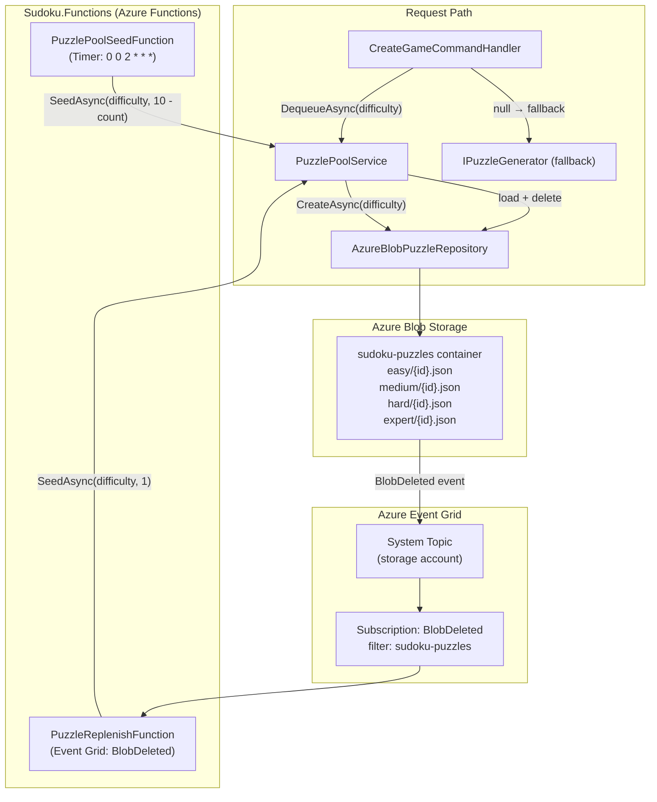

# ADR-012 — Pre-Generated Puzzle Pool with Azure Blob Storage and Event Grid

| Field        | Value               |
| ------------ | ------------------- |
| **Date**     | 2026-06-06          |
| **Status**   | Accepted            |
| **Deciders** | Project maintainers |

---

## Context

Puzzle generation is performed by `StrategyBasedPuzzleSolver`, a compute-intensive process that can take multiple seconds per puzzle. This generation was performed synchronously on-demand inside `CreateGameCommandHandler`, which caused the `POST /api/players/{profileId}/games/{difficulty}` endpoint to time out under normal conditions and delivered a poor user experience (Issue #220).

The core tension is between **generation cost** (slow, CPU-bound) and **request latency** (must be fast). Options considered:

| Option | Considered | Reason not chosen |
| --- | --- | --- |
| **On-demand generation (status quo)** | Yes | Endpoint times out; generation takes 2–10 s per puzzle |
| **Generate and cache in Cosmos DB** | Yes | CosmosDB is sized and billed for game state, not puzzle inventory; adds schema coupling between game and puzzle concerns |
| **Generate in Redis cache** | Yes | Adds a new infrastructure dependency with no other use case in the solution; requires cache invalidation strategy |
| **Background job with SQL queue** | Yes | Requires a separate queue infrastructure; polling adds latency; overkill at 10-puzzle pool size |
| **Azure Blob Storage puzzle pool + Event Grid replenishment** | **Chosen** | Reuses existing `IAzureStorageService`; blob-delete is a natural exclusive-claim primitive; Event Grid is already available on the storage account; nightly timer provides a safety net |

---

## Decision

Pre-generate puzzles and store them in an Azure Blob Storage container (`sudoku-puzzles`). A new `IPuzzlePoolService` / `PuzzlePoolService` layer manages the pool lifecycle. A new **`Sudoku.Functions`** project (Azure Functions isolated worker, .NET 8) hosts two functions that maintain pool size: an event-driven replenisher and a nightly timer sweep.

### Architecture

### Key Design Choices

**Blob-delete as exclusive claim.** `DequeueAsync` loads a random available blob then deletes it. The delete is the claim — if two concurrent callers race for the same blob, the second delete returns 404 (swallowed). At most the two callers receive the same puzzle grid, which is acceptable at current scale. No distributed lock is needed.

**One-for-one event-driven replenishment.** `PuzzleReplenishFunction` listens for `BlobDeleted` events on the `sudoku-puzzles` container via Event Grid. On each deletion it calls `SeedAsync(difficulty, 1)`, generating exactly one replacement puzzle. This is the primary replenishment path and keeps the pool at steady state without coordination.

**Nightly timer as safety net.** `PuzzlePoolSeedFunction` runs at `0 0 2 * * *` and calls `SeedAsync(difficulty, 10 − currentCount)` for each difficulty. This fills any gaps caused by missed events (cold-start delays, Event Grid retries, or first-deploy before the subscription is live).

**On-demand fallback.** `CreateGameCommandHandler` falls back to `IPuzzleGenerator.GeneratePuzzleAsync(difficulty)` when `DequeueAsync` returns null. This ensures game creation never fails even when the pool is empty.

**Keyed DI registration.** `AzureBlobPuzzleRepository` is registered as a keyed service for the pool path, keeping it distinct from `InMemoryPuzzleRepository` (which remains registered as `IPuzzleRepository` for the puzzle-generation/solving path per ADR-005).

### Blob Naming Convention

| Part | Value |
| --- | --- |
| Container | `sudoku-puzzles` |
| Blob name | `{difficulty-name}/{puzzleId}.json` |
| Difficulty names | `easy`, `medium`, `hard`, `expert` — derived via `difficulty.Name.ToLowerInvariant()` |

### Affected Components

| Project | Change |
| --- | --- |
| `Sudoku.Application` | New `IPuzzlePoolService` interface |
| `Sudoku.Infrastructure` | New `AzureBlobPuzzleRepository`, `PuzzlePoolService`, `SudokuPuzzleDocument`; DI wiring |
| `Sudoku.Functions` | **New project** — `PuzzlePoolSeedFunction`, `PuzzleReplenishFunction` |
| `Sudoku.AppHost` | Register `Sudoku.Functions` as Aspire resource |
| `infra/` (Bicep) | Event Grid System Topic + subscription for `BlobDeleted` on `sudoku-puzzles` |

---

## Consequences

### Positive

- **Sub-500 ms new-game endpoint**: Blob dequeue targets < 200 ms; the slow generation path is fully removed from the request path.
- **Reuses existing infrastructure**: `IAzureStorageService` and Azure Blob Storage are already in use; no new infrastructure primitives are required.
- **Failure isolation**: Puzzle generation happens asynchronously in Functions, so a slow or failed generation does not affect game creation.
- **Self-healing pool**: Event Grid replenishment keeps the pool at steady state; the nightly timer corrects any drift. The on-demand fallback means an empty pool is never a hard failure.
- **Simple concurrency model**: Optimistic blob-delete provides per-puzzle exclusive assignment without locks or coordination.

### Tradeoffs

- **New deployment unit**: `Sudoku.Functions` is an additional Azure Functions app to deploy, scale, and monitor.
- **Event Grid provisioning dependency**: `PuzzleReplenishFunction` requires an Event Grid System Topic and subscription, which must be provisioned via Bicep before the replenish path is live. Until then, the nightly timer and on-demand fallback bridge the gap.
- **Cold-start risk on replenishment**: Azure Functions cold starts may delay the replenish event handler. Event Grid retries and the nightly timer mitigate this.
- **Low-probability puzzle duplicates**: Two concurrent players may receive the same puzzle grid if they race for the last blob. Acceptable at current scale (10-puzzle pool, low concurrency).

### Rules Enforced by This Decision

1. **Never generate puzzles synchronously in `CreateGameCommandHandler`.** Always call `IPuzzlePoolService.DequeueAsync` first; on-demand generation is a fallback only, and a warning must be logged when it is taken.
2. **`AzureBlobPuzzleRepository` must be registered as a keyed service for the puzzle-pool path.** It must not displace `InMemoryPuzzleRepository` as the default `IPuzzleRepository` (see ADR-005).
3. **`PuzzlePoolService` depends directly on `AzureBlobPuzzleRepository`** (not `IPuzzleRepository`) to access the `CreateAsync(GameDifficulty)` overload that generates and persists a new puzzle.
4. **Target pool size is 10 puzzles per difficulty.** The nightly seed function fills to exactly this target; `SeedAsync`'s `count` parameter means "number to generate", not a ceiling check.
5. **Blob names must use `difficulty.Name.ToLowerInvariant()`** (not `ToString()`). The replenish function parses difficulty from the blob path using `ToLowerInvariant()`; these must be consistent.

---

## Related ADRs

- [ADR-005 — In-Memory Repository Scoped to Puzzle Generation](ADR-005-in-memory-puzzle-repository.md)
- [ADR-006 — Blob Storage Repurpose](ADR-006-blob-storage-repurpose.md)
- [ADR-008 — Azure Aspire for Service Orchestration](ADR-008-aspire.md)
