# Current Sudoku Solution Architecture

## Solution Overview

The solution is a multi-layered application following Clean Architecture with DDD and CQRS. It consists of 10 main projects:

```
Sudoku.sln
├── src/backend/
│   ├── Sudoku.Domain/                # Core Domain Library (Clean Architecture)
│   ├── Sudoku.Application/           # Application Layer (Clean Architecture)
│   ├── Sudoku.Infrastructure/        # Infrastructure Layer (Clean Architecture)
│   ├── Sudoku.Api/                   # REST API (.NET 9.0)
│   ├── Sudoku.AppHost/               # Application Orchestration (.NET 9.0)
│   ├── Sudoku.ServiceDefaults/       # Shared Service Configuration (.NET 9.0)
│   ├── Sudoku.McpServer/             # MCP Server for AI tooling (.NET 9.0)
│   └── Tests/                        # Unit & Integration Tests (.NET 9.0)
├── src/frontend/
│   ├── Sudoku.Blazor/                # Blazor Server Web Application (.NET 9.0)
│   └── Sudoku.React/                 # React/Vite SPA (TypeScript)
└── Tests/E2E/                        # Playwright E2E Tests
```

## Architectural Diagram

```mermaid
graph TB
    %% External
    Azure[Azure Cloud Services]
    CosmosDB[Azure CosmosDB]
    KeyVault[Azure Key Vault]
    Browser[Web Browser]

    %% Orchestration
    subgraph "Sudoku.AppHost (Orchestration)"
        AppHost[Application Host]
        ServiceDefaults[Service Defaults]
    end

    %% Frontends
    subgraph "Sudoku.Blazor (Blazor Server)"
        BlazorApp[Blazor Application]
        BlazorComponents[Blazor Components]
        BlazorServices[Blazor Services]
    end

    subgraph "Sudoku.React (React/Vite SPA)"
        ReactApp[React Application]
        ReactComponents[React Components]
        ReactHooks[Custom Hooks]
    end

    %% API
    subgraph "Sudoku.Api (REST API)"
        GamesController[GamesController]
        GameActionsController[GameActionsController]
        GameStatusController[GameStatusController]
        PossibleValuesController[PossibleValuesController]
        ProfilesController[ProfilesController]
        Swagger[Swagger Documentation]
    end

    %% MCP Server
    subgraph "Sudoku.McpServer (MCP Server)"
        McpTools[ApplicationInsights Tools]
    end

    %% Domain Layer
    subgraph "Sudoku.Domain (Domain Layer)"
        DomainEntities[Entities: SudokuGame, SudokuPuzzle, UserProfile]
        DomainValueObjects[Value Objects]
        DomainEvents[Domain Events]
        DomainServices[Domain Services]
        DomainExceptions[Domain Exceptions]
        DomainRepositories[Repository Interfaces]
    end

    %% Application Layer
    subgraph "Sudoku.Application (Application Layer)"
        ApplicationCommands[Commands]
        ApplicationQueries[Queries]
        ApplicationHandlers[Command/Query Handlers]
        ApplicationServices[Application Services]
        ApplicationDTOs[DTOs]
    end

    %% Infrastructure Layer
    subgraph "Sudoku.Infrastructure (Infrastructure Layer)"
        CosmosDbGameRepo[CosmosDbGameRepository]
        CosmosDbProfileRepo[CosmosDbUserProfileRepository]
        AzureBlobRepo[AzureBlobGameRepository]
        InMemoryPuzzleRepo[InMemoryPuzzleRepository]
        InfraServices[External Services]
        EventHandlers[Domain Event Handlers]
    end

    %% Tests
    subgraph "Tests"
        UnitTests[Unit & Integration Tests]
        E2ETests[E2E Tests - Playwright]
    end

    %% Dependencies
    AppHost --> GamesController
    AppHost --> BlazorApp
    AppHost --> ReactApp
    AppHost --> KeyVault

    Browser --> BlazorApp
    Browser --> ReactApp

    BlazorApp --> BlazorServices
    BlazorServices --> ApplicationServices

    ReactApp --> GamesController

    GamesController --> ApplicationServices
    GameActionsController --> ApplicationServices
    GameStatusController --> ApplicationServices
    PossibleValuesController --> ApplicationServices
    ProfilesController --> ApplicationServices

    ApplicationServices --> DomainEntities
    ApplicationHandlers --> DomainEntities
    ApplicationHandlers --> CosmosDbGameRepo
    ApplicationHandlers --> CosmosDbProfileRepo

    DomainEntities --> DomainValueObjects
    DomainEntities --> DomainEvents
    DomainEntities --> DomainServices
    DomainEntities --> DomainExceptions

    CosmosDbGameRepo --> DomainRepositories
    CosmosDbGameRepo --> CosmosDB
    CosmosDbProfileRepo --> DomainRepositories
    CosmosDbProfileRepo --> CosmosDB
    AzureBlobRepo --> DomainRepositories
    AzureBlobRepo --> Azure
    InMemoryPuzzleRepo --> DomainRepositories

    InfraServices --> Azure
    EventHandlers --> DomainEvents

    UnitTests --> DomainEntities
    UnitTests --> ApplicationServices
    UnitTests --> GamesController
    E2ETests --> ReactApp

    %% Styling
    classDef domain fill:#28A745,stroke:#333,stroke-width:2px,color:#fff
    classDef application fill:#007BFF,stroke:#333,stroke-width:2px,color:#fff
    classDef infrastructure fill:#FFC107,stroke:#333,stroke-width:2px,color:#000
    classDef presentation fill:#17A2B8,stroke:#333,stroke-width:2px,color:#fff
    classDef orchestration fill:#6F42C1,stroke:#333,stroke-width:2px,color:#fff
    classDef test fill:#6C757D,stroke:#333,stroke-width:2px,color:#fff
    classDef external fill:#343A40,stroke:#333,stroke-width:2px,color:#fff

    class DomainEntities,DomainValueObjects,DomainEvents,DomainServices,DomainExceptions,DomainRepositories domain
    class ApplicationCommands,ApplicationQueries,ApplicationHandlers,ApplicationServices,ApplicationDTOs application
    class CosmosDbGameRepo,CosmosDbProfileRepo,AzureBlobRepo,InMemoryPuzzleRepo,InfraServices,EventHandlers infrastructure
    class GamesController,GameActionsController,GameStatusController,PossibleValuesController,ProfilesController,Swagger,BlazorApp,BlazorComponents,BlazorServices,ReactApp,ReactComponents,ReactHooks presentation
    class AppHost,ServiceDefaults,McpTools orchestration
    class UnitTests,E2ETests test
    class Azure,Browser,CosmosDB,KeyVault external
```



## Key Components

### **Sudoku.Domain (Domain Layer)**

- **Purpose**: Core business logic and domain models following DDD principles
- **Entities**: `SudokuGame`, `SudokuPuzzle`, `UserProfile`
- **Value Objects**: `GameId`, `PlayerAlias`, `GameDifficulty`, `Cell`, `GameStatistics`, `ProfileId`
- **Domain Events**: `GameCreatedEvent`, `MoveMadeEvent`, `GameCompletedEvent`, `ProfileEvents`
- **Domain Services**: `PuzzleValidator`
- **Repository Interfaces**: `IGameRepository`, `IPuzzleRepository`, `IUserProfileRepository`

### **Sudoku.Application (Application Layer)**

- **Purpose**: Application use cases and orchestration via CQRS
- **Commands**: 16 command types (e.g. `CreateGameCommand`, `MakeMoveCommand`, `UndoLastMoveCommand`)
- **Queries**: 5 query types (e.g. `GetGameQuery`, `GetPlayerGamesQuery`)
- **Handlers**: 22+ command/query handlers
- **DTOs**: Request/response models

### **Sudoku.Infrastructure (Infrastructure Layer)**

- **Purpose**: External concerns and data persistence
- **Repositories**:
  - `CosmosDbGameRepository` — primary game store
  - `CosmosDbUserProfileRepository` — primary profile store
  - `AzureBlobGameRepository` — legacy blob snapshot store
  - `InMemoryPuzzleRepository` — puzzle caching (performance, not persisted)
- **Services**: `CosmosDbService`, `AzureStorageService`, `PuzzleGenerator`, `StrategyBasedPuzzleSolver` (12+ strategies)
- **Event Handling**: `IDomainEventDispatcher` dispatches domain events after persistence

### **Sudoku.Api (REST API)**

- **Purpose**: REST API presentation layer
- **Controllers**: `GamesController`, `GameActionsController`, `GameStatusController`, `PossibleValuesController`, `ProfilesController`
- **Swagger**: Full API documentation

### **Sudoku.Blazor (Blazor Server)**

- **Purpose**: Server-side Blazor web application
- **Key Components**: Game board, cell input, game controls, stats display

### **Sudoku.React (React/Vite SPA)**

- **Purpose**: React/TypeScript single-page application
- **Components**: `GameBoard`, `CellInput`, `GameControls`, `GameStats`, `GameThumbnail`, `VictoryDisplay`
- **Pages**: `HomePage`, `NewGamePage`, `GamePage`, `ProfilePage`, `CreateProfilePage`
- **Hooks**: `useGameService`, `usePlayerService`

### **Sudoku.McpServer (MCP Server)**

- **Purpose**: MCP server exposing Azure Application Insights tools for AI tooling integrations

### **Sudoku.AppHost (Orchestration)**

- **Purpose**: .NET Aspire application host — orchestrates all services, CosmosDB emulator, and Azure Key Vault

## Data Flow

### API Request Flow

1. **Client** (React or Blazor) → `Sudoku.Api` controllers
2. **Controllers** → Application services / MediatR handlers
3. **Handlers** → Domain aggregates (business rules enforced)
4. **Handlers** → Infrastructure repositories (persistence)
5. **Repositories** → CosmosDB (primary store)
6. **Domain events** → dispatched post-persistence via `IDomainEventDispatcher`

## Technology Stack

- **.NET 9.0**: All backend projects
- **React/TypeScript + Vite**: SPA frontend
- **Blazor Server**: Server-side UI frontend
- **Azure CosmosDB**: Primary persistent store
- **Azure Blob Storage**: Legacy game snapshot store
- **Azure Key Vault**: Secure configuration management
- **Azure App Configuration**: Feature flags and runtime config
- **.NET Aspire**: Service orchestration and developer dashboard
- **MediatR**: CQRS command/query dispatching
- **Playwright**: E2E testing
- **Swagger**: API documentation

## Migration Status

- ✅ **Domain Layer**: Complete — `SudokuGame`, `SudokuPuzzle`, `UserProfile` aggregates
- ✅ **Application Layer**: Complete — 16 commands, 5 queries, 22+ handlers
- ✅ **Infrastructure Layer**: Complete — CosmosDB primary, blob as secondary
- ✅ **REST API**: Complete — 5 controllers, full Swagger docs
- ✅ **Application Orchestration**: Complete — Aspire AppHost with CosmosDB emulator
- ✅ **Blazor Migration**: Complete — `Sudoku.Blazor` uses Application layer directly
- ✅ **Storage Migration**: Complete — CosmosDB is primary; `AzureBlobGameRepository` retained as secondary
- ✅ **React Frontend**: Complete — full SPA with E2E test coverage
- ✅ **MCP Server**: Complete — ApplicationInsights tooling exposed
