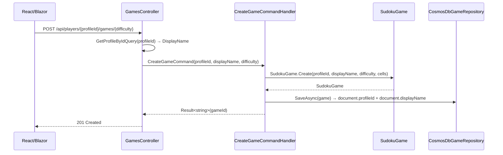
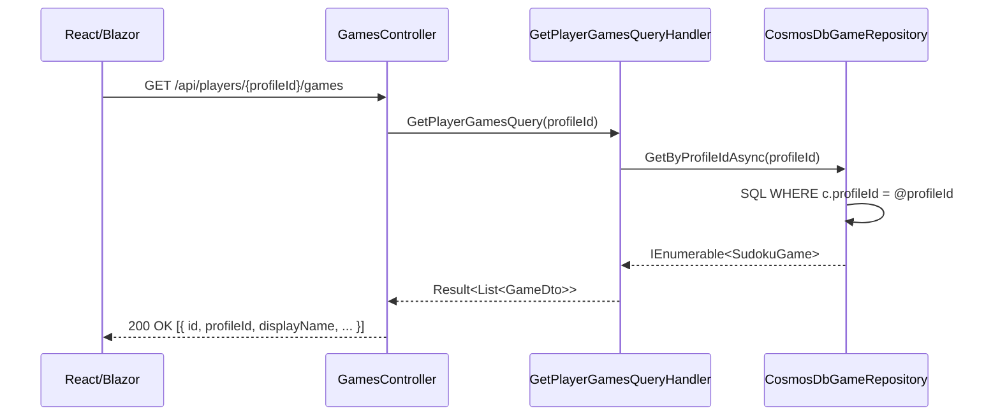

# Associate Games with ProfileId

**GitHub Issue:** #270

---

## 1. Overview

**Feature Name:** Associate Games with ProfileId

**Problem Statement**
Games are currently looked up using a composite key of `GameId + PlayerAlias`. The alias is a mutable string chosen by the user; if it changes, the relationship between player and game breaks. Because `UserProfile` already has a stable, immutable `ProfileId` (GUID), all game-player associations should use that stable identity instead. The alias field on `SudokuGame` becomes a human-readable display label only — not a lookup key.

Additionally, `CreateProfileCommandHandler`, `GetProfileByAliasQueryHandler`, `UpdateProfileAliasCommandHandler` currently lowercases aliases via `.ToLowerInvariant()` because lookup correctness depended on consistent casing. Once lookups use `ProfileId`, case normalization for storage is no longer necessary; the alias should be stored with its original casing (trimmed only), preserving user intent.

**Goals**

- Replace all `(xxx)ByAlias` game lookups with `(xxx)ByProfileId` equivalents at every layer
- Rename `GameDto.PlayerAlias` → `GameDto.DisplayName` (add `GameDto.ProfileId` for ownership check)
- Add `profileId` to the `SudokuGameDocument` persistence model
- Change `CreateGameCommand`, handlers, and repository interface to carry and store `ProfileId`
- Update all API controller routes from `{alias}` to `{profileId}` in the games namespace
- Remove the `ToLowerInvariant()` normalization in `CreateProfileCommandHandler`
- Update both React and Blazor frontends to pass `profileId` instead of `alias` to all game API calls

**Non-Goals**

- Backfilling `profileId` onto existing CosmosDB game documents (separate story)
- Changing the profiles API or `ProfilesController` routes
- Any authentication or authorization changes
- CosmosDB index changes or partition key changes

---

## 2. Functional Requirements

| ID    | Requirement                                                                                                                                                                                                                                                                                                                                                                                                        |
| ----- | ------------------------------------------------------------------------------------------------------------------------------------------------------------------------------------------------------------------------------------------------------------------------------------------------------------------------------------------------------------------------------------------------------------------ |
| FR-1  | `SudokuGame` gains a `ProfileId ProfileId` property. The `PlayerAlias PlayerAlias` property is renamed to `PlayerAlias DisplayName`. Both `Create()` and `Reconstitute()` factory methods accept `ProfileId` as a required parameter.                                                                                                                                                                              |
| FR-2  | `CreateGameCommand` carries `string ProfileId` and `string DisplayName` (renamed from `string PlayerAlias`). `string Difficulty` is unchanged.                                                                                                                                                                                                                                                                     |
| FR-3  | `DeletePlayerGamesCommand` carries `string ProfileId` (renamed from `string PlayerAlias`).                                                                                                                                                                                                                                                                                                                         |
| FR-4  | `GetPlayerGamesQuery` carries `string ProfileId` (renamed from `string PlayerAlias`).                                                                                                                                                                                                                                                                                                                              |
| FR-5  | `GetPlayerGamesByStatusQuery` carries `string ProfileId` (renamed from `string PlayerAlias`).                                                                                                                                                                                                                                                                                                                      |
| FR-6  | `IGameRepository` replaces `GetByPlayerAsync(PlayerAlias)` with `GetByProfileIdAsync(ProfileId)` and `GetByPlayerAndStatusAsync(PlayerAlias, ...)` with `GetByProfileIdAndStatusAsync(ProfileId, ...)`. The optional `PlayerAlias?` parameters on `GetCompletedGamesAsync`, `GetTotalGamesCountAsync`, `GetCompletedGamesCountAsync`, and `GetAverageCompletionTimeAsync` are replaced with optional `ProfileId?`. |
| FR-7  | `SudokuGameDocument` gains `string ProfileId` (JSON: `"profileId"`) and `string DisplayName` (JSON: `"displayName"`). The `string PlayerAlias` C# property is renamed to `string DisplayName`.                                                                                                                                                                                                                     |
| FR-8  | `SudokuGameMapper.ToDocument()` writes `game.ProfileId.ToString()` and `game.DisplayName.Value`. `ToDomain()` reads `document.ProfileId` (null-guarded: use `ProfileId.From(Guid.Empty)` for legacy docs) and `document.DisplayName` (null-guarded: fall back to `PlayerAlias.Create("Unknown")`).                                                                                                                 |
| FR-9  | `CosmosDbGameRepository` SQL queries filter on `c.profileId` instead of `c.playerAlias`.                                                                                                                                                                                                                                                                                                                           |
| FR-10 | `GameSpecifications` replaces `GameByPlayerSpecification` → `GameByProfileIdSpecification`, `GameByPlayerAndStatusSpecification` → `GameByProfileIdAndStatusSpecification`, and updates `CompletedGamesSpecification` and `GameByPlayerAndDifficultySpecification` to accept `ProfileId?`.                                                                                                                         |
| FR-11 | `GameDto` adds `string ProfileId` and renames `string PlayerAlias` to `string DisplayName`. `FromGame()` maps `game.ProfileId.ToString()` and `game.DisplayName.Value`.                                                                                                                                                                                                                                            |
| FR-12 | A new `GetProfileByIdQuery(string ProfileId)` and its handler are added to resolve the player's display name in `GamesController.CreateGameAsync`.                                                                                                                                                                                                                                                                 |
| FR-13 | API route prefix changes from `api/players/{alias}/games` to `api/players/{profileId}/games` across all four game controllers.                                                                                                                                                                                                                                                                                     |
| FR-14 | `BaseGameController.GetAuthorizedGameAsync` compares `game.ProfileId == profileId` (using the new `GameDto.ProfileId` field). Parameter is renamed from `alias` to `profileId`.                                                                                                                                                                                                                                    |
| FR-15 | React `GameModel` interface adds `profileId: string` and renames `playerAlias` to `displayName`. All game API calls in `apiClient` and `useGameService` use `profileId`.                                                                                                                                                                                                                                           |
| FR-16 | Blazor `GameModel` adds `ProfileId` property and renames `PlayerAlias` to `DisplayName`. `IGameApiClient` / `GameApiClient` replace `alias` parameters with `profileId` in all game methods. URL segments change accordingly.                                                                                                                                                                                      |
| FR-17 | `IPlayerManager` gains `GetCurrentProfileIdAsync()`. Pages pass `profileId` (not `alias`) to all game service calls.                                                                                                                                                                                                                                                                                               |
| FR-18 | `CreateProfileCommandHandler` changes `request.Alias.Trim().ToLowerInvariant()` to `request.Alias.Trim()` only.                                                                                                                                                                                                                                                                                                    |
| FR-19 | `GetProfileByAliasQueryHandler` likewise removes `.ToLowerInvariant()`. Lookup is now case-sensitive against whatever casing was stored.                                                                                                                                                                                                                                                                           |

---

## 3. Non-Functional Requirements

- **Performance:** Game queries by `profileId` use the same CosmosDB SQL pattern as current alias queries — no fan-out, no full-container scans.
- **Reliability:** Documents without `profileId` (pre-migration) return zero results from profile-scoped queries. Point reads via `GetByIdAsync` still work; `ToDomain()` handles null `ProfileId`/`DisplayName` with sentinels.
- **Observability:** Structured log messages updated from `{PlayerAlias}` to `{ProfileId}` throughout.
- **Deployment:** No Bicep/infra changes required. Adding `profileId` to the document schema is additive and requires no CosmosDB migration.
- **Breaking change:** This is a breaking API and DTO contract change. All clients (React, Blazor) must ship atomically with the backend in the same PR.

---

## 4. Architecture Overview

**Affected Projects:**

- `Sudoku.Domain` — entity field rename, new `ProfileId` property
- `Sudoku.Application` — commands, queries, handlers, DTOs, specifications, repository interface
- `Sudoku.Infrastructure` — document model, mapper, repository implementation
- `Sudoku.Api` — four game controllers and base controller
- `Sudoku.React` — types, apiClient, hooks, pages
- `Sudoku.Blazor` — models, HTTP clients, services, pages

**Sequence — Create Game (after this feature):**



**Sequence — Get Player Games (after this feature):**



---

## 5. Data Models and Contracts

### Domain Changes — `SudokuGame`

| Before                                                 | After                                                                               |
| ------------------------------------------------------ | ----------------------------------------------------------------------------------- |
| `public PlayerAlias PlayerAlias { get; private set; }` | `public ProfileId ProfileId { get; private set; }` (new)                            |
| —                                                      | `public PlayerAlias DisplayName { get; private set; }` (renamed from `PlayerAlias`) |

Factory method changes:

```csharp
// Before
static Create(PlayerAlias playerAlias, GameDifficulty difficulty, IEnumerable<Cell> initialCells)
static Reconstitute(GameId id, PlayerAlias playerAlias, ...)

// After
static Create(ProfileId profileId, PlayerAlias displayName, GameDifficulty difficulty, IEnumerable<Cell> initialCells)
static Reconstitute(GameId id, ProfileId profileId, PlayerAlias displayName, ...)
```

### Domain Event Change — `GameCreatedEvent`

```csharp
// Before
record GameCreatedEvent(GameId GameId, PlayerAlias PlayerAlias, GameDifficulty Difficulty)

// After
record GameCreatedEvent(GameId GameId, ProfileId ProfileId, PlayerAlias DisplayName, GameDifficulty Difficulty)
```

### Application Commands / Queries

| Type                          | Before                                    | After                                                       |
| ----------------------------- | ----------------------------------------- | ----------------------------------------------------------- |
| `CreateGameCommand`           | `(string PlayerAlias, string Difficulty)` | `(string ProfileId, string DisplayName, string Difficulty)` |
| `DeletePlayerGamesCommand`    | `(string PlayerAlias)`                    | `(string ProfileId)`                                        |
| `GetPlayerGamesQuery`         | `(string PlayerAlias)`                    | `(string ProfileId)`                                        |
| `GetPlayerGamesByStatusQuery` | `(string PlayerAlias, string Status)`     | `(string ProfileId, string Status)`                         |
| `GetProfileByIdQuery`         | _(new)_                                   | `(string ProfileId)`                                        |

### `GameDto`

```csharp
// Before
record GameDto(string Id, string PlayerAlias, string Difficulty, ...)

// After
record GameDto(string Id, string ProfileId, string DisplayName, string Difficulty, ...)
```

JSON response shape:

```json
// Before
{ "id": "...", "playerAlias": "CoolPlayer", "difficulty": "Easy" }

// After
{ "id": "...", "profileId": "guid-here", "displayName": "CoolPlayer", "difficulty": "Easy" }
```

### `IGameRepository` Interface Changes

| Before                                                   | After                                                     |
| -------------------------------------------------------- | --------------------------------------------------------- |
| `GetByPlayerAsync(PlayerAlias)`                          | `GetByProfileIdAsync(ProfileId)`                          |
| `GetByPlayerAndStatusAsync(PlayerAlias, GameStatusEnum)` | `GetByProfileIdAndStatusAsync(ProfileId, GameStatusEnum)` |
| `GetCompletedGamesAsync(PlayerAlias? = null)`            | `GetCompletedGamesAsync(ProfileId? = null)`               |
| `GetTotalGamesCountAsync(PlayerAlias? = null)`           | `GetTotalGamesCountAsync(ProfileId? = null)`              |
| `GetCompletedGamesCountAsync(PlayerAlias? = null)`       | `GetCompletedGamesCountAsync(ProfileId? = null)`          |
| `GetAverageCompletionTimeAsync(PlayerAlias? = null)`     | `GetAverageCompletionTimeAsync(ProfileId? = null)`        |

### `SudokuGameDocument` Changes

| Before                                             | After                                                                    |
| -------------------------------------------------- | ------------------------------------------------------------------------ |
| `[JsonProperty("playerAlias")] string PlayerAlias` | _(removed; legacy `"playerAlias"` key silently ignored by deserializer)_ |
| —                                                  | `[JsonProperty("profileId")] string ProfileId`                           |
| —                                                  | `[JsonProperty("displayName")] string DisplayName`                       |

### `SudokuGameMapper` Changes

`ToDocument()`: `PlayerAlias = game.PlayerAlias.Value` → `ProfileId = game.ProfileId.ToString(), DisplayName = game.DisplayName.Value`

`ToDomain()`: Pass `ProfileId.From(Guid.Parse(document.ProfileId))` (guard: use `Guid.Empty` if null/empty) and `PlayerAlias.Create(document.DisplayName ?? "Unknown")` to `Reconstitute()`.

---

## 6. CQRS Components

### Commands

**`CreateGameCommand`**

- Inputs: `ProfileId`, `DisplayName`, `Difficulty`
- Handler resolves `ProfileId.From(...)` and `PlayerAlias.Create(displayName)`, calls `SudokuGame.Create()`
- Side effects: raises `GameCreatedEvent(GameId, ProfileId, DisplayName, Difficulty)`

**`DeletePlayerGamesCommand`**

- Input: `ProfileId`
- Handler calls `GetByProfileIdAsync(profileId)` to enumerate games, deletes each

### Queries

**`GetPlayerGamesQuery`** — input `ProfileId` → calls `GetByProfileIdAsync()`

**`GetPlayerGamesByStatusQuery`** — input `ProfileId`, `Status` → calls `GetByProfileIdAndStatusAsync()`

**`GetProfileByIdQuery`** _(new)_ — input `ProfileId` → calls `profileRepository.GetByIdAsync(ProfileId.From(...))` → returns `ProfileDto?`

### Handlers

**`CreateProfileCommandHandler`** — change: `request.Alias.Trim().ToLowerInvariant()` → `request.Alias.Trim()`

**`GetProfileByAliasQueryHandler`** — same change: remove `.ToLowerInvariant()`. Lookup is now case-exact against stored value.

---

## 7. Domain Events

| Event              | Trigger               | Payload Change                                        | Action Required                                                                        |
| ------------------ | --------------------- | ----------------------------------------------------- | -------------------------------------------------------------------------------------- |
| `GameCreatedEvent` | `SudokuGame.Create()` | Add `ProfileId`; rename `PlayerAlias` → `DisplayName` | Grep `INotificationHandler<GameCreatedEvent>` — update all consumer handler signatures |

All other events (`GameStartedEvent`, `MoveMadeEvent`, etc.) are unchanged.

---

## 8. UI/UX Flow

### React Frontend

**`types/index.ts`** — `GameModel` changes:

```typescript
// Before
playerAlias: string;

// After
profileId: string;
displayName: string;
```

**`api/apiClient.ts`** — all game methods change `alias: string` → `profileId: string`; URL segments change from `/api/players/${alias}/` to `/api/players/${profileId}/`.

**`hooks/useGameService.ts`** — all method signatures: `playerAlias: string` → `profileId: string`; pass through to `apiClient`.

**Pages** (`GamePage.tsx`, `GameListPage.tsx`, `NewGamePage.tsx`) — destructure `profileId` (not `playerAlias`) from `usePlayerService()` for all game calls. `usePlayerService()` already exposes `profileId: string | null` — no change to that hook.

### Blazor Frontend

**`Models/GameModel.cs`** — rename `PlayerAlias` → `DisplayName`; add `string ProfileId`.

**`Services/HttpClients/IGameApiClient.cs` + `GameApiClient.cs`** — all `string alias` parameters → `string profileId`; URL construction updated.

**`Services/Abstractions/IGameStateManager.cs`** + implementation — method signatures with `string alias` → `string profileId`.

**`Services/Abstractions/IPlayerManager.cs`** — add `Task<string?> GetCurrentProfileIdAsync()`. Implement in `PlayerManager.cs` returning `profile.ProfileId`.

**Pages** (`New.razor.cs`, `GameList.razor.cs`, `Game.razor.cs`) — call `GetCurrentProfileIdAsync()` for game operations; `GetCurrentPlayerAsync()` retained for display purposes only.

---

## 9. API Endpoints

| Controller                 | Method      | Before                                                   | After                                                        |
| -------------------------- | ----------- | -------------------------------------------------------- | ------------------------------------------------------------ |
| `GamesController`          | POST        | `POST /api/players/{alias}/games/{difficulty}`           | `POST /api/players/{profileId}/games/{difficulty}`           |
| `GamesController`          | DELETE      | `DELETE /api/players/{alias}/games`                      | `DELETE /api/players/{profileId}/games`                      |
| `GamesController`          | DELETE      | `DELETE /api/players/{alias}/games/{gameId}`             | `DELETE /api/players/{profileId}/games/{gameId}`             |
| `GamesController`          | GET         | `GET /api/players/{alias}/games`                         | `GET /api/players/{profileId}/games`                         |
| `GamesController`          | GET         | `GET /api/players/{alias}/games/{gameId}`                | `GET /api/players/{profileId}/games/{gameId}`                |
| `GameActionsController`    | PUT         | `PUT /api/players/{alias}/games/{gameId}/actions`        | `PUT /api/players/{profileId}/games/{gameId}/actions`        |
| `GameActionsController`    | POST        | `POST /api/players/{alias}/games/{gameId}/actions/reset` | `POST /api/players/{profileId}/games/{gameId}/actions/reset` |
| `GameActionsController`    | POST        | `POST /api/players/{alias}/games/{gameId}/actions/undo`  | `POST /api/players/{profileId}/games/{gameId}/actions/undo`  |
| `GameStatusController`     | POST        | `POST /api/players/{alias}/games/{gameId}/status/*`      | `POST /api/players/{profileId}/games/{gameId}/status/*`      |
| `PossibleValuesController` | POST/DELETE | `/api/players/{alias}/games/{gameId}/possible-values*`   | `/api/players/{profileId}/games/{gameId}/possible-values*`   |

**`ProfilesController` is unchanged.** `/api/profiles/{alias}` stays as-is.

**`BaseGameController.GetAuthorizedGameAsync`:**

```csharp
// Before
protected async Task<(GameDto?, ActionResult?)> GetAuthorizedGameAsync(string alias, string gameId)
// ownership check: gameResult.Value.PlayerAlias != alias

// After
protected async Task<(GameDto?, ActionResult?)> GetAuthorizedGameAsync(string profileId, string gameId)
// ownership check: gameResult.Value.ProfileId != profileId
```

**`GamesController.CreateGameAsync`** must resolve `DisplayName` via `GetProfileByIdQuery` before dispatching `CreateGameCommand`:

```csharp
var profileResult = await Mediator.Send(new GetProfileByIdQuery(profileId));
if (!profileResult.IsSuccess || profileResult.Value == null)
    return NotFound($"Profile '{profileId}' not found.");
var result = await Mediator.Send(new CreateGameCommand(profileId, profileResult.Value.Alias, difficulty));
```

---

## 10. Testing Strategy

### Unit Tests — Domain (`SudokuGameTests.cs`)

- Update all `SudokuGame.Create(playerAlias, ...)` calls to `Create(profileId, displayName, ...)`
- Add: `Create_SetsProfileIdProperty`, `Create_SetsDisplayNameProperty`, `Create_RaisesGameCreatedEvent_WithProfileId`
- Update `GameFactory` helper to default `ProfileId.New()` and `PlayerAlias.Create("DefaultPlayer")`

### Unit Tests — Application DTOs

- `GameDtoTests`: rename `PlayerAlias` → `DisplayName` in all assertions; add `ProfileId` assertions
- Add: `FromGame_MapsProfileId_Correctly`

### Unit Tests — Application Handlers

- `CreateGameCommandHandlerTests`: update command constructor; verify `ProfileId` passed to domain
- `GetPlayerGamesQueryHandlerTests`: verify `GetByProfileIdAsync` called (not `GetByPlayerAsync`)
- `DeletePlayerGamesCommandHandlerTests`: update to use `ProfileId`
- New `GetProfileByIdQueryHandlerTests`: success path, not-found path, invalid GUID path
- `CreateProfileCommandHandlerTests`: add test verifying original casing is preserved (not lowercased)

### Unit Tests — Infrastructure

- `CosmosDbGameRepositoryTests`: verify SQL contains `c.profileId = @profileId`
- `SudokuGameMapperTests`: verify `ToDocument()` writes `profileId`/`displayName`; verify `ToDomain()` handles null `ProfileId` gracefully (uses `Guid.Empty` sentinel)

### Unit Tests — API Controllers

- Update `BaseGameControllerTests.CreateTestGameDto` helper to include `ProfileId` parameter
- Add: `CreateGameAsync_WithUnknownProfileId_Returns404`
- Add: `GetAllGamesAsync_WithValidProfileId_CallsGetPlayerGamesQuery`

### Unit Tests — React

- `useGameService.test.ts`: all calls pass `profileId`; verify URL construction uses `/api/players/${profileId}/`
- TypeScript strict mode will surface remaining `playerAlias` references at compile time

### Unit Tests — Blazor

- `GameManagerTests`: update to pass `profileId`; add `CreateGameAsync_PassesProfileIdToApiClient`
- Update page tests to reflect `profileId` in game service calls

### Integration Tests

- End-to-end round-trip: save game with `ProfileId` → query by same `ProfileId` → correct game returned

---

## 11. Risks and Considerations

- **Legacy documents without `profileId`:** Profile-scoped queries return zero results for pre-migration docs. Accepted regression; backfill is a separate story. `ToDomain()` must not throw on null `ProfileId`.
- **Alias case sensitivity:** Removing `.ToLowerInvariant()` means newly stored aliases preserve original casing. Profiles created before this feature were stored lowercase and will only be found if queried with all-lowercase input. This is an accepted behavioral change.
- **`GameCreatedEvent` consumers:** Any `INotificationHandler<GameCreatedEvent>` must update its handler signature — grep for all consumers before implementing.
- **`GameDto.ProfileId` is required for `GetAuthorizedGameAsync`:** Without this field, the ownership check has nothing stable to compare against. Do not skip this addition.
- **Breaking API contract:** All external clients (Swagger UI, Postman collections) must be updated. Document in release notes.

---

## 12. Implementation Plan

Execute in order — each step should compile and pass tests before proceeding to the next.

1. **Domain** — Add `ProfileId` to `SudokuGame`; rename `PlayerAlias` property to `DisplayName`; update `Create()`/`Reconstitute()` signatures; update `GameCreatedEvent`; update `SudokuGameTests` and `GameFactory`
2. **Application DTOs** — Add `ProfileId` to `GameDto`; rename `PlayerAlias` → `DisplayName`; update `FromGame()`; update DTO tests
3. **Application Commands/Queries** — Update `CreateGameCommand`, `DeletePlayerGamesCommand`, `GetPlayerGamesQuery`, `GetPlayerGamesByStatusQuery`; add `GetProfileByIdQuery`
4. **Application Handlers** — Update all game command/query handlers; add `GetProfileByIdQueryHandler`; remove `.ToLowerInvariant()` from `CreateProfileCommandHandler` and `GetProfileByAliasQueryHandler`
5. **Application Interface** — Update `IGameRepository` with renamed methods and `ProfileId?` optional params
6. **Application Specifications** — Rename/replace `GameByPlayer*` specs → `GameByProfileId*`
7. **Infrastructure Document + Mapper** — Remove `PlayerAlias` from `SudokuGameDocument`; add `ProfileId` and `DisplayName`; update `SudokuGameMapper` with null guards for legacy docs
8. **Infrastructure Repository** — Implement renamed `IGameRepository` methods in `CosmosDbGameRepository`; update SQL filters; update log messages
9. **API Layer** — Rename `{alias}` → `{profileId}` route templates on all four game controllers; update `BaseGameController.GetAuthorizedGameAsync`; update `GamesController.CreateGameAsync` to call `GetProfileByIdQuery` first; update controller tests
10. **React Frontend** — Update `GameModel` types; update `apiClient`; update `useGameService`; update pages; run TypeScript compiler to catch stragglers; update React tests
11. **Blazor Frontend** — Update `GameModel`; update `IGameApiClient`/`GameApiClient`; update `IGameStateManager`/`GameStateManager`; add `GetCurrentProfileIdAsync()` to `IPlayerManager`; update pages; update Blazor tests
12. **Final validation** — `dotnet test`, `npm run test`, end-to-end smoke test

---

## 13. Open Questions

None — all design decisions confirmed. Data migration backfill is explicitly out of scope and will be handled in a separate story.
