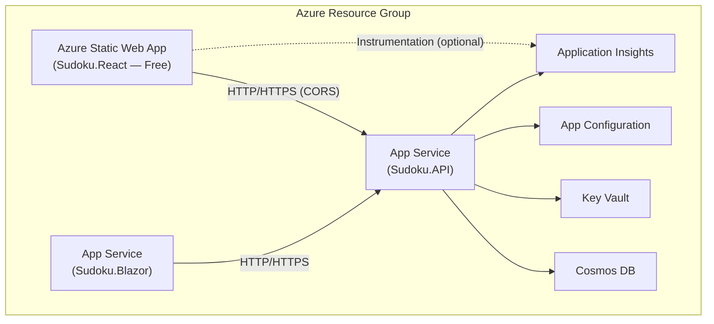
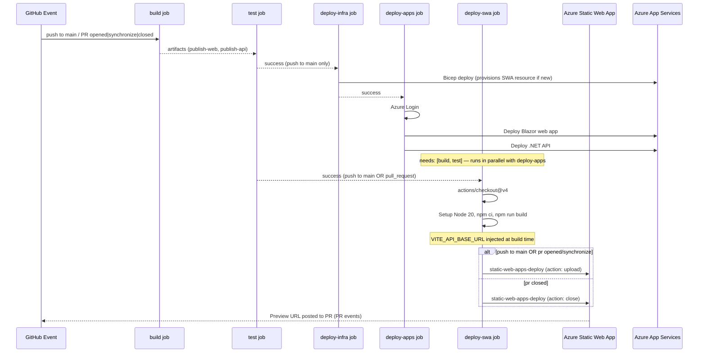

# Feature / Change Specification: Deploy React App to Azure Static Web App

**Purpose:** Provide a complete, unambiguous, implementation-ready design specification for provisioning and deploying the `Sudoku.React` front-end application to an Azure Static Web App, integrated into the existing CI/CD pipeline and shared Azure resource stack.
**Audience:** Implementation Agent, DevOps Agent, reviewers, and future maintainers.

---

## 1. 🧭 Overview

**Feature Name:** Deploy React App to Azure Static Web App

**Problem Statement:**
The `Sudoku.React` front-end application has been created as a Vite/React project alongside the existing Blazor front-end. There is currently no Azure hosting resource, infrastructure-as-code definition, or CI/CD pipeline integration for the React app. Without these, the React app cannot be deployed to any environment, cannot share the existing API and platform services, and cannot benefit from PR preview environments for integration feedback. This gap blocks production delivery of the React front-end.

**Goals:**
- Provision an Azure Static Web App (SWA) resource for the React application via Bicep IaC.
- Integrate the React build and deploy steps into the existing `main.yml` CI/CD workflow.
- Share the existing API, Cosmos DB, Key Vault, App Configuration, and Application Insights resources — no new data or monitoring infrastructure is introduced.
- Enable PR preview environments so every pull request targeting `main` produces a unique, live staging URL.
- Ensure the existing Blazor app, .NET API, and all other deployments are unaffected.

**Non-Goals:**
- Introducing a custom domain for the React SWA (default `.azurestaticapps.net` hostname only, for now).
- Provisioning a separate API, database, Key Vault, App Configuration, or Application Insights for the React app.
- Migrating or replacing the Blazor front-end.
- Changing the React application's source code beyond adding the SWA routing configuration file.
- Creating a new GitHub Actions workflow file.

---

## 2. 📌 Functional Requirements

| ID | Requirement |
|----|-------------|
| FR-01 | A new `Microsoft.Web/staticSites` resource (Free SKU) is provisioned by the existing Bicep template for both `prod` and `staging` environments. |
| FR-02 | The SWA resource outputs its default hostname and deployment API key. |
| FR-03 | The API App Service CORS `allowedOrigins` is updated to include the production SWA hostname. |
| FR-04 | A `staticwebapp.config.json` file is added to `src/frontend/Sudoku.React/public/` to configure SPA fallback routing and security response headers. |
| FR-05 | `VITE_API_BASE_URL` is injected at build time — production value on `push` to `main`, preview value on `pull_request` events. |
| FR-06 | The React app is built (Node 20 LTS, `actions/checkout@v4`, `actions/setup-node@v4`, `npm ci`, `npm run build`) in the new standalone `deploy-swa` job in `main.yml` — not in `deploy-apps`. |
| FR-07 | The built React app is deployed to the SWA using `Azure/static-web-apps-deploy@v1` with `action: upload` in the `deploy-swa` job, triggered on push to `main` and on PR `opened`/`synchronize` events. |
| FR-08 | PR preview environments are automatically torn down using `Azure/static-web-apps-deploy@v1` with `action: close` in the `deploy-swa` job, triggered on PR `closed` events. |
| FR-09 | The SWA deployment API token is stored as a GitHub repository secret and never committed to source. |
| FR-10 | The `deploy-apps` job is entirely unchanged by this spec — no React build or SWA deploy steps are added to it. All existing Blazor and API deployment steps remain unmodified. |

---

## 3. 🛡️ Non-Functional Requirements

- **Performance:** Static assets are served from the Azure CDN edge nodes embedded in the SWA service. No additional CDN configuration is required. Build time addition to the `deploy-apps` job is expected to be under 2 minutes.
- **Security:** The SWA deployment token is stored exclusively as a GitHub secret (`AZURE_STATIC_WEB_APP_API_TOKEN`). The Vite build environment variable (`VITE_API_BASE_URL`) is injected at build time and baked into the static bundle — no runtime secrets are stored in the SWA. `X-Frame-Options` and `X-Content-Type-Options` response headers are configured in `staticwebapp.config.json`.
- **Reliability:** Azure App Service CORS does not support wildcard subdomains; PR preview URLs (`https://<name>-<pr>.<region>.azurestaticapps.net`) cannot be individually whitelisted. PR previews will use the production API URL (already CORS-allowed for the production SWA hostname). This is an accepted limitation of the Free tier approach.
- **Observability:** The React app connects to the same Application Insights instance used by the API and Blazor app. Telemetry from the React front-end (if instrumented) flows into the shared workspace. Deployment events are visible in the existing GitHub Actions workflow run logs.
- **Accessibility:** N/A — no new UI components are introduced by this spec.
- **Localization:** N/A
- **Deployment Considerations:** The `main.yml` `pull_request` trigger must include event types `opened`, `synchronize`, and `closed` to fully support PR preview lifecycle management. This may require a minor update to the existing `on:` block.
- **Scalability:** Azure Static Web Apps scales automatically at the platform level. No additional configuration is required.

---

## 4. 🏛️ Architecture Overview

**High-Level Description:**
The React app is served as a globally distributed static site via Azure Static Web Apps, operating independently from the Blazor App Service. Both front-ends share the same .NET API backend (App Service), Cosmos DB, Key Vault, App Configuration store, and Application Insights workspace. The SWA has no server-side compute of its own; all data access flows through the existing API. The new SWA resource is defined in a dedicated Bicep module (`infra/modules/staticwebapp.bicep`) and composed into `main.bicep`, following the established module pattern.

**Affected Projects:**

| Area | Change |
|------|--------|
| `infra/modules/staticwebapp.bicep` | New Bicep module — provisions the SWA resource |
| `infra/main.bicep` | Compose new `staticwebapp` module; add SWA parameters; pass SWA hostname to `compute` module for CORS |
| `infra/modules/compute.bicep` | Update `corsAllowedOrigins` variable to accept the SWA hostname |
| `infra/params/prod.bicepparam` | Add `staticWebAppName` parameter value |
| `infra/params/staging.bicepparam` | Add `staticWebAppName` parameter value |
| `src/frontend/Sudoku.React/public/staticwebapp.config.json` | New SPA routing fallback and response header configuration |
| `.github/workflows/main.yml` | Add `pull_request` event types; add new standalone `deploy-swa` job (does not modify `deploy-apps`) |
| GitHub Repository Secrets | Add `AZURE_STATIC_WEB_APP_API_TOKEN`, `VITE_API_BASE_URL_PRODUCTION`, `VITE_API_BASE_URL_PREVIEW` |

**Resource Sharing Diagram:**

**Deployment Flow Diagram:**

---

## 5. 📦 Data Models & Contracts

**Domain Models:** N/A — no domain model changes.

**DTOs / API Contracts:** N/A — no new API endpoints or contracts. The React app consumes the existing API surface.

**Persistence Changes:** None. The React app reads and writes data exclusively through the existing API, which owns all Cosmos DB interactions.

**Bicep Parameter Additions:**

| Parameter | Type | Description |
|-----------|------|-------------|
| `staticWebAppName` | `string` | Name of the Azure Static Web App resource |
| `staticWebAppSku` | `string` | SKU tier — `'Free'` (default) |

**Bicep Output Additions (from `main.bicep`):**

| Output | Description |
|--------|-------------|
| `staticWebAppUrl` | Default `.azurestaticapps.net` hostname |
| ~~`staticWebAppApiKey`~~ | **Not a Bicep output — sensitive.** Retrieved post-deploy via `az staticwebapp secrets list --name <staticWebAppName> --resource-group <rg> --query "properties.apiKey" -o tsv`. Must not be emitted as a plain Bicep output. |

---

## 6. 🔄 CQRS Components

N/A — no commands, queries, or handlers are introduced or modified.

---

## 7. 📣 Domain Events

N/A — no domain events are introduced or modified.

---

## 8. 🖥️ UI/UX Flow

**Frontend Target:** React/Vite (`src/frontend/Sudoku.React`)

**New Files:**
- `src/frontend/Sudoku.React/public/staticwebapp.config.json` — SPA routing fallback and HTTP response headers

**SPA Routing Configuration:**
The `navigationFallback` property must be set to `/index.html` so that all paths that do not resolve to a static file (e.g., deep-linked React Router routes) return `index.html` rather than a 404 from the CDN.

**Response Headers (minimum):**

| Header | Value |
|--------|-------|
| `X-Frame-Options` | `DENY` |
| `X-Content-Type-Options` | `nosniff` |
| `Referrer-Policy` | `strict-origin-when-cross-origin` |

**`deploy-swa` Job Summary:**
The `deploy-swa` job runs independently of `deploy-apps`. It has `needs: [build, test]` and no `environment:` gate, meaning it executes on both `push` and `pull_request` events. It starts with `actions/checkout@v4` (required because the job does not inherit a workspace from any other job), followed by Node setup, React build, and conditional SWA deployment.

**State Management:** N/A — no changes to React component state or server interaction patterns.

---

## 9. 🌐 API Endpoints

No new API endpoints are introduced. The existing API's CORS configuration is updated to include the production SWA hostname (`https://<staticWebAppName>.azurestaticapps.net`), permitting cross-origin requests from the React front-end.

> **Note on PR Preview CORS:** Azure App Service CORS does not support wildcard subdomains, so dynamic PR preview hostnames (`https://<name>-<pr-number>.<region>.azurestaticapps.net`) cannot be individually whitelisted. PR preview environments will target the production API URL, which already allows the production SWA hostname. This is an accepted constraint of the Free SKU approach.

---

## 10. 🧪 Testing Strategy

**Unit Tests:** N/A — no application or domain logic changes.

**Integration Tests:** N/A — no API or persistence changes.

**UI Tests:** N/A — no new React UI components are introduced by this spec.

**Infrastructure Validation:**
- Run `az bicep build --file infra/main.bicep` to confirm the template compiles without errors after adding the new module and parameters.
- Run `az deployment group what-if` against a non-production resource group to validate the SWA resource definition before merging.

**Workflow Validation (manual, post-merge):**
- Verify a push to `main` provisions the SWA via Bicep and deploys the React app bundle.
- Verify a PR opened against `main` produces a unique preview URL posted to the PR.
- Verify a PR closure automatically tears down the staging environment.
- Verify `VITE_API_BASE_URL` is baked into the correct bundle for each event type.
- Verify deep-linked React routes resolve to `index.html` (no 404 on refresh).
- Verify the existing Blazor and API deployments are unaffected.

---

## 11. ⚠️ Risks & Considerations

- **Free SKU limitation — staging environments:** The Free SKU supports up to **2 concurrent staging environments** (PR previews). If more than 2 PRs are open simultaneously, additional preview deployments will fail. Upgrading to Standard SKU (10 concurrent staging environments) should be planned for as team size grows.
- **Free SKU limitation — CORS on PR previews:** PR preview hostnames are dynamic subdomains that cannot be individually added to Azure App Service CORS. PR preview builds must target the production API; this is acceptable for now but limits the ability to test against an isolated API environment.
- **Deployment token rotation:** The `AZURE_STATIC_WEB_APP_API_TOKEN` GitHub secret must be manually rotated if the SWA resource is re-created (e.g., after a Bicep `complete` mode deployment that deletes and re-provisions the resource). This is a standard operational concern.
- **`deploy-swa` job `if:` conditions:** The `deploy-swa` job must correctly gate each step across all three PR event types plus push. The `action: upload` step must run only on `push` to `main` or PR `opened`/`synchronize` events; the `action: close` step must run only on PR `closed` events. Incorrect `if:` expressions could result in double-deployment, missed teardowns, or spurious failures on unrelated triggers. These conditions must be carefully validated before merging.
- **`pull_request` trigger types:** The current `main.yml` `on: pull_request:` block may not include `closed` as an event type. Adding `closed` is necessary for automatic staging teardown; this change should be validated to ensure it does not inadvertently trigger other jobs on PR closure.
- **Build artifact isolation:** The React `dist/` output is produced directly within the `deploy-apps` job runner and consumed immediately by the SWA deploy action — it does not need to be uploaded as a GitHub Actions artifact. However, this means the built assets are not retained for post-deployment inspection.
- **Bicep `apiKey` sensitivity:** The `listSecrets` or deployment token output from the SWA Bicep resource is a sensitive value. It must not be emitted as a plain `main.bicep` output, and must be retrieved via the Azure CLI or `az staticwebapp secrets list` in the workflow rather than stored in deployment outputs.
- **Breaking change to `main.yml` triggers:** Adding `opened`, `synchronize`, and `closed` types to the `pull_request` trigger is an additive change that should not affect existing job `if:` conditions, but must be verified.

---

## 12. 🔧 Implementation Plan

1. **Create `infra/modules/staticwebapp.bicep`**
   - Define `Microsoft.Web/staticSites` with `sku: { name: 'Free', tier: 'Free' }`.
   - Accept parameters: `location`, `environment`, `staticWebAppName`.
   - Apply standard `tags` (`environment`, `project: XenobiaSoftSudoku`).
   - Output `staticWebAppHostname` (`properties.defaultHostname`).

2. **Update `infra/modules/compute.bicep`**
   - Add parameter `staticWebAppHostname string = ''`.
   - Extend `corsAllowedOrigins` to conditionally include `'https://${staticWebAppHostname}'` when the value is non-empty.

3. **Update `infra/main.bicep`**
   - Add parameters `staticWebAppName` and `staticWebAppSku`.
   - Compose `module staticwebapp 'modules/staticwebapp.bicep'`.
   - Pass `staticwebapp.outputs.staticWebAppHostname` to the `compute` module.

4. **Update `infra/params/prod.bicepparam`**
   - Add `param staticWebAppName = 'swa-xenobiasoft-sudoku-prod'`.

5. **Update `infra/params/staging.bicepparam`**
   - Add `param staticWebAppName = 'swa-xenobiasoft-sudoku-staging'`.

6. **Add `src/frontend/Sudoku.React/public/staticwebapp.config.json`**
   - Configure `navigationFallback` to `index.html`.
   - Configure security response headers (`X-Frame-Options`, `X-Content-Type-Options`, `Referrer-Policy`).

7. **Update `.github/workflows/main.yml`**
   - Add `opened`, `synchronize`, `closed` to the `pull_request` event type list.
   - Add a new `deploy-swa` job with the following definition:
     - `needs: [build, test]` — runs in parallel with `deploy-apps` after `test` passes; does **not** depend on `deploy-infra`
     - No `environment:` gate — runs on both `push` to `main` and `pull_request` events
     - Steps in order:
       1. `actions/checkout@v4` — required because this job has no pre-checked-out workspace (it does not inherit from `deploy-apps`)
       2. `actions/setup-node@v4` (Node 20 LTS, cache npm via `src/frontend/Sudoku.React/package-lock.json`)
       3. `npm ci` (working directory: `src/frontend/Sudoku.React`)
       4. `npm run build` with `VITE_API_BASE_URL` env var (production secret on `push`, preview secret on `pull_request`)
       5. `Azure/static-web-apps-deploy@v1` with `action: upload` — `if:` condition: `push` to `main` or PR `opened`/`synchronize`
       6. `Azure/static-web-apps-deploy@v1` with `action: close` — `if:` condition: PR `closed`
   - The `deploy-apps` job is **not modified** — no React steps are added to it.

8. **Add GitHub Repository Secrets**
   - `AZURE_STATIC_WEB_APP_API_TOKEN` — retrieved after first Bicep deployment via `az staticwebapp secrets list`.
   - `VITE_API_BASE_URL_PRODUCTION` — production API URL (e.g., `https://XenobiasoftSudokuApi-prod.azurewebsites.net`).
   - `VITE_API_BASE_URL_PREVIEW` — same as production for now.

9. **Validate end-to-end** per the testing strategy above.

---

## 13. ❓ Open Questions

- **Application Insights instrumentation in React:** Should the React app be instrumented with the Application Insights JavaScript SDK (`@microsoft/applicationinsights-web`) to emit telemetry to the shared workspace? The connection string would need to be injected at build time (as a `VITE_*` env var). This is not in scope for this spec but should be tracked as a follow-on task.
- **Bicep deployment token retrieval in CI:** The preferred approach for retrieving the SWA API token in CI is via `az staticwebapp secrets list --name <name> --resource-group <rg> --query "properties.apiKey" -o tsv` after the Bicep deploy step, rather than storing it as a Bicep output. This requires the `deploy-infra` job to pass the token to `deploy-apps` via a job output. Alternatively, the token is stored once as a GitHub secret after the first manual deployment. The latter is simpler and is assumed for this spec; the former offers full automation and should be considered for future GitOps hardening.
- **Lint and test steps for React in CI:** The existing informal notes included `npm run lint` and `npm test` steps. These are not included in the `deploy-apps` job (which runs only on push to `main` or on PR events after Bicep deploy). If React linting and testing should gate the `build` job (alongside .NET), that is a separate workflow enhancement and is out of scope for this spec.
