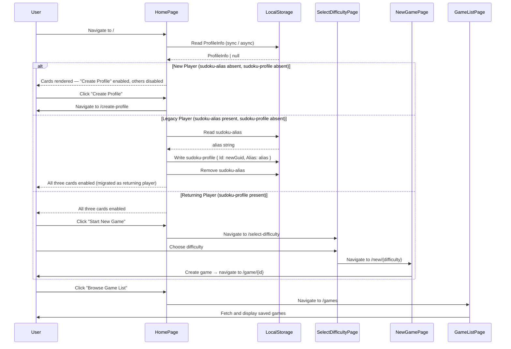

# New Landing / Home Page

**Covers:** Issue [#214](https://github.com/xenobiasoft/sudoku/issues/214)

---

## 1. 🧭 Overview

**Feature Name:** New Landing / Home Page

**Problem Statement:**
The current landing page (`/`) uses an accordion-style menu to expose "Start New Game" and "Load Game" actions. This buries available features behind toggled sub-menus, offers no visual distinction between a new visitor and a returning player, and immediately redirects brand-new users to the profile-creation flow before they can see what the app offers. The result is a confusing first impression with no clear call-to-action hierarchy.

**Goals:**
- Replace the accordion menu with a card-based home screen presenting three explicit navigation cards
- Dynamically show "Create Profile" vs. "Manage Profile" based on whether the player has a saved local profile
- Disable "Start New Game" and "Browse Game List" for players who have not yet created a profile, with visual affordance explaining why
- Introduce a dedicated **Select Difficulty** page (replaces the inline difficulty accordion)
- Introduce a dedicated **Game List** page (replaces the inline saved-game accordion)
- Implement feature parity across both Blazor Server and React/Vite frontends

**Non-Goals:**
- Redesigning the difficulty selection page beyond a simple three-option picker
- Adding filtering, sorting, or pagination to the Game List page
- Changing the profile creation or profile management flows
- Adding an onboarding wizard, tutorial, or guided tour
- Any backend, API, or domain changes

---

## 2. 📌 Functional Requirements

| ID | Requirement |
|----|-------------|
| FR-1 | The home page at `/` shall display three navigation cards: **Profile** (Create / Manage), **Start New Game**, and **Browse Game List**. |
| FR-2 | The **Profile** card shall show the label "Create Profile" and navigate to `/create-profile` when no local profile exists, and the label "Manage Profile" navigating to `/profile` when a profile is stored. |
| FR-3 | The **Start New Game** card shall be visually disabled (non-interactive) when no local player profile exists. |
| FR-4 | The **Browse Game List** card shall be visually disabled (non-interactive) when no local player profile exists. |
| FR-5 | Clicking **Start New Game** (when enabled) shall navigate to a new **Select Difficulty** page. |
| FR-6 | The **Select Difficulty** page shall present Easy, Medium, and Hard options. Selecting one shall navigate to the existing game-creation route (`/new/{difficulty}`). |
| FR-7 | Clicking **Browse Game List** (when enabled) shall navigate to a new **Game List** page. |
| FR-8 | The **Game List** page shall display all in-progress saved games for the current player, with the ability to load (navigate to `/game/{id}`) or delete each game, and an empty-state message when no games exist. |
| FR-9 | The home page shall **not** automatically redirect new players to `/create-profile`; the "Create Profile" card is the explicit call-to-action. |
| FR-10 | The home page shall determine player state from local storage only, with no backend API call on initial render. Three states are recognised: **new player** (`sudoku-alias` absent, `sudoku-profile` absent), **legacy player** (`sudoku-alias` present, `sudoku-profile` absent), and **returning player** (`sudoku-profile` present). |
| FR-11 | Both Blazor Server and React/Vite frontends shall implement the above with feature parity. |
| FR-12 | When a **legacy player** is detected on home page mount, the app shall silently migrate: read the `sudoku-alias` string, generate a new GUID, write `sudoku-profile = { Id: newGuid, Alias: aliasValue }` to local storage, remove the `sudoku-alias` key, then render the page as a returning player (all cards enabled). No redirect, spinner, or visible feedback shall be shown. If migration fails for any reason, the app shall silently treat the user as a new player. |

---

## 3. 🛡️ Non-Functional Requirements

- **Performance:** The home page must render without a full-page loading spinner for returning players. The player-state check must read local storage only and must not block the initial paint.
- **Accessibility:** Navigation cards must be keyboard-accessible (focusable, activated by Enter/Space). Disabled cards must use `disabled` attribute or `aria-disabled="true"` with visible helper text explaining the requirement to create a profile.
- **Reliability:** A local-storage read failure shall silently treat the user as a new player (all game-action cards disabled; no crash).
- **Observability:** Blazor: log page initialization and navigation events using the existing `ILogger<T>` pattern. React: no change to current logging behaviour.
- **Deployment:** Frontend-only change; no infrastructure, deployment pipeline, or backend configuration changes required.
- **Scalability:** Not applicable (pure UI change).

---

## 4. 🏛️ Architecture Overview

**High-Level Description:**
This is a pure UI-layer change across both frontends. No new backend endpoints, CQRS commands/queries, domain aggregates, or infrastructure components are required. The home page reads the locally-stored `ProfileInfo` object to decide card state; all other data fetching is deferred to the new dedicated pages.

**Affected Projects:**
- `src/frontend/Sudoku.Blazor` — `Index.razor` / `Index.razor.cs` (replaced), new `SelectDifficulty.razor`, new `GameList.razor`, routing
- `src/frontend/Sudoku.React` — `HomePage.tsx` (replaced), new `SelectDifficultyPage.tsx`, new `GameListPage.tsx`, `App.tsx` routing, `usePlayerService` hook

**Sequence Diagram:**

---

## 5. 📦 Data Models & Contracts

**Domain Models:** No changes.

**DTOs / API Contracts:** No changes. The existing `GameModel` DTO (returned by `GET /api/games/{alias}`) is reused on the Game List page.

**Persistence Changes:** `sudoku-profile` shape is unchanged (`{ Id: string, Alias: string }`). The `sudoku-alias` key is removed from local storage during legacy migration; no other persistence changes.

---

## 6. 🔄 CQRS Components

No new CQRS components. The existing `GetPlayerGamesQuery` (used by `GameManager.LoadGamesAsync` in Blazor and `useGameService.loadGames` in React) is reused without modification on the Game List page.

---

## 7. 📣 Domain Events

Not applicable. No domain events are raised or consumed by these UI pages.

---

## 8. 🖥️ UI/UX Flow

**Frontend Target:** Both Blazor Server and React/Vite

### Home Page (`/`)

Three navigation cards arranged in a grid or column layout. Each card has an icon, a title, and an optional subtitle.

| Card | New Player | Returning Player | Destination |
|------|-----------|-----------------|-------------|
| Profile | "Create Profile" — **enabled** | "Manage Profile" — **enabled** | `/create-profile` or `/profile` |
| Start New Game | **disabled** + helper text | **enabled** | `/select-difficulty` |
| Browse Game List | **disabled** + helper text | **enabled** | `/games` |

- No loading spinner on initial page render for returning players.
- Helper text on disabled cards (e.g., *"Create a profile to unlock this"*) guides new users toward the Profile card.

### Select Difficulty Page (`/select-difficulty`)

- Minimal page with three option buttons: Easy, Medium, Hard.
- Selecting a difficulty navigates to `/new/{difficulty}` (the existing game-creation route).
- Includes back navigation to `/`.
- Requires an active player profile (redirect to `/` if no profile found).

### Game List Page (`/games`)

- Fetches and displays all in-progress saved games for the current player using the existing `GameThumbnail` / game-card components.
- Load action navigates to `/game/{id}`.
- Delete action removes the game and refreshes the list in place.
- Empty state: displays a message such as *"No saved games yet. Start a new game to get going!"*
- Error state: displays an error message if the API call fails.
- Includes back navigation to `/`.
- Requires an active player profile (redirect to `/` if no profile found).

**State Management:**
- **Home page:** reads local storage on mount; performs silent legacy migration if needed (write new `sudoku-profile`, remove `sudoku-alias`); no server calls; no loading state or visible feedback required for migration.
- **Select Difficulty page:** stateless; navigation only.
- **Game List page:** fetches saved games via existing game service/hook on mount; manages loading and error states locally.

---

## 9. 🌐 API Endpoints

No new API endpoints. The existing `GET /api/games/{alias}` endpoint is used by the Game List page.

---

## 10. 🧪 Testing Strategy

**Unit Tests — React (Vitest + React Testing Library):**
- `HomePage`: renders three cards; correct enabled/disabled state based on mocked player service; navigation targets; no API call on mount.
- `HomePage` — legacy migration: `sudoku-alias` present and `sudoku-profile` absent → writes `sudoku-profile` with correct alias and a valid GUID `Id`, removes `sudoku-alias`, renders all cards enabled.
- `HomePage` — migration failure: local storage write throws → `sudoku-alias` not removed, renders as new player (Profile card enabled, game cards disabled).
- `SelectDifficultyPage`: renders three difficulty buttons; clicking each navigates to the correct `/new/{difficulty}` route.
- `GameListPage`: renders game list from mocked service; load navigates to `/game/{id}`; delete calls service and removes item; empty state; error state.

**Unit Tests — Blazor (bunit):**
- `Index` page: renders three cards for a new player with only "Create Profile" enabled; renders all cards enabled for a returning player; no backend call on `OnAfterRenderAsync`.
- `Index` page — legacy migration: `sudoku-alias` present and `sudoku-profile` absent → writes `sudoku-profile` with correct alias and a valid GUID `Id`, removes `sudoku-alias`, renders all cards enabled.
- `Index` page — migration failure: local storage write throws → renders as new player.
- `SelectDifficulty` page: renders three difficulty buttons; clicking each triggers correct navigation.
- `GameList` page: renders game thumbnails; load and delete actions behave correctly.

**Integration Tests:** No new integration tests required. Existing API-layer tests cover game retrieval and deletion.

**Test Data / Fixtures:**
- React: reuse the existing `makeGame()` helper from `src/frontend/Sudoku.React/src/test/helpers`.
- Blazor: use existing mock service patterns.

---

## 11. ⚠️ Risks & Considerations

- **Behaviour change — new-player onboarding:** The current flow auto-redirects unauthenticated users to `/create-profile`. The new flow presents a home screen instead. The "Create Profile" card must be visually prominent enough (e.g., featured/highlighted card) to drive new users to complete onboarding before trying to play.
- **`usePlayerService` auto-navigation (React):** The hook currently calls `navigate('/create-profile')` whenever no profile is detected. This side effect must be removed or conditionally bypassed for the home page to render correctly for new players. A read-only local-storage utility or a new `isNewPlayer` flag exposed by the hook may be needed.
- **Blazor `EnsureProfileInitializedAsync` backend call:** The current `Index.razor.cs` calls `EnsureProfileInitializedAsync()`, which hits the backend API. This call should be removed from the home-page initialization so the page renders without a network round-trip. Backend profile validation can be deferred to when the player attempts to start or load a game.
- **Existing tests:** `HomePage.test.tsx` (React) and the Blazor `Index` page tests will need to be updated or replaced to reflect the new card-based UI. Difficulty and game-list tests will move to their respective new page test files.
- **Route additions:** Two new routes (`/select-difficulty` and `/games`) must be registered in `App.tsx` (React) and the Blazor `Routes.razor` / `App.razor`.
- **Legacy migration — alias carries over unchanged:** The migrated `sudoku-profile.Alias` is copied directly from `sudoku-alias`, so existing backend game lookups (`GET /api/games/{alias}`) continue to work without any data loss. The newly generated `Id` is a client-side identifier only and does not affect backend queries.
- **Legacy migration — failure fallback:** If the local storage write fails (e.g., storage quota exceeded, private-browsing restriction), the app silently falls back to new-player state. The user will see the "Create Profile" card enabled and game-action cards disabled. They can re-create their profile; their saved games on the backend remain accessible once a matching alias is re-entered.
- **Concurrent tabs:** If the same legacy player has the app open in two tabs simultaneously, both may attempt migration. Because both tabs read the same `sudoku-alias` and write the same derived value, the outcome is idempotent; the last writer wins without data corruption.

---

## 12. 🔧 Implementation Plan

1. **React frontend**
   - Refactor `usePlayerService` to expose an `isNewPlayer` boolean derived from local storage only, removing the auto-navigate-to-create-profile side effect from the home page context.
   - Add a `migrateProfileIfNeeded` utility (pure function): reads `sudoku-alias`; if present and `sudoku-profile` absent, writes `sudoku-profile = { Id: newGuid, Alias: alias }` and removes `sudoku-alias`; swallows errors silently.
   - Replace `HomePage.tsx` with a card-based layout; call `migrateProfileIfNeeded` on mount before deriving player state; update `HomePage.module.css`.
   - Create `SelectDifficultyPage.tsx` at `/select-difficulty`.
   - Create `GameListPage.tsx` at `/games`, extracting the saved-game list logic previously inline in `HomePage.tsx`.
   - Register the two new routes in `App.tsx`.
   - Update `HomePage.test.tsx`; add `SelectDifficultyPage.test.tsx` and `GameListPage.test.tsx`.

2. **Blazor frontend**
   - Rewrite `Index.razor` and `Index.razor.cs` with card-based layout; remove `EnsureProfileInitializedAsync` call on initial render; use local-storage-only profile check.
   - Add a `ProfileMigrationService` (or inline logic in `Index.razor.cs`): reads `sudoku-alias`; if present and `sudoku-profile` absent, writes `sudoku-profile = { Id: Guid.NewGuid(), Alias: alias }` and removes `sudoku-alias`; swallows exceptions silently.
   - Call migration logic in `OnAfterRenderAsync` before deriving player state.
   - Create `SelectDifficulty.razor` at `/select-difficulty`.
   - Create `GameList.razor` at `/games`, extracting game-list logic from the current `Index.razor.cs`.
   - Update bunit tests for all three pages.

---

## 13. ❓ Open Questions

1. **Route slugs:** Should the new pages live at `/select-difficulty` and `/games`, or are other slugs preferred (e.g., `/difficulty`, `/game-list`, `/my-games`)?
2. **Card visual design:** Should the cards reuse the existing Font Awesome icons (`fa-play-circle`, `fa-folder-open`, `fa-user`) or adopt a new visual treatment?
3. **Disabled-card helper text:** What exact copy should appear on disabled cards? Options include *"Create a profile to unlock this"*, *"Profile required"*, or simply leaving the card greyed out with no additional text.
4. **Featured / highlighted card for new players:** Should the "Create Profile" card be visually differentiated (e.g., accent border, larger, or positioned first) when the player has no profile, to ensure discoverability?
5. **Back navigation:** Should the Select Difficulty and Game List pages include an explicit "Back to Home" button, or rely on the browser back button / a shared nav component?
6. **Profile validation deferral:** When a returning player clicks "Start New Game" or "Browse Game List", should the app perform a silent backend profile check at that point (to catch stale/orphaned profiles) before proceeding, or should it wait until the game action itself fails?
