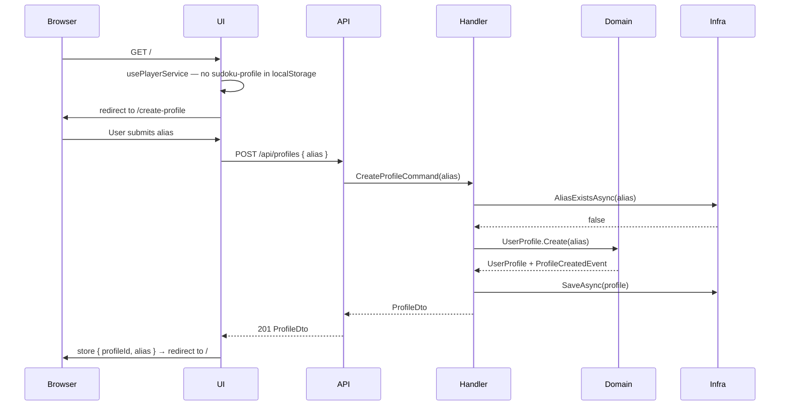
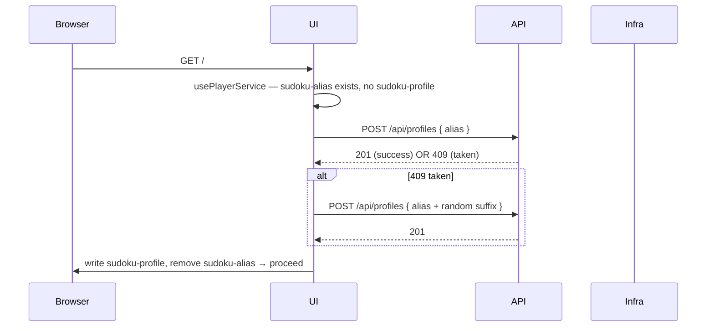

# Player Profile — Creation Flow & Profile Page

**Covers:** Issues [#211](https://github.com/xenobiasoft/sudoku/issues/211) and [#213](https://github.com/xenobiasoft/sudoku/issues/213)

---

## 1. Overview

**Feature Name:** Player Profile — Creation Flow & Profile Page

**Problem Statement**
Users are silently assigned a random auto-generated alias (e.g., `CleverTiger42`) with no way to choose their identity or manage it later. There is no persistent `UserProfile` record — player identity is inferred by querying game documents. This makes the app feel impersonal and blocks any future identity-dependent features (profile locking, stats, leaderboards).

**Goals**
- Let users choose their own alias during first-visit onboarding (hard gate — must complete before accessing the app)
- Persist a `UserProfile` document per player in a dedicated CosmosDB container
- Silently migrate existing users (localStorage alias → profile record, no interruption to their session)
- Give users a dedicated `/profile` page to view and edit their alias
- Stub `lockedAt` / `lockToken` fields to avoid a schema migration when issue #212 is implemented

**Non-Goals**
- Authentication or passwordless locking (issue #212)
- Email, social features, avatar uploads
- Alias change history or audit log
- Multi-profile switching within one browser session

---

## 2. Functional Requirements

| ID | Requirement |
|----|-------------|
| FR-1 | New users (no `sudoku-profile` in localStorage) are redirected to `/create-profile` before any other page loads |
| FR-2 | Profile creation requires the user to enter an alias: 2–50 characters, alphanumeric and spaces only. Aliases are treated as **case-insensitive**: the value is normalized to lowercase before validation, storage, and uniqueness checks ("Tiger" and "tiger" are the same alias) |
| FR-3 | Alias must be globally unique; a duplicate alias returns HTTP 409 with a user-friendly error message |
| FR-4 | On successful creation, `{ profileId, alias }` is stored in localStorage and the user is redirected to home |
| FR-5 | Existing users with only an alias in localStorage (pre-migration) have a profile silently created on next app load; if the alias is taken (409), append a random 2-digit suffix and retry once before falling through to the creation flow. **Edge case:** if the stored alias is exactly 50 characters, a suffix cannot be appended without exceeding the limit — skip the retry and fall through to the creation flow with an appropriate message |
| FR-6 | `/profile` page displays: current alias and `createdAt` date. Game stats (total, in-progress, completed) are deferred to a future issue |
| FR-7 | Users can edit their alias on the profile page; a successful change updates the profile document and all associated game documents |
| FR-8 | Both React and Blazor frontends implement all flows to maintain feature parity |
| FR-9 | If `sudoku-profile` is present in localStorage but the profile API returns 404 (CosmosDB document missing — e.g., after a data migration or container recreation), the app attempts to re-create the profile using the stored alias. On 201: update localStorage with the new profileId and continue. On 409 (alias claimed by another user): redirect to `/create-profile` |

---

## 3. Non-Functional Requirements

- **Performance:** Profile lookup by alias must be a single within-partition query (O(1) per partition); no full-container scans. Note: because `id = profileId` (GUID) and the partition key is `/alias`, a lookup by alias uses a within-partition SQL query rather than a true CosmosDB point-read — both are O(1) but this distinction matters for the CosmosDB SDK call
- **Security:** `lockToken` field is stored hashed (bcrypt/SHA-256); never returned in API responses (reserved for #212)
- **Reliability:** Alias change is a best-effort sequential batch update across game documents; partial failure is logged but does not roll back the profile update
- **Observability:** Log `ProfileCreated` and `ProfileAliasUpdated` events with alias and profileId (no PII beyond alias); emit Application Insights custom events
- **Accessibility:** Profile creation form must be keyboard-navigable and WCAG 2.1 AA compliant
- **Deployment:** New `profiles` CosmosDB container must be provisioned in Bicep before deployment; no code-first migration needed

---

## 4. Architecture Overview

**Affected Projects:** `Sudoku.Domain`, `Sudoku.Application`, `Sudoku.Infrastructure`, `Sudoku.Api`, `Sudoku.React`, `Sudoku.Blazor`

New CosmosDB container `profiles` — partition key: `/alias`, unique constraint on `/alias`.

`PlayerAlias` value object is reused as-is. `SudokuGame` documents continue to store `playerAlias` as a plain string; an alias change triggers a sequential batch update of all game documents for that player via the existing `IGameRepository`.

**Sequence — First visit (new user):**



**Sequence — Existing user (silent migration):**



---

## 5. Data Models & Contracts

### Domain Models

**New aggregate: `UserProfile`** — `src/backend/Sudoku.Domain/Entities/UserProfile.cs`

```csharp
public class UserProfile : AggregateRoot
{
    public ProfileId Id { get; private set; }
    public PlayerAlias Alias { get; private set; }
    public DateTime CreatedAt { get; private set; }
    public DateTime UpdatedAt { get; private set; }
    public DateTime? LockedAt { get; private set; }   // reserved for #212
    public string? LockToken { get; private set; }    // reserved for #212, stored hashed

    private UserProfile() { }

    public static UserProfile Create(PlayerAlias alias)
    {
        var profile = new UserProfile
        {
            Id = ProfileId.New(),
            Alias = alias,
            CreatedAt = DateTime.UtcNow,
            UpdatedAt = DateTime.UtcNow
        };
        profile.AddDomainEvent(new ProfileCreatedEvent(profile.Id, alias));
        return profile;
    }

    public void UpdateAlias(PlayerAlias newAlias)
    {
        var old = Alias;
        Alias = newAlias;
        UpdatedAt = DateTime.UtcNow;
        AddDomainEvent(new ProfileAliasUpdatedEvent(Id, old, newAlias));
    }
}
```

**New value object: `ProfileId`** — `src/backend/Sudoku.Domain/ValueObjects/ProfileId.cs`

```csharp
public record ProfileId
{
    public Guid Value { get; }
    private ProfileId(Guid value) => Value = value;
    public static ProfileId New() => new(Guid.NewGuid());
    public static ProfileId From(Guid value) => new(value);
    public override string ToString() => Value.ToString();
}
```

**Existing reuse:** `PlayerAlias` value object (`src/backend/Sudoku.Domain/ValueObjects/PlayerAlias.cs`) — no changes needed.

### DTOs / API Contracts

**New: `ProfileDto`** — `src/backend/Sudoku.Application/DTOs/ProfileDto.cs`

```csharp
public record ProfileDto(string ProfileId, string Alias, DateTime CreatedAt, DateTime UpdatedAt);
```

**API request models:**

```csharp
// src/backend/Sudoku.Api/Models/CreateProfileRequest.cs
public record CreateProfileRequest([Required] string Alias);

// src/backend/Sudoku.Api/Models/UpdateProfileAliasRequest.cs
public record UpdateProfileAliasRequest([Required] string NewAlias);
```

### Persistence Changes

**New CosmosDB container: `profiles`**

- Partition key: `/alias`
- Unique key policy: `/alias`
- Bicep resource to add to `infra/main.bicep`

**New document model: `UserProfileDocument`** — `src/backend/Sudoku.Infrastructure/Models/UserProfileDocument.cs`

```csharp
public class UserProfileDocument
{
    [JsonProperty("id")]        public string Id { get; set; } = string.Empty;      // = profileId (string)
    [JsonProperty("profileId")] public string ProfileId { get; set; } = string.Empty;
    [JsonProperty("alias")]     public string Alias { get; set; } = string.Empty;
    [JsonProperty("createdAt")] public DateTime CreatedAt { get; set; }
    [JsonProperty("updatedAt")] public DateTime UpdatedAt { get; set; }
    [JsonProperty("lockedAt")]  public DateTime? LockedAt { get; set; }
    [JsonProperty("lockToken")] public string? LockToken { get; set; }
}
```

No changes to the existing `games` container or `SudokuGameDocument`.

---

## 6. CQRS Components

### Commands

**`CreateProfileCommand`** — `src/backend/Sudoku.Application/Commands/CreateProfileCommand.cs`

| Property | Type | Description |
|----------|------|-------------|
| `Alias` | `string` | The user-chosen alias |

Handler (`CreateProfileCommandHandler`):
1. Validate alias via `PlayerAlias.Create()` — throws `InvalidPlayerAliasException` on failure
2. Call `IUserProfileRepository.AliasExistsAsync()` — return failure if taken
3. Call `UserProfile.Create(alias)`
4. Call `IUserProfileRepository.SaveAsync(profile)`
5. Dispatch domain events via `IDomainEventDispatcher`
6. Return `Result<ProfileDto>`

---

**`UpdateProfileAliasCommand`** — `src/backend/Sudoku.Application/Commands/UpdateProfileAliasCommand.cs`

| Property | Type | Description |
|----------|------|-------------|
| `ProfileId` | `string` | The profile to update |
| `NewAlias` | `string` | The desired new alias |

Handler (`UpdateProfileAliasCommandHandler`):
1. Validate new alias via `PlayerAlias.Create()`
2. Load profile via `IUserProfileRepository.GetByIdAsync()`
3. Check `IUserProfileRepository.AliasExistsAsync(newAlias)` — return 409 if taken
4. Call `profile.UpdateAlias(newAlias)`
5. Persist profile
6. Batch-update all game documents: `IGameRepository.GetByPlayerAsync(oldAlias)` → update each `playerAlias` field
7. Return `Result<ProfileDto>`

### Queries

**`GetProfileByAliasQuery`** — `src/backend/Sudoku.Application/Queries/GetProfileByAliasQuery.cs`

| Property | Type |
|----------|------|
| `Alias` | `string` |

Handler returns `Result<ProfileDto?>` — null if not found.

---

## 7. Domain Events

| Event | Raised by | Properties | Purpose |
|-------|-----------|------------|---------|
| `ProfileCreatedEvent` | `UserProfile.Create()` | `ProfileId`, `Alias` | Audit log, App Insights telemetry |
| `ProfileAliasUpdatedEvent` | `UserProfile.UpdateAlias()` | `ProfileId`, `OldAlias`, `NewAlias` | Audit log, downstream sync |

Add to: `src/backend/Sudoku.Domain/Events/ProfileEvents.cs`

```csharp
public record ProfileCreatedEvent(ProfileId ProfileId, PlayerAlias Alias) : DomainEvent;
public record ProfileAliasUpdatedEvent(ProfileId ProfileId, PlayerAlias OldAlias, PlayerAlias NewAlias) : DomainEvent;
```

---

## 8. Repository Interface

**New: `IUserProfileRepository`** — `src/backend/Sudoku.Application/Interfaces/IUserProfileRepository.cs`

```csharp
public interface IUserProfileRepository
{
    Task<UserProfile?> GetByAliasAsync(PlayerAlias alias);
    Task<UserProfile?> GetByIdAsync(ProfileId id);
    Task<bool> AliasExistsAsync(PlayerAlias alias);
    Task SaveAsync(UserProfile profile);
}
```

**New: `CosmosDbUserProfileRepository`** — `src/backend/Sudoku.Infrastructure/Repositories/CosmosDbUserProfileRepository.cs`

Follows the same pattern as `CosmosDbGameRepository`: inject `ICosmosDbService`, map to/from `UserProfileDocument` via a `UserProfileMapper`.

---

## 9. UI/UX Flow

**Frontend Target:** React (Sudoku.React) and Blazor (Sudoku.Blazor) — both required for feature parity.

### Screens / Components

**React — New files:**
- `src/pages/CreateProfilePage.tsx` — alias input, client-side validation, submit → `POST /api/profiles`, store in localStorage, navigate to `/`
- `src/pages/ProfilePage.tsx` — displays alias and `createdAt`; inline edit form

**React — Updated files:**
- `src/App.tsx` — add routes `/create-profile` and `/profile`
- `src/hooks/usePlayerService.ts` — gate logic and migration (see below)
- `src/api/apiClient.ts` — add `createProfile(alias)`, `getProfile(alias)`, `updateProfileAlias(alias, newAlias)`

**Blazor — New files:**
- `src/frontend/Sudoku.Blazor/Components/Pages/CreateProfile.razor` — route `/create-profile`
- `src/frontend/Sudoku.Blazor/Components/Pages/Profile.razor` — route `/profile`

**Blazor — Updated files:**
- `IPlayerManager` / `PlayerManager` — add `CreateProfileAsync(string alias)`, `GetProfileAsync()`; update `TryGetPlayerAlias()` to redirect new users and silently migrate alias-only users
- `ILocalStorageService` — add `GetProfileAsync()` / `SetProfileAsync(ProfileInfo)`

### localStorage Shape Change (React)

```
Before: key='sudoku-alias'   value="CleverTiger42"
After:  key='sudoku-profile' value='{"profileId":"<guid>","alias":"CleverTiger42"}'
```

Migration in `usePlayerService.initializePlayer()`:
1. Check for `sudoku-profile` → attempt to parse JSON; if parse fails (malformed/corrupted value), treat as missing and fall through to step 3
2. If `sudoku-profile` is present and valid → use it (already migrated). If a subsequent profile API call returns 404 (orphaned profile — CosmosDB document missing), attempt `POST /api/profiles` with the stored alias. On 201: update localStorage with new profileId and continue. On 409: redirect to `/create-profile` (FR-9)
3. Else check for `sudoku-alias` → call `POST /api/profiles` silently → on success write `sudoku-profile`, remove `sudoku-alias`. If alias is exactly 50 chars, skip suffix retry and redirect to `/create-profile` with a message (FR-5 edge case)
4. Else → navigate to `/create-profile`

### User Flow

```
New user:
  Any page → no sudoku-profile → redirect /create-profile
  /create-profile: enter alias → submit → 201 → store profile → redirect /

Returning user (already migrated):
  Any page → has sudoku-profile → proceed normally (or orphaned-profile recovery per FR-9 if API returns 404)
  Nav to /profile → view alias + createdAt → edit alias → PATCH → update localStorage

Returning user (pre-migration, has sudoku-alias):
  Any page → has sudoku-alias, no sudoku-profile → silent POST /api/profiles
  → 201: write sudoku-profile, delete sudoku-alias → proceed normally
  → 409: retry with suffix → 201: proceed | fail: redirect /create-profile
```

---

## 10. API Endpoints

**New controller:** `ProfilesController` — `src/backend/Sudoku.Api/Controllers/ProfilesController.cs`

| Method | Path | Request Body | Response Body | Success | Error codes |
|--------|------|--------------|---------------|---------|-------------|
| POST | `/api/profiles` | `CreateProfileRequest` | `ProfileDto` | 201 | 400 invalid alias, 409 alias taken |
| GET | `/api/profiles/{alias}` | — | `ProfileDto` | 200 | 404 not found |
| PATCH | `/api/profiles/{alias}` | `UpdateProfileAliasRequest` | `ProfileDto` | 200 | 400, 404, 409 |

---

## 11. Testing Strategy

### Unit Tests
- `UserProfile.Create()` — valid alias creates profile and raises `ProfileCreatedEvent`
- `UserProfile.Create()` — invalid alias (too short, special chars) throws `InvalidPlayerAliasException`
- `UserProfile.UpdateAlias()` — raises `ProfileAliasUpdatedEvent` with old and new alias
- `CreateProfileCommandHandler` — alias taken returns `Result.Failure`; success returns `ProfileDto`
- `UpdateProfileAliasCommandHandler` — alias taken returns 409 result; success updates games

### Integration Tests
- `POST /api/profiles` → 201 with `ProfileDto`
- `POST /api/profiles` duplicate alias → 409
- `GET /api/profiles/{alias}` → 200 / 404
- `PATCH /api/profiles/{alias}` → 200; verify game documents updated

### UI Tests

**React:**
- `usePlayerService` navigates to `/create-profile` when no localStorage profile present
- `usePlayerService` silently migrates `sudoku-alias` to `sudoku-profile`
- `CreateProfilePage` disables submit on empty/invalid alias
- `CreateProfilePage` shows inline error on 409

**Blazor (bunit):**
- `CreateProfile.razor` renders alias input and submit button
- `CreateProfile.razor` displays validation error on 409 response

### Test Data / Fixtures
- AutoFixture can generate valid `PlayerAlias` values; add a customization to respect the 2–50 char, alphanumeric constraint
- Seed a `UserProfile` document for integration tests using the existing `ICosmosDbService` test setup pattern

---

## 12. Risks & Considerations

- **Alias uniqueness race condition:** Two users submitting the same alias simultaneously. Mitigated by the CosmosDB unique key constraint on `/alias`, which will return a conflict error at the database level regardless of application-layer checks.
- **Alias change → game documents:** Updating an alias is a multi-document operation with no distributed transaction. Implement as a best-effort sequential loop; log any document that fails to update. Consider making the alias change UI rare/confirmable (e.g., "Are you sure? This cannot be undone easily."). For users with large game histories, the sequential batch may approach API timeout limits; if this becomes an issue, moving the batch to a background job (returning 202 Accepted immediately) is the recommended mitigation.
- **Migration collision:** A user whose auto-generated alias was already claimed by another migrated user. FR-5 handles this with a suffix retry; if the retry also fails, fall through to the creation flow so the user can pick a fresh alias.
- **Blazor rendering mode:** The existing `ILocalStorageService` already handles the JS interop required for localStorage in SSR mode — no additional work needed.
- **`lockToken` field:** Never include this field in any API response DTO. It is write-only from the application's perspective until #212 is implemented.
- **Concurrent alias updates — last-write-wins:** `UpdateProfileAliasCommandHandler` performs a read-then-write with no atomic lock between them. Two simultaneous PATCH requests for the same profile can both pass the alias uniqueness check; the second write silently overwrites the first. CosmosDB's unique key constraint applies to creates only, not updates. This is accepted as last-write-wins. If this becomes a concern, ETag-based optimistic concurrency on the profile document is the recommended mitigation.
- **Stale PATCH routing after alias change:** `PATCH /api/profiles/{alias}` uses the current alias as the path parameter. After renaming "Tiger" → "Lion," a stale client still holding "Tiger" in localStorage will receive 404 on the next PATCH attempt. On PATCH 404, the client should apply the FR-9 orphaned-profile recovery flow. Typical single-session, single-tab usage is unaffected.
- **localStorage loss — no profile recovery path (until #212):** If a user clears browser history (including localStorage), they lose their `sudoku-profile` entry. Attempting to re-create their profile with the same alias returns 409, leaving them locked out of their game history. Without authentication there is no way to prove ownership of an alias. This is a **known limitation** until issue #212 (passwordless profile locking) is implemented; once shipped, users can use their lock token to recover their profile. Until then, users who lose localStorage must choose a new alias and forfeit access to prior games. Consider surfacing this in the UI (e.g., a note on the profile page: "Your profile is stored in this browser — clearing browser data will require you to create a new profile").

---

## 13. Implementation Plan

1. **Domain** — Create `ProfileId` value object, `UserProfile` aggregate, `ProfileEvents.cs`
2. **Application** — Add `IUserProfileRepository`, `ProfileDto`, `CreateProfileCommand` + handler, `UpdateProfileAliasCommand` + handler, `GetProfileByAliasQuery` + handler
3. **Infrastructure** — Add `UserProfileDocument`, `CosmosDbUserProfileRepository`, `UserProfileMapper`; provision `profiles` container in `infra/main.bicep`
4. **API** — Add `ProfilesController`, request models; register `IUserProfileRepository` in DI
5. **React** — Update `apiClient.ts`; update `usePlayerService.ts` (gate + migration); add `CreateProfilePage.tsx`, `ProfilePage.tsx`; update `App.tsx` routes
6. **Blazor** — Update `IPlayerManager`/`PlayerManager`; update `ILocalStorageService`; add `CreateProfile.razor`, `Profile.razor`
7. **Tests** — Unit tests for domain + handlers; integration tests for API; React + bunit UI tests
8. **Validate end-to-end** — New user flow, returning user (migrated), alias edit, both frontends

---

## 14. Open Questions

- Should alias editing on the profile page be restricted (e.g., once every 30 days) to discourage abuse, or is unrestricted editing acceptable for now?
- When `UpdateProfileAliasCommand` batch-updates game documents, should the operation be synchronous (blocking the API response) or kicked off as a background job?
- How should the profile page surface game stats? FR-6 currently shows alias + `createdAt` only. A follow-up issue should define whether stats are added to `ProfileDto`, fetched via `GET /api/players/{alias}/games`, or via a new `GET /api/profiles/{alias}/stats` endpoint.
