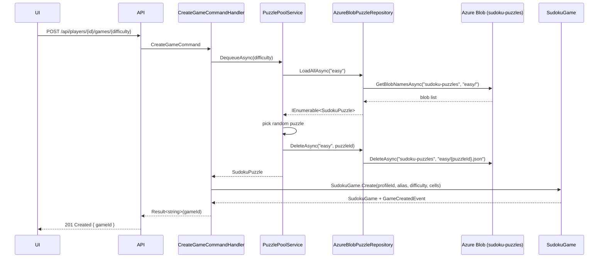
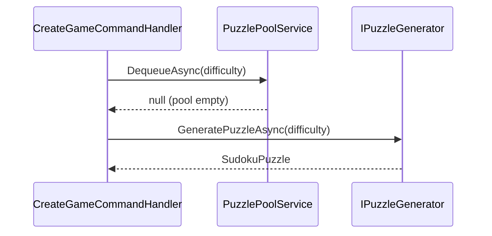
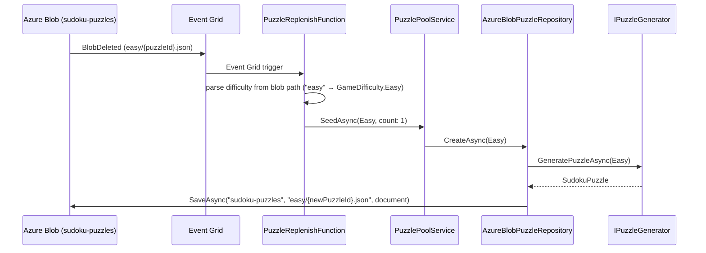
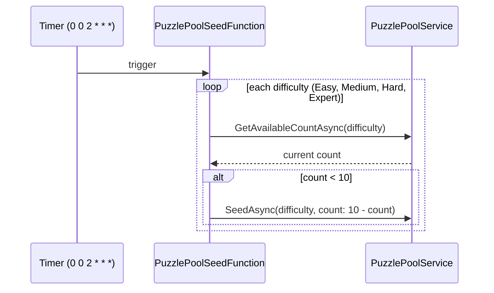

# Feature Specification: Pre-Generate Puzzle Pool

## 1. Overview

**Feature Name:** Pre-Generate Puzzle Pool

**Problem Statement**
Puzzle generation is performed synchronously on-demand inside `CreateGameCommandHandler`. The solver can take multiple seconds per puzzle, causing the `POST /api/players/{profileId}/games/{difficulty}` endpoint to time out and delivering a poor user experience. This is tracked as Issue #220.

**Goals**
- Eliminate on-demand puzzle generation from the new-game request path
- Keep the new-game endpoint response time under 500 ms under normal conditions
- Maintain a per-difficulty pool of 10 pre-generated puzzles in Azure Blob Storage (`sudoku-puzzles` container)
- Replenish the pool automatically: event-driven (one-for-one on consumption) with a nightly timer as a safety net

**Non-Goals**
- Client-side puzzle caching or offline puzzle generation
- Per-player or personalized puzzle pools
- Puzzle deduplication across players (two players may receive the same puzzle; this is acceptable at current scale)
- Distributed locking on puzzle claim (optimistic delete is sufficient at 10-puzzle pool size)

---

## 2. Functional Requirements

| ID | Requirement |
|----|-------------|
| FR-1 | `AzureBlobPuzzleRepository` shall implement `IPuzzleRepository` backed by a `sudoku-puzzles` blob container, with blobs named `{difficulty-name}/{puzzleId}.json` |
| FR-2 | `AzureBlobPuzzleRepository` shall expose an overloaded `CreateAsync(GameDifficulty difficulty)` method (without alias) that calls `IPuzzleGenerator`, persists the result as a blob, and returns the puzzle; `PuzzlePoolService` calls this overload directly |
| FR-3 | `IPuzzlePoolService.DequeueAsync(difficulty)` shall select a random available puzzle, load it, delete the blob (exclusive assignment), and return the puzzle |
| FR-4 | `CreateGameCommandHandler` shall call `IPuzzlePoolService.DequeueAsync(difficulty)` first; if the result is null it shall fall back to `IPuzzleGenerator.GeneratePuzzleAsync(difficulty)` |
| FR-5 | A `PuzzlePoolSeedFunction` (Timer trigger, `0 0 2 * * *`) shall call `IPuzzlePoolService.SeedAsync(difficulty, count)` for each difficulty, where `count = targetSize - GetAvailableCountAsync(difficulty)`, generating only the missing puzzles |
| FR-6 | A `PuzzleReplenishFunction` (Event Grid trigger on `BlobDeleted`) shall replace the consumed puzzle by calling `IPuzzlePoolService.SeedAsync(difficulty, 1)` — this is the primary replenishment path; `SeedAsync`'s `count` parameter means "number of puzzles to generate", not a target ceiling |
| FR-7 | An Event Grid System Topic and subscription for `BlobDeleted` events on the `sudoku-puzzles` container shall be defined in Bicep and deployed as part of this feature |
| FR-8 | If the pool is empty (e.g., first deploy before seed function runs), FR-4's on-demand fallback ensures game creation never fails |

---

## 3. Non-Functional Requirements

- **Performance:** Blob dequeue targets < 200 ms; on-demand fallback retains current behavior
- **Reliability:** An empty pool must never cause a game creation failure — the fallback is always available
- **Concurrency:** Optimistic delete (load → delete) is acceptable at 10-puzzle scale. If two concurrent requests race for the same blob, the second delete returns a 404 which is swallowed; at worst both callers receive the same puzzle grid, which is a low-severity duplicate
- **Observability:** Log pool size per difficulty on each seed cycle; log a warning when the on-demand fallback is taken
- **Security:** No new auth surface; `sudoku-puzzles` container uses existing `AzureStorageOptions` credentials
- **Deployment:** `Sudoku.Functions` (isolated worker, .NET 8) is a new project that runs alongside the API; Event Grid requires Bicep provisioning before the replenish function is live
- **Scalability:** Multiple API and Function instances share the same blob container; blob-delete provides per-instance exclusive claim without coordination overhead

---

## 4. Architecture Overview

**High-Level Description**

`AzureBlobPuzzleRepository` replaces `InMemoryPuzzleRepository` for pool operations, persisting pre-generated puzzles to a dedicated blob container. A new `IPuzzlePoolService` / `PuzzlePoolService` layer sits above it and exposes the count/seed/dequeue operations consumed by both the handler and the Azure Functions. The two Azure Functions provide the replenishment lifecycle: event-driven one-for-one replacement via Event Grid (`BlobDeleted`) and a nightly timer sweep as a safety net.

**Affected Projects**

| Project | Change |
|---------|--------|
| `Sudoku.Application` | New `IPuzzlePoolService` interface |
| `Sudoku.Infrastructure` | New `AzureBlobPuzzleRepository`, `PuzzlePoolService`, `SudokuPuzzleDocument`; DI wiring |
| `Sudoku.Functions` | **New project** — `PuzzlePoolSeedFunction`, `PuzzleReplenishFunction` |
| `Sudoku.AppHost` | Register `Sudoku.Functions` as Aspire resource |
| `infra/` (Bicep) | Event Grid System Topic + subscription for `sudoku-puzzles` BlobDeleted |
| `Sudoku.Api` | `appsettings.json` — no code changes |

**Sequence Diagram — Happy Path (pool has puzzles)**



**Sequence Diagram — Fallback Path (pool empty)**



**Sequence Diagram — Event-Driven Replenishment**



**Sequence Diagram — Nightly Timer Seed**



---

## 5. Data Models & Contracts

**New Infrastructure Model: `SudokuPuzzleDocument`**

Used to serialize/deserialize puzzle blobs. Reuses existing `CellDocument` from `SudokuGameDocument.cs`.

```csharp
public class SudokuPuzzleDocument
{
    public string PuzzleId { get; set; } = string.Empty;
    public string Difficulty { get; set; } = string.Empty;
    public List<CellDocument> Cells { get; set; } = [];
}
```

**Blob naming convention**

| Part | Value |
|------|-------|
| Container | `sudoku-puzzles` |
| Blob name | `{difficulty-name}/{puzzleId}.json` — e.g., `easy/3fa2c1....json` |
| Difficulty names | `easy`, `medium`, `hard`, `expert` — derived via `difficulty.Name.ToLowerInvariant()` (not `ToString()`, which returns the capitalized form e.g. `"Easy"`) |

**Persistence Changes**
- New Azure Blob Storage container: `sudoku-puzzles` (auto-created by `IAzureStorageService.SaveAsync` on first write)
- No Cosmos DB changes; no EF migrations
- New Event Grid System Topic and subscription (Bicep — see §12)

---

## 6. CQRS Components

**Commands — No new commands**

`CreateGameCommand` record is unchanged. Its handler gains a new dependency on `IPuzzlePoolService`.

**Queries — No new queries**

**Handler Change: `CreateGameCommandHandler`**

| Aspect | Detail |
|--------|--------|
| New dependency | `IPuzzlePoolService _puzzlePoolService` |
| Updated logic | `var puzzle = await _puzzlePoolService.DequeueAsync(difficulty);` then `puzzle ??= await _puzzleGenerator.GeneratePuzzleAsync(difficulty);` |
| Logging | `LogWarning` when the fallback path is taken |

---

## 7. Domain Events

No new domain events. `GameCreatedEvent` is raised by `SudokuGame.Create()` regardless of whether the puzzle came from the pool or on-demand generation.

---

## 8. UI/UX Flow

No UI changes. The improvement is transparent to the React PWA — the new-game endpoint returns faster.

---

## 9. API Endpoints

No new or changed endpoints. `POST /api/players/{profileId}/games/{difficulty}` behavior is unchanged; only its latency improves.

---

## 10. Testing Strategy

**Unit Tests**

| Test Class | Scenarios |
|------------|-----------|
| `CreateGameCommandHandlerTests` | Pool returns puzzle → handler uses it, generator not called; pool returns null → handler calls generator (fallback path) |
| `PuzzlePoolServiceTests` | `DequeueAsync` — puzzles available, random one returned and deleted; no puzzles → returns null. `SeedAsync(difficulty, count)` — calls `CreateAsync(difficulty)` exactly `count` times. `GetAvailableCountAsync` — returns correct count. |
| `AzureBlobPuzzleRepositoryTests` | `CreateAsync(difficulty)` overload — calls generator, saves blob at `{difficulty.Name.ToLowerInvariant()}/{id}.json`, returns puzzle. `LoadAllAsync` — deserializes blobs correctly. `DeleteAsync` — calls storage delete with correct path. |
| `PuzzleReplenishFunctionTests` | Parses difficulty from blob path using `ToLowerInvariant()`; calls `SeedAsync(difficulty, 1)` (generates exactly 1 puzzle); handles unknown difficulty name gracefully |
| `PuzzlePoolSeedFunctionTests` | Calls `SeedAsync(difficulty, 10 - currentCount)` for each difficulty; passes 0 when already at target (no generation) |

**Integration Tests**

Add a scenario to the existing `CreateGameCommandHandler` integration suite that stubs `IPuzzlePoolService.DequeueAsync` to return a `PuzzleFactory` fixture and asserts `IPuzzleGenerator` is not invoked.

**Test Data / Fixtures**

Reuse `PuzzleFactory.GetPuzzle(difficulty)` from `Tests/Helpers/Factories/PuzzleFactory.cs` as the puzzle returned by the mocked pool.

---

## 11. Risks & Considerations

| Risk | Mitigation |
|------|------------|
| Concurrent dequeue race (two API instances take same blob) | Optimistic: load then delete. At 10-puzzle pool size the collision probability is very low; worst case is two players receive identical grids. Pool replenishment restores count immediately via Event Grid. |
| `PuzzleReplenishFunction` cold start delays | Event Grid retries; the nightly timer is the safety net if a cold start causes a missed event |
| Event Grid not provisioned yet (first deploy) | FR-4 on-demand fallback ensures game creation works without the Event Grid subscription; timer seed runs nightly regardless |
| `AzureBlobPuzzleRepository.CreateAsync` generates slowly | Generation happens inside Functions (background), never in the request path |
| `InMemoryPuzzleRepository` still needed by `StrategyBasedPuzzleSolver` | `AzureBlobPuzzleRepository` is registered as the pool's implementation; `InMemoryPuzzleRepository` stays registered as `IPuzzleRepository` for solving. DI registration must be named/keyed to avoid collision — see §12 step 8. |

---

## 12. Implementation Plan

1. **Add `SudokuPuzzleDocument`** — `Infrastructure/Models/SudokuPuzzleDocument.cs`; reuse existing `CellDocument`
2. **Implement `AzureBlobPuzzleRepository`** — `Infrastructure/Repositories/AzureBlobPuzzleRepository.cs`; implement `IPuzzleRepository` using `IAzureStorageService` and the `sudoku-puzzles` container; add an overloaded `public Task<SudokuPuzzle> CreateAsync(GameDifficulty difficulty)` method (without alias) that derives the blob prefix via `difficulty.Name.ToLowerInvariant()`
3. **Add `IPuzzlePoolService`** — `Application/Interfaces/IPuzzlePoolService.cs` with `GetAvailableCountAsync(difficulty)`, `SeedAsync(difficulty, count)` (count = number to generate), `DequeueAsync(difficulty)`
4. **Implement `PuzzlePoolService`** — `Infrastructure/Services/PuzzlePoolService.cs`; depends directly on `AzureBlobPuzzleRepository` (not `IPuzzleRepository`) to access the alias-free `CreateAsync(difficulty)` overload
5. **Update `CreateGameCommandHandler`** — inject `IPuzzlePoolService`, apply dequeue-then-fallback logic, add fallback warning log
6. **Create `Sudoku.Functions` project** — isolated worker .NET 8; add project references to `Sudoku.Application` and `Sudoku.Infrastructure`; configure DI to share `IPuzzlePoolService` and its dependencies
7. **Implement `PuzzlePoolSeedFunction`** — Timer trigger `0 0 2 * * *`; iterate all 4 difficulties, call `GetAvailableCountAsync(difficulty)` and then `SeedAsync(difficulty, 10 - count)` when count < 10
8. **Implement `PuzzleReplenishFunction`** — Event Grid trigger; parse difficulty name from the deleted blob path using `ToLowerInvariant()`; call `SeedAsync(difficulty, 1)` to generate exactly one replacement puzzle
9. **Wire DI** in `InfrastructureServiceCollectionExtensions.cs` — register `AzureBlobPuzzleRepository` as a keyed service for the pool (distinct from the `InMemoryPuzzleRepository` used by the solver); register `IPuzzlePoolService → PuzzlePoolService`
10. **Update `Sudoku.AppHost`** — add `Sudoku.Functions` as an Aspire resource for local development
11. **Add Event Grid Bicep** — in `infra/`: create System Topic on the storage account, add event subscription filtering `Microsoft.Storage.BlobDeleted` on the `sudoku-puzzles` container, routing to the `PuzzleReplenishFunction` endpoint
12. **Update appsettings** — no new config section required; container name can be a constant in `AzureBlobPuzzleRepository` or read from `AzureStorageOptions`
13. **Add unit tests** — per §10 test table
14. **Verify end-to-end** — deploy to dev, confirm nightly function seeds pool, create a game, confirm fast path in logs, delete a blob manually to verify Event Grid triggers replenishment

---

## 13. Open Questions

None — all design decisions resolved.
