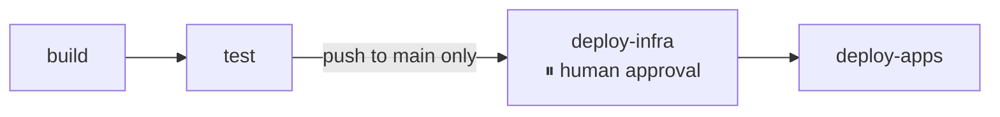
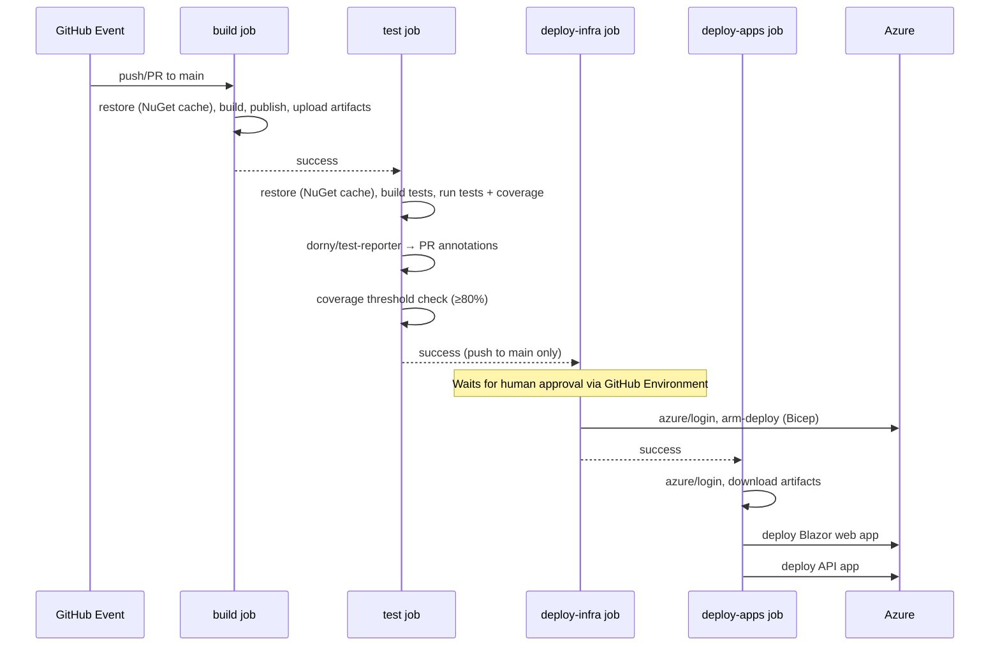

# Split GitHub Actions into Build → Test → Deploy Jobs

## Problem Statement

1. The deploy should only run on push to main (never on PRs)
2. There should be a human approval for the deployment job.
3. Option c should be used: Bicep runs before the app deployments.
4. I am happy with the default approach of upload publish folders as artifacts from build, and download them in deploy.
5. The NuGet package cache should be shared across jobs.
6. I would like to have additional GitHub PR check annotations via a test reporter action. If possible, I would like to block deployment unless there is at least 80 test coverage on new code.
7. Failures on the test job should be skipped automatically.
8. Only the deploy needs the Azure credentials.
9. For the sections that don't apply, fill in with "N/A"
10. No changes at this time

---

## 1. 🧭 Overview

**Feature Name:** Split CI/CD Pipeline into Discrete Build, Test, and Deploy Jobs

**Problem Statement:**
The current `main.yml` workflow executes all CI/CD steps inside a single `build-and-deploy` job. This means:
- PRs trigger a full Azure deployment (security and cost risk).
- A test failure does not prevent a potentially broken build from being deployed.
- Azure credentials are loaded even when no deployment occurs.
- There is no human approval gate before production changes go live.
- Test results are not surfaced as inline PR annotations.
- There is no code coverage enforcement.

**Goals:**
- Separate `build`, `test`, and `deploy` into distinct jobs with clear dependencies.
- Ensure deploy jobs run only on push to `main`, never on PRs.
- Require a human approval before any Azure resource is touched.
- Enforce ≥ 80 % line coverage on new code as a hard gate that blocks deployment.
- Surface test results and coverage as GitHub PR check annotations.
- Share the NuGet package cache across jobs to minimise restore time.
- Restrict Azure credentials to the deploy jobs only.

**Non-Goals:**
- Adding new environments (staging, preview).
- Changing trigger branches.
- Adding notifications (Slack, Teams, email).
- Changing the .NET version or runner OS.
- Modifying application source code.

---

## 2. 📌 Functional Requirements

| ID | Requirement |
|----|-------------|
| FR-01 | The `build` job runs on every push to `main` and every PR targeting `main`. |
| FR-02 | The `test` job runs only after `build` succeeds. |
| FR-03 | The `deploy-infra` job runs only after `test` succeeds **and** the event is `push` to `main`. |
| FR-04 | The `deploy-apps` job runs only after `deploy-infra` succeeds. |
| FR-05 | A required human reviewer must approve before `deploy-infra` proceeds (via GitHub Environment `production`). |
| FR-06 | If the `test` job fails, all downstream deploy jobs are skipped automatically. |
| FR-07 | The `build` job uploads the web and API publish folders as named artifacts. |
| FR-08 | The `deploy-apps` job downloads those artifacts before deploying. |
| FR-09 | The NuGet package cache (`~/.nuget/packages`) is keyed on `**/*.csproj` and shared/restored by every job that runs `dotnet restore`. |
| FR-10 | The `test` job collects code coverage using `coverlet.collector` (`XPlat Code Coverage` format). |
| FR-11 | The `test` job fails if line coverage on new/changed code falls below 80 %. |
| FR-12 | The `test` job publishes TRX test results as inline annotations on the PR/commit check using `dorny/test-reporter`. |
| FR-13 | TRX test result files are uploaded as an artifact (`test-results`) from the `test` job. |
| FR-14 | Azure Login (`azure/login`) is performed only in the deploy jobs; `build` and `test` have no Azure credentials. |
| FR-15 | The Bicep infrastructure template is deployed in `deploy-infra` before any app deployment in `deploy-apps`. |
| FR-16 | The Blazor web app and the API are deployed sequentially within `deploy-apps` (web first, then API). |

---

## 3. 🛡️ Non-Functional Requirements

- **Performance:** Shared NuGet cache ensures each job's `dotnet restore` completes in seconds after the first warm run. Total wall-clock time must not regress more than 5 minutes compared to the current single-job run.
- **Security:** Azure credentials are scoped exclusively to deploy jobs. `id-token: write` permission is retained on the workflow but only exercised in deploy jobs. No secrets are exposed to PR builds from forked repositories.
- **Reliability:** Each job independently retries transient GitHub runner failures via the default GitHub Actions retry semantics. A coverage-check failure must produce a clear, non-zero exit code so the gate is enforced even if the reporter action itself is skipped.
- **Observability:** Test results are visible as PR check annotations (via `dorny/test-reporter`). Coverage summary is printed to the job log and emitted as a step summary. Artifact uploads use `if: always()` so evidence is preserved on failure.
- **Accessibility:** N/A
- **Localization:** N/A
- **Deployment Considerations:** A GitHub Environment named `production` must exist in the repository settings with at least one required reviewer configured before this workflow is merged.
- **Scalability:** N/A

---

## 4. 🏛️ Architecture Overview

**High-Level Description:**
This change is entirely within the `.github/workflows/main.yml` file. No application source code is modified. The single `build-and-deploy` job is replaced by four jobs connected via `needs:` declarations. A GitHub Environment (`production`) provides the human approval gate. The NuGet cache action is declared in every job that performs a restore step, keyed identically so they all share the same cache entry.

**Affected Projects:**
- `.github/workflows/main.yml` — primary change
- GitHub Repository Settings — add `production` Environment with required reviewers

All application projects (Domain, Application, Infrastructure, API, Blazor) are unaffected.

**Job Dependency Graph (Mermaid):**

**Sequence Diagram:**

---

## 5. 📦 Data Models & Contracts

N/A — No domain models, DTOs, persistence changes, or API contracts are introduced.

---

## 6. 🔄 CQRS Components

N/A — No commands, queries, or handlers are introduced or modified.

---

## 7. 📣 Domain Events

N/A — No domain events are introduced or modified.

---

## 8. 🖥️ UI/UX Flow

N/A — No UI components are introduced or modified.

---

## 9. 🌐 API Endpoints

N/A — No API endpoints are introduced or modified.

---

## 10. 🧪 Testing Strategy

**Unit Tests:** N/A — no application code changes.

**Integration Tests:** N/A — no application code changes.

**UI Tests:** N/A — no UI code changes.

**Workflow Validation:**
The workflow itself is validated by running it end-to-end after merging:
- Verify a PR build runs `build` + `test` only and does **not** trigger any deploy job.
- Verify a push to `main` with passing tests pauses at `deploy-infra` awaiting approval.
- Verify that rejecting the approval leaves Azure untouched.
- Verify that approving runs `deploy-infra` (Bicep) and then `deploy-apps` (Blazor + API) in order.
- Verify that deliberately failing a test causes `deploy-infra` and `deploy-apps` to be skipped.
- Verify the TRX artifact and PR annotations appear on the PR checks page.
- Verify that a coverage drop below 80 % fails the `test` job and blocks the deploy chain.

---

## 11. ⚠️ Risks & Considerations

- **Coverage baseline:** The existing test suite must already meet ≥ 80 % line coverage before this gate is enforced, or it will immediately block all deploys. The coverage threshold should be validated against the current test suite before merging.
- **`dorny/test-reporter` permissions:** The action requires `checks: write` permission (and `pull-requests: write` for PR annotations). These must be added to the workflow `permissions` block; the current workflow only declares `contents: read` and `id-token: write`.
- **`coverlet.collector` format:** `XPlat Code Coverage` produces Cobertura XML. `reportgenerator` (or the `dotnet-coverage` CLI) must be used to compute the aggregate line coverage percentage and apply the threshold. This requires adding `dotnet tool install` or a `uses:` step for the generator action.
- **GitHub Environment prerequisite:** The `production` environment must be manually created in GitHub repository settings before the workflow is merged. If it does not exist, the deploy jobs will error rather than pause for approval.
- **Artifact size:** Uploading the full publish folders (web + API) between jobs adds upload/download time. This is expected to be < 60 seconds for a typical Blazor + .NET API publish output.
- **Cache collision:** If multiple workflow runs execute concurrently and both attempt to write the NuGet cache on a cache miss, GitHub Actions handles this gracefully — the last writer wins, and no data is lost.
- **Breaking change to PR behavior:** PRs that previously triggered a full deploy will now only run `build` and `test`. Teams relying on automatic staging deploys from PRs must be informed; this is intentional per the requirements but is a behavioral change.

---

## 12. 🔧 Implementation Plan

1. **Create the `production` GitHub Environment** in repository Settings → Environments, adding at least one required reviewer.
2. **Add `checks: write` and `pull-requests: write`** to the workflow-level `permissions` block.
3. **Rename the existing job** from `build-and-deploy` to `build`; trim it to: checkout, setup .NET, NuGet cache, restore, build (`--no-restore`), publish web + API, upload artifacts (`publish-web`, `publish-api`).
4. **Add the `test` job** with `needs: build`: checkout, setup .NET, NuGet cache (restore from shared cache), restore, `dotnet test` with `--collect:"XPlat Code Coverage"` and `--logger trx`, run `reportgenerator` (or `danielpalme/ReportGenerator-GitHub-Action`) to compute totals and enforce the 80 % threshold (non-zero exit on failure), run `dorny/test-reporter` to publish TRX annotations, upload `test-results` artifact with `if: always()`.
5. **Add the `deploy-infra` job** with `needs: test`, `if: github.event_name == 'push' && github.ref == 'refs/heads/main'`, and `environment: production`: Azure Login, `azure/arm-deploy` (Bicep template).
6. **Add the `deploy-apps` job** with `needs: deploy-infra`: Azure Login, download `publish-web` and `publish-api` artifacts, `azure/webapps-deploy` for Blazor, `azure/webapps-deploy` for API.
7. **Remove Azure Login from `build` and `test` jobs** (already not there; confirm no stray credential steps remain).
8. **Validate** the pipeline end-to-end per the testing strategy above.

---

## 13. ❓ Open Questions

- **Coverage tool choice:** Should `reportgenerator` be installed as a global `dotnet tool` (requires a manifest or install step) or invoked via the `danielpalme/ReportGenerator-GitHub-Action` GitHub Action? The Action approach is simpler but adds a third-party action dependency.
- **Coverage scope:** Should the 80 % gate apply to the entire solution (all projects) or only to domain/application logic projects (excluding generated code, migrations, etc.)? Excluding test-infrastructure and generated files from the coverage report is advisable but requires a coverage filter list.
- **Parallel app deploys:** FR-16 specifies sequential deployment of Blazor and API within `deploy-apps`. If independent parallel deployment is preferred in the future, the two deploys can be split into separate jobs (`deploy-web`, `deploy-api`), both depending on `deploy-infra`. This is out of scope for this spec but noted for future consideration.
