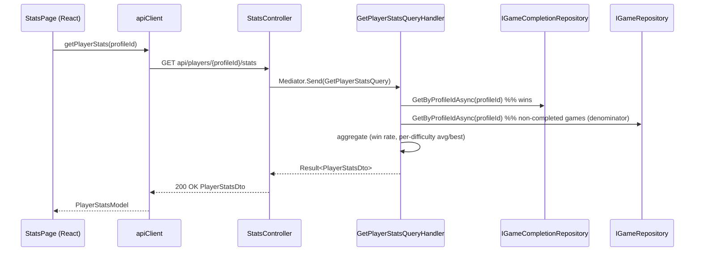

# Game Stats Page Specification

> Source: GitHub issue [#215](https://github.com/Xenobiasoft/sudoku/issues/215). Status: **Design — not yet implemented.**

## 1. Overview

**Feature Name:** Player Game Stats Page

**Problem Statement:**
There is no way for a player to track their progress or performance over time, reducing engagement and motivation. Two problems block this today:

1. **No stats surface.** Per-game data (difficulty, status, play duration) is captured but never aggregated or shown back to the player.
2. **Won games are destroyed.** When a puzzle is solved, the React client issues `DELETE api/players/{profileId}/games/{gameId}` (`GamePage.tsx:139`), and `DeleteGameCommandHandler` hard-deletes the Cosmos document. Although the game is briefly marked `Completed` server-side (a final move auto-completes it and raises `GameCompletedEvent`), it is destroyed moments later. **The server therefore retains zero record of wins** — so any stats built by scanning game documents would always read zero completions.

The fix is to **materialize a compact completion record** when a game is completed (via the already-raised `GameCompletedEvent`), independent of the heavy game document. The full solved game can still be deleted as it is today; the slim stats record survives and feeds a new stats page.

**Goals:**
- Give each player a Stats page surfacing per-user statistics: **games played, win rate, average solve time by difficulty, and best times**.
- Persist a durable, compact **completion record** on game completion so wins are never lost when the game document is deleted.
- Compute statistics **server-side** (authoritative), consistent with the project decision to keep game logic server-authoritative.
- Leverage the existing (currently stubbed) `GameCompletedEventHandler` and domain event pipeline; avoid changing the client's delete-on-solve behaviour.

**Non-Goals:**
- Keeping full solved-game documents (cells + move history) for history/replay. Completed games are reduced to stats-only records and **do not appear in the games list**.
- Changes to the games list page — no completed/active grouping and no "hide completed" toggle (the original idea, made unnecessary because completed games no longer surface as game documents).
- A rolling per-player aggregate document. Stats are stored as append-only per-completion records and aggregated on read (chosen for idempotency and re-aggregatability).
- Leaderboards, achievements, cross-player comparison.
- Extended metrics (accuracy %, hints used, total moves, streaks) and charts/graphs.
- Backfill of historical wins — all previously-completed games were already hard-deleted; stats accumulate from ship date forward.

---

## 2. Functional Requirements

| ID | Requirement |
|----|-------------|
| FR-1 | When a game is completed, `GameCompletedEventHandler` persists a completion record `{ gameId, profileId, difficulty, playDuration, completedAt }`. |
| FR-2 | The completion record is written before/independently of the client deleting the full game document, so a win is never lost. |
| FR-3 | As a backstop, deleting a `Completed` game ensures a completion record exists first (idempotent upsert from the game's own data), so a missed completion event cannot lose a win. |
| FR-4 | Writing a completion record is idempotent — a duplicate completion event or the delete-time backstop for the same `gameId` does not double-count (record is keyed by `gameId`). |
| FR-5 | A player can navigate to a Stats page from the Home page. |
| FR-6 | The Stats page shows three headline tiles: **games played** (= completion records + the player's current non-completed games), **games won** (= completion records), and **win rate**. |
| FR-7 | **Win rate** = wins ÷ games played (0 when the player has no games). |
| FR-8 | The Stats page shows, **for each difficulty** (Easy, Medium, Hard, Expert): games played, wins, average solve time, and best (fastest) solve time. |
| FR-9 | Average and best solve times use `playDuration` from completion records for that difficulty; a difficulty with no wins shows a dash (—). |
| FR-10 | Stats are computed server-side and returned by a single `GET api/players/{profileId}/stats` endpoint. |
| FR-11 | A player with no games/wins sees a clear empty state, not an error. |
| FR-12 | A player who has not created a profile is redirected away from the Stats page (same guard as other authenticated pages). |

---

## 3. Non-Functional Requirements

- **Performance:** Stats read = one query of the player's completion records (small N) plus one read of the player's non-completed games (already used elsewhere). No full-document scans of solved games (those don't exist). The completion write is a single small upsert on the completion path.
- **Reliability:** The completion record must be persisted durably. Primary write is `GameCompletedEventHandler`; a **delete-time backstop** (deleting a `Completed` game ensures a record exists first) closes the gap if the completion event is missed. Both writes are idempotent upserts keyed by `gameId`, so retries and the double-path never double-count.
- **Security:** The stats endpoint follows the existing identity model — `profileId` is a route parameter validated non-empty at the controller boundary, identical to all other `api/players/{profileId}/...` endpoints. No new auth surface.
- **Observability:** The completion handler logs each record write (profileId, gameId, difficulty); the query handler logs profileId and aggregated counts, mirroring existing handlers. Errors flow through the `Result<T>` → HTTP mapping.
- **Accessibility:** Stat tiles and per-difficulty rows use semantic markup and the Zen theme tokens (WCAG AA contrast), keyboard-navigable, working in light and dark themes.
- **Localization:** Minimal English strings, consistent with existing pages (no i18n framework today).
- **Deployment considerations:** A **new Cosmos container `game-completions`** (partition key `/profileId`) must be provisioned alongside the existing games container. This is the one infrastructure addition. (See §11 for the single-container alternative.)
- **Scalability:** Completion records are tiny and append-only; per-player volume is modest. Aggregation is O(player's completions).

---

## 4. Architecture Overview

### High-Level Description

Two flows:

**Write (on completion).** The `SudokuGame` aggregate's `CompleteGame()` raises an **enriched** `GameCompletedEvent` carrying `ProfileId`, `Difficulty`, `Statistics`, and `CompletedAt`. `IDomainEventDispatcher` dispatches it in-process **after persistence**, invoking `GameCompletedEventHandler` (Infrastructure) — currently a stub with a literal TODO "Update player statistics." The handler maps the event to a `GameCompletion` record and upserts it (keyed by `gameId`) via a new `IGameCompletionRepository`. The heavy game document is unaffected and is still deleted by the client's existing delete-on-solve call.

**Read (stats page).** `StatsController` → `GetPlayerStatsQuery` → handler loads the player's completion records (`IGameCompletionRepository`) and non-completed games (`IGameRepository.GetByProfileIdAsync`), aggregates them into `PlayerStatsDto`, and returns it. The React `StatsPage` renders KPI tiles + per-difficulty rows.

### Affected Projects

- **Domain:** Enrich `GameCompletedEvent` with `ProfileId`, `Difficulty`, `CompletedAt` (raised in `CompleteGame()`).
- **Application:** New `GetPlayerStatsQuery` + handler; `PlayerStatsDto`/`DifficultyStatsDto`; `GameCompletion` read model; `IGameCompletionRepository` interface; `DeleteGameCommandHandler` gains the delete-time backstop (upsert a completion record before deleting a `Completed` game).
- **Infrastructure:** Implement `GameCompletedEventHandler` to write the record; new `CosmosDbGameCompletionRepository` + `GameCompletionDocument` (mirrors the `profiles` container's `AutoCreateContainers`/`CreateContainerIfNotExistsAsync` pattern); DI registration; new `game-completions` Cosmos container.
- **API:** New `StatsController` with one GET endpoint.
- **React/Vite:** New `StatsPage` + styles + test, `useStatsService` hook, `apiClient.getPlayerStats`, `PlayerStatsModel`/`DifficultyStatsModel` types, `/stats` route, Home page nav card. **No games-list or GamePage changes.**
- **Aspire components:** New container provisioning (see §3 Deployment).

### Sequence Diagram — Completion write (new)

```mermaid
sequenceDiagram
    participant UI as GamePage (React)
    participant API as Backend API
    participant Domain as SudokuGame
    participant Disp as IDomainEventDispatcher
    participant H as GameCompletedEventHandler
    participant CRepo as IGameCompletionRepository

    UI->>API: PUT .../actions (final move)
    API->>Domain: MakeMove(...) → CompleteGame()
    Domain-->>API: raises GameCompletedEvent(profileId, difficulty, stats, completedAt)
    API->>Disp: dispatch after persistence
    Disp->>H: HandleAsync(event)
    H->>CRepo: Upsert(GameCompletion keyed by gameId)
    UI->>API: DELETE .../games/{gameId} (existing behaviour)
    Note over API,CRepo: DeleteGameCommandHandler backstop:<br/>if game is Completed, ensure record exists (idempotent) before deleting
    Note over API: full game doc deleted; completion record remains
```

### Sequence Diagram — Stats read (new)



---

## 5. Data Models & Contracts

### Domain Models

Enriched event (`src/backend/Sudoku.Domain/Events/GameEvents.cs`):

```csharp
public record GameCompletedEvent(
    GameId GameId,
    ProfileId ProfileId,
    GameDifficulty Difficulty,
    GameStatistics Statistics,
    DateTime CompletedAt) : DomainEvent;
```

Raised in `SudokuGame.CompleteGame()` (SudokuGame.cs:478) where all fields are in scope. No other aggregate changes.

### Read Model (new)

`GameCompletion` (Application read model — no domain invariants):

```csharp
public record GameCompletion(
    string GameId,        // record identity (idempotency key)
    string ProfileId,     // partition key
    string Difficulty,    // "Easy" | "Medium" | "Hard" | "Expert"
    TimeSpan PlayDuration,
    DateTime CompletedAt);
```

### DTOs / API Contracts

`src/backend/Sudoku.Application/DTOs/PlayerStatsDto.cs`:

```csharp
public record PlayerStatsDto(
    int GamesPlayed,
    int GamesWon,
    double WinRate,
    IReadOnlyList<DifficultyStatsDto> ByDifficulty);

public record DifficultyStatsDto(
    string Difficulty,          // Easy | Medium | Hard | Expert
    int GamesPlayed,
    int GamesWon,
    TimeSpan? AverageSolveTime, // null when no wins at this difficulty
    TimeSpan? BestSolveTime);   // null when no wins at this difficulty
```

Serialization: `System.Text.Json` serializes `TimeSpan` as `"HH:MM:SS"` in this app (matches the existing `GameStatisticsModel.playDuration` string on the frontend); nullable durations serialize to `null`.

Example response:

```json
{
  "gamesPlayed": 12,
  "gamesWon": 7,
  "winRate": 0.5833333333333334,
  "byDifficulty": [
    { "difficulty": "Easy",   "gamesPlayed": 5, "gamesWon": 4, "averageSolveTime": "00:06:12", "bestSolveTime": "00:04:30" },
    { "difficulty": "Medium", "gamesPlayed": 4, "gamesWon": 2, "averageSolveTime": "00:11:45", "bestSolveTime": "00:09:20" },
    { "difficulty": "Hard",   "gamesPlayed": 3, "gamesWon": 1, "averageSolveTime": "00:18:03", "bestSolveTime": "00:18:03" },
    { "difficulty": "Expert", "gamesPlayed": 0, "gamesWon": 0, "averageSolveTime": null,       "bestSolveTime": null }
  ]
}
```

Frontend types (`src/frontend/Sudoku.React/src/types/index.ts`): `PlayerStatsModel` / `DifficultyStatsModel` mirroring the DTOs, with `averageSolveTime`/`bestSolveTime` as `string | null` ("HH:MM:SS").

### Persistence Changes

- **New Cosmos container `game-completions`**, partition key `/profileId`, document id = `gameId` (idempotent upsert). Document shape `GameCompletionDocument` mirrors `GameCompletion` (Infrastructure `Models/`).
- No changes to the games container. No migration of existing data (none exists to migrate).

---

## 6. CQRS Components

### Queries

**`GetPlayerStatsQuery(string ProfileId) : IQuery<PlayerStatsDto>`** — `src/backend/Sudoku.Application/Queries/`. No filters/paging.

### Handlers

**`GetPlayerStatsQueryHandler : IQueryHandler<GetPlayerStatsQuery, PlayerStatsDto>`** — dependencies `IGameCompletionRepository`, `IGameRepository`, `ILogger<>`. Same try/`DomainException`/`Exception` + logging structure as `GetPlayerGamesQueryHandler`.

Aggregation:
1. `profileId = ProfileId.From(request.ProfileId)`.
2. `completions = await completionRepository.GetByProfileIdAsync(profileId)` → wins.
3. `activeGames = (await gameRepository.GetByProfileIdAsync(profileId)).Where(g => g.Status != Completed)` → in-progress/paused/abandoned (excludes any transient just-completed doc to avoid double counting).
4. `GamesWon = completions.Count`; `GamesPlayed = GamesWon + activeGames.Count`; `WinRate = GamesPlayed == 0 ? 0 : (double)GamesWon / GamesPlayed`.
5. For each of the four difficulties (fixed order Easy→Medium→Hard→Expert so empty rows still appear): `wins = completions.Where(difficulty)`, `won = wins.Count`, `played = won + activeGames.Where(difficulty).Count`; if `won > 0`: `AverageSolveTime = wins.Average(PlayDuration)`, `BestSolveTime = wins.Min(PlayDuration)`; else both `null`.
6. Return `Result<PlayerStatsDto>.Success(...)` with an informational log.

The controller contains no business logic; the handler performs read-side projection only.

---

## 7. Domain Events

| Event | Change | Payload added | Handler |
|-------|--------|---------------|---------|
| `GameCompletedEvent` | Enriched (was `(GameId, GameStatistics)`) | `ProfileId`, `Difficulty`, `CompletedAt` | `GameCompletedEventHandler` implemented to upsert a `GameCompletion` via `IGameCompletionRepository` |

No new events. Dispatch remains in-process after persistence via `IDomainEventDispatcher`. Update any existing consumers/tests of the old `GameCompletedEvent` signature.

---

## 8. UI/UX Flow

**Frontend Target:** React/Vite (`src/frontend/Sudoku.React`). **Scope is the Stats page only — no games-list or GamePage changes.**

### Screens / Components

- **New:** `src/pages/StatsPage.tsx` + `StatsPage.module.css` + `StatsPage.test.tsx`.
- **New:** `src/hooks/useStatsService.ts` — `{ stats, isLoading, error, isLoaded }` with a `loadingRef` concurrency guard, mirroring `useGameService`.
- **Updated:** `src/api/apiClient.ts` — add `getPlayerStats(profileId): Promise<PlayerStatsModel>` using the existing `request<T>()` helper.
- **Updated:** `src/types/index.ts` — add `PlayerStatsModel`, `DifficultyStatsModel`.
- **Updated:** `src/App.tsx` — add `<Route path="/stats" element={<StatsPage />} />`.
- **Updated:** `src/pages/HomePage.tsx` — add a "Stats" card to the existing cards list navigating to `/stats`.
- **Reused:** `Layout` (`title="Stats"`), the `VictoryDisplay` stat-tile pattern (Newsreader value + global `.tnum` + uppercase caption), the `GameListPage` loading/empty/error structure, and a duration formatter like `GameThumbnail`'s `formatDuration("HH:MM:SS")` (extract to `src/utils/` if shared).

Page layout: `<Layout title="Stats">` → three headline KPI tiles (Games played, Games won, Win rate %) → a per-difficulty section (Easy/Medium/Hard/Expert rows: games, avg time, best time; dash for difficulties with no wins) → empty state when `gamesPlayed === 0`.

### State Management

- Local state via `useStatsService`; single GET on mount; identity from `usePlayerService` (`profileId`, `isNewPlayer`). Guard: `if (isNewPlayer) navigate('/')`.
- Error handling: inline error state like `GameListPage`. No direct `fetch` in the component.

---

## 9. API Endpoints

New `StatsController : BaseGameController` — `src/backend/Sudoku.Api/Controllers/StatsController.cs`, `[Route("api/players/{profileId}/stats")]` (kept off `GamesController` so the route is `.../stats`, not `.../games/stats`).

| Method | Route | Auth | Request | Success | Errors |
|--------|-------|------|---------|---------|--------|
| GET | `api/players/{profileId}/stats` | route `profileId` (same as all game endpoints) | none | `200 OK` `PlayerStatsDto` | `400 Bad Request` (empty `profileId` or handler failure) |

Behaviour mirrors `GamesController.GetAllGamesAsync`: validate `profileId` non-empty → `BadRequest`; `Mediator.Send(new GetPlayerStatsQuery(profileId))`; `!IsSuccess` → `BadRequest(result.Error)`; else `Ok(result.Value)`. XML docs + `[ProducesResponseType]` for `200`/`400`. An empty player is a valid `200` with zeroed stats (not `404`).

---

## 10. Testing Strategy

### Unit Tests (backend)

- **`GameCompletedEventHandler`:** writes a `GameCompletion` with the event's `profileId`, `gameId`, `difficulty`, `playDuration`, `completedAt`; upsert is idempotent (same `gameId` twice → one record). Mock `IGameCompletionRepository`.
- **`DeleteGameCommandHandler` backstop:** deleting a `Completed` game with no existing record upserts one from the game before deleting; deleting a non-completed game writes no record; deleting a `Completed` game whose record already exists does not double-write.
- **Domain:** `CompleteGame()` raises `GameCompletedEvent` with the enriched payload (profileId, difficulty, completedAt, stats).
- **`GetPlayerStatsQueryHandler`:** win rate = wins ÷ (wins + non-completed games); per-difficulty avg/best from completion `playDuration`; difficulty with no wins → `null` avg/best; empty player → zeros/nulls, no divide-by-zero; repository throwing → `Result.Failure` (both exception paths). Completed docs (if transiently present) excluded from the denominator.

Note: when creating new handler test files, omit `[LogOutput]` or add `using DepenMock.Attributes;` to avoid CS1614.

### Integration / Controller Tests (backend)

`StatsController`: empty/whitespace `profileId` → `400`; valid → `200` with the DTO; failed `Result` → `400`.

### UI Tests (frontend)

`StatsPage.test.tsx` (Vitest + @testing-library/react), mocking `apiClient`/`useStatsService` at the module boundary (never the network layer): KPI values, per-difficulty rows (dash for no-win difficulty), empty state, `isNewPlayer` redirect.

### Test Data / Fixtures

Backend: AutoFixture + explicit `GameCompletion`/`SudokuGame` fixtures at known difficulties/durations/statuses. Frontend: `src/test/helpers.ts` factories for `PlayerStatsModel`. CI enforces 80% line coverage on new backend code; run `npm run build` before pushing (CI type-checks tests via `tsc -b`).

---

## 11. Risks & Considerations

- **Completion-write reliability (mitigated):** The client deletes the full game document shortly after completion. The primary write (`GameCompletedEventHandler`) plus the **delete-time backstop** (a `Completed` game cannot be deleted without a record existing first) means a win survives even if the completion event is missed. Both writes are idempotent by `gameId`. Residual edge case: the game is completed but the client never issues the delete (e.g., crash) *and* the event write failed — then a completed doc lingers (harmless, excluded from reads) until re-deleted. Failed writes should still be logged/alertable. Server-side delete-on-completion was rejected because the client's `makeMove` does PUT-then-GET and the follow-up GET would 404.
- **Denominator is retention-dependent:** "Games played" = wins + currently-existing non-completed games. If a player deletes an in-progress or abandoned game, it drops out of the denominator. Accepted as consistent with "a deleted game is gone"; win rate includes in-progress games (per the agreed definition). Showing separate Played/Won/Win-rate tiles makes the relationship transparent.
- **Container provisioning:** A new `game-completions` Cosmos container is required — cheap given the `profiles` container precedent (`AutoCreateContainers` in dev; infra provisioning in prod). The single-container `type`-discriminator alternative was considered and not chosen (mixes read models with aggregates, forces type-filtering on every game query).
- **Event-signature change:** Enriching `GameCompletedEvent` touches its declaration, `CompleteGame()`, the handler, and any tests referencing the old shape — a contained, compile-checked change.
- **No historical data:** Stats start from ship date; previously-won games are already deleted and cannot be recovered.
- **Cross-project impact:** Domain (event), Application, Infrastructure, API, and one React page — no changes to existing gameplay, the games list, or the delete-on-solve flow.

---

## 12. Implementation Plan

1. **Domain:** Enrich `GameCompletedEvent` (add `ProfileId`, `Difficulty`, `CompletedAt`); update `CompleteGame()` to pass them.
2. **Application:** Add `GameCompletion` read model and `IGameCompletionRepository` (`GetByProfileIdAsync`, `GetByGameIdAsync`, `UpsertAsync`).
3. **Infrastructure:** Implement `GameCompletedEventHandler` to map the event → `GameCompletion` → `UpsertAsync`; add `CosmosDbGameCompletionRepository` + `GameCompletionDocument`; register in DI; provision the `game-completions` container.
4. **Application (backstop):** In `DeleteGameCommandHandler`, when the game being deleted is `Completed`, upsert a completion record (idempotent) before `DeleteAsync`.
5. **Application (read):** Add `PlayerStatsDto`/`DifficultyStatsDto`, `GetPlayerStatsQuery`, `GetPlayerStatsQueryHandler` (§6 aggregation).
6. **API:** Add `StatsController` with `GET api/players/{profileId}/stats`.
7. **Backend tests:** Handler-write, backstop, domain-event, query-aggregation, and controller tests; verify ≥80% coverage.
8. **Frontend:** Add `PlayerStatsModel`/`DifficultyStatsModel`, `apiClient.getPlayerStats`, `useStatsService`, `StatsPage` (three KPI tiles) + styles, `/stats` route, Home "Stats" card.
9. **Frontend tests:** `StatsPage.test.tsx`; run `npm run lint` and `npm run build`.
10. **Validate end-to-end:** Run API + React; complete several games across difficulties; confirm a completion record is written, the solved game is still removed from the list, and `/stats` numbers match the completions.

---

## 13. Open Questions

None outstanding. The following were raised during design and resolved:

- **Completion durability / delete ordering** → **Event-handler write + delete-time backstop**, keeping the client-driven delete. Server-side delete-on-completion was rejected (the client's `makeMove` PUT-then-GET would 404).
- **Storage** → **Dedicated `game-completions` Cosmos container** (partition key `/profileId`), not a `type` discriminator on the games container.
- **Zero-duration wins** → **Include as-is** in average/best; `PlayDuration` is reliably populated from moves, so `00:00:00` should be vanishingly rare.
- **KPI presentation** → **Three headline tiles: Games played, Games won, Win rate** (makes the win-rate numerator/denominator self-evident).
