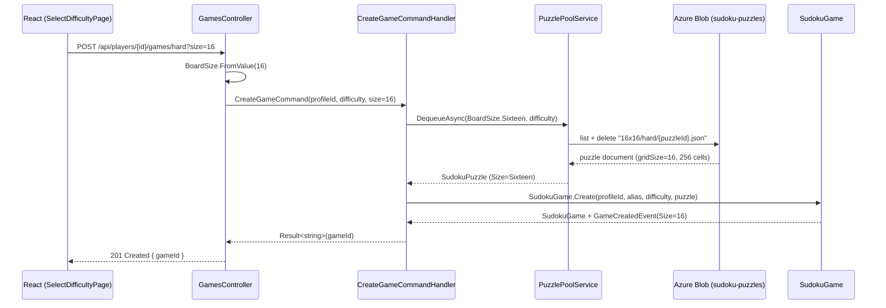
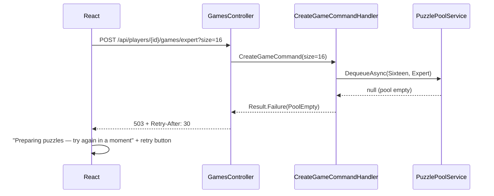

# Feature Specification: 16x16 Sudoku Variant

## 1. Overview

**Feature Name:** 16x16 Sudoku Variant (symbols 1–9, A–G)

**Problem Statement**
The game supports only classic 9x9 Sudoku. Players who want a longer, more challenging session have no option beyond the Expert difficulty. A 16x16 variant (four 4x4 boxes per band, 16 symbols rendered as 1–9 and A–G) adds a substantially deeper game mode. Today the codebase has no grid-size concept at all — `9`, `81`, and `3` are literals scattered across the Domain, Infrastructure, and React layers — so this feature also pays down that parameterization debt.

**Goals**
- Offer 16x16 as a board size **alongside** 9x9; existing games, puzzles, and stored documents keep working unchanged
- Full feature parity in the first release: all four difficulties (Easy–Expert), hints, game stats, and the pre-generated puzzle pool
- Cell values remain `int` 1..16 end-to-end; the A–G lettering is purely presentation (10=A … 16=G)
- Introduce a first-class `BoardSize` domain concept so future sizes are a data change, not a rewrite

**Non-Goals**
- Replacing or migrating 9x9 (both sizes coexist indefinitely)
- Generalizing the nine human-technique solver strategies (`SinglesIn*`, `TwinsIn*`, `TripletsIn*`) or `StrategyBasedPuzzleSolver` to 16x16 — 16x16 solving/generation uses the bitwise engine exclusively
- Other sizes (4x4, 12x12, 25x25) — `BoardSize` makes them cheaper later, but only 9 and 16 ship
- The Blazor frontend (archived under `archive/`, not built or deployed) and the Benchmarks project's 81-char string tooling
- Positional 4x4 pencil-mark grids (see §8 — 16x16 uses non-positional wrapped symbols)

---

## 2. Functional Requirements

| ID | Requirement |
|----|-------------|
| FR-1 | A `BoardSize` value object shall define the supported sizes: `Nine` (Size 9, BoxSize 3, MinimumClues 17, MaxHints 3) and `Sixteen` (Size 16, BoxSize 4, MinimumClues 55, MaxHints 6), constructed only via `BoardSize.FromValue(int)`, which throws a domain exception for any other value |
| FR-2 | `Cell`, `SudokuPuzzle`, and `SudokuGame` shall validate positions (`0..Size-1`), values (`1..Size`), cell count (`Size*Size`), and row/column/box uniqueness against the instance's `BoardSize` — no hard-coded 9/81/3 remains in the domain |
| FR-3 | `POST /api/players/{profileId}/games/{difficulty}?size=16` shall create a 16x16 game; `size` is optional and defaults to 9; values other than 9 or 16 return 400 |
| FR-4 | `BitwiseSolverEngine` shall solve and count solutions for both sizes, inferring the size from `grid.Length` (81→9, 256→16, otherwise throw) |
| FR-5 | `UniqueSolutionPuzzleGenerator` shall generate unique-solution 16x16 puzzles with per-difficulty empty-cell bands scaled from the 9x9 bands: Easy 126–142, Medium 145–155, Hard 158–168, Expert 171–183 (of 256). Bands are named constants, expected to be tuned after Phase 2 measurement |
| FR-6 | The legacy `PuzzleGenerator` shall throw `NotSupportedException` for any size other than 9 |
| FR-7 | The puzzle pool shall be keyed by (size, difficulty) with the uniform blob path `{size}x{size}/{difficulty}/{puzzleId}.json` for **all** sizes, including 9x9 |
| FR-8 | 16x16 game creation shall be served **only** from the pool: on pool-empty the handler returns a failure that the controller maps to **503 Service Unavailable + Retry-After: 30**; there is no inline 16x16 generation. 9x9 keeps its existing on-demand fallback |
| FR-9 | The pool seeder shall target 10 puzzles per difficulty for 9x9 and 5 for 16x16, and shall stop seeding when a per-invocation time budget is reached (resuming on the next timer/event trigger) |
| FR-10 | `SudokuGameDocument`, `SudokuPuzzleDocument`, and `GameCompletionDocument` shall carry a `gridSize` property defaulting to 9, so every pre-existing Cosmos and blob document deserializes as a 9x9 game with no migration |
| FR-11 | A 16x16 game shall allow 6 hints; 9x9 keeps 3. The allowance comes from `BoardSize.MaxHints`, replacing the flat `GameStatistics.MaxHints = 3` constant |
| FR-12 | `GameDto` shall expose `Size`; player stats shall be grouped by (size, difficulty), with legacy completions (no `gridSize`) counted as 9x9 |
| FR-13 | The React frontend shall render values 10–16 as letters A–G everywhere (board, number pad, pencil marks, thumbnails) via a single `symbols.ts` utility; the wire format stays numeric |
| FR-14 | The frontend shall accept keyboard input `1–9` for both sizes and `a–g`/`A–G` only when the board is 16x16; arrow navigation clamps to `Size-1`; erase behavior (0/Delete/Backspace) is unchanged |
| FR-15 | `SelectDifficultyPage` shall offer a board-size choice ("Classic 9×9" / "Giant 16×16" segmented toggle) alongside the existing difficulty cards, passed to the API as the `size` parameter |
| FR-16 | Client-side validation (`gameUtils.validateCells`, `getMiniGridCells`, `isSolved`) shall derive size and box size from the cell collection and work for both sizes |

---

## 3. Non-Functional Requirements

- **Performance:** 16x16 bitwise solving (hints, validation of uniqueness) completes in milliseconds — MRV backtracking scales fine at 256 cells. Generation is the expensive path (potentially minutes for Expert) and is confined to the pool seeder; the create-game request path never generates 16x16 inline. Board rendering must stay responsive at 256 cells (no per-cell re-render of the whole grid on input).
- **Reliability:** Pool-empty for 16x16 degrades to an honest 503 + Retry-After, never a gateway timeout. 9x9 behavior is unchanged (on-demand fallback preserved).
- **Backward compatibility:** Zero-migration deserialization of all existing Cosmos game documents and blob puzzles via the `gridSize = 9` default. Existing 9x9 API clients are unaffected (new query param is optional; new DTO field is additive).
- **Observability:** Log 16x16 generation duration per puzzle and per difficulty in the seeder (App Insights — keep at Debug/limited volume per the ingestion-cost incident); log a warning with `Retry-After` context whenever the 16x16 pool-empty path is taken; pool size per (size, difficulty) on each seed cycle.
- **Accessibility:** Cell `aria-label`s remain "Row r, column c"; number-pad buttons and pencil marks use the symbol (e.g. "A"), not the raw int, in accessible names. Keyboard play must be fully possible on 16x16 (letters + arrows).
- **Mobile usability:** A 16-column board on a phone is inherently dense; the layout must keep cells tappable (board may exceed viewport width constraints of the 9x9 design — wider `max-width`, smaller fonts via `clamp()`).
- **Deployment:** The uniform blob path scheme orphans legacy `{difficulty}/{id}.json` pool blobs; run the seed function as part of the deploy so the 9x9 pool refills immediately, then delete the orphans once.
- **Scalability (Azure Functions):** The seeder's time budget must keep each invocation inside the consumption-plan timeout even when multiple Expert 16x16 puzzles are pending.

---

## 4. Architecture Overview

**High-Level Description**

A new `BoardSize` value object (smart-enum, same pattern as `GameDifficulty`) becomes the single source of size truth and is threaded through the aggregates: `Cell` is constructed with the size and keeps its role as the one validation choke point (the API request models deliberately carry no `[Range]` attributes); `SudokuPuzzle` and `SudokuGame` replace every `9`/`81`/`/3` literal with size-derived values. The bitwise solver stack (`BitwiseSolverEngine`, `BitwiseSolverGridMapper`, `BitwiseBacktrackingPuzzleSolver`) is parameterized by inferring size from grid length, which means the hint pipeline works for 16x16 with no handler changes. The strategy-based solver stack stays 9x9-only. The puzzle pool gains a size axis and becomes the *only* source of 16x16 puzzles. Persistence documents gain a defaulted `gridSize` discriminator. The React frontend threads `GameModel.size` through the board components and maps values ≥10 to letters at render/input time only.

**Affected Projects**

| Project | Change |
|---------|--------|
| `Sudoku.Domain` | **New** `BoardSize` VO; `Cell`, `SudokuPuzzle`, `SudokuGame` parameterized; `GameCreatedEvent`/`GameCompletedEvent` gain `Size`; `GameStatistics.MaxHints` sourced from `BoardSize` |
| `Sudoku.Application` | `CreateGameCommand.Size`; `GameDto.Size`; `IPuzzleGenerator`/`IPuzzlePoolService` size parameter; stats query grouped by (size, difficulty); `GameCompletion.GridSize` |
| `Sudoku.Infrastructure` | `BitwiseSolverEngine`/`BitwiseSolverGridMapper` size-aware; `UniqueSolutionPuzzleGenerator(size)`; legacy `PuzzleGenerator` guard; `PuzzlePoolService` (size, difficulty) key + blob paths; documents `gridSize`; `SudokuGameMapper` threads `BoardSize` |
| `Sudoku.Api` | `GamesController` `size` query param, 400 validation, 503 + Retry-After mapping |
| `Sudoku.Functions` | Seeder iterates (size × difficulty), per-size targets, invocation time budget |
| `Sudoku.React` | **New** `utils/symbols.ts`; size threading through `GameBoard`/`CellInput`/`GameControls`/`GameThumbnail` + CSS; size toggle on `SelectDifficultyPage`; keyboard A–G; `gameUtils` generalization; stats sections per size; test helper `makeCells(size)` |

**Sequence Diagram — Create 16x16 Game (pool has puzzles)**

**Sequence Diagram — 16x16 Pool Empty (no inline generation)**

---

## 5. Data Models & Contracts

**Domain Models**

- **`BoardSize`** (new, `src/backend/Sudoku.Domain/ValueObjects/BoardSize.cs`) — smart-enum record mirroring `GameDifficulty`:
  - `Nine`: Size 9, BoxSize 3, MinimumClues 17, MaxHints 3
  - `Sixteen`: Size 16, BoxSize 4, MinimumClues 55, MaxHints 6
  - `FromValue(int)` (throws for anything else), `CellCount => Size * Size`, `AllValues => Enumerable.Range(1, Size)`
  - `MinimumClues` 55 for 16x16 is the believed-minimum region (unproven, unlike 9x9's proven 17); it only gates `HasUniqueSolution` sanity checks and all difficulty bands stay far above it
- **`Cell`** — gains a `BoardSize` parameter on the private ctor and all factories (`Create`/`CreateFixed`/`CreateEmpty`/`CreateHint`), **no default value** so every call site is compiler-forced to decide. The `0..8` position guards and `1..9` value guards (ctor, both `SetValue` overloads, `AddPossibleValue`, `RemovePossibleValue`) become `Size`-derived. `DeepCopy` passes the size through. Record equality now includes size — semantically correct: `(0,0,5)` on a 9x9 board is not the same value as on a 16x16 board.
- **`SudokuPuzzle`** — `BoardSize Size` property; `Create(puzzleId, difficulty, size, cells)`. The `81` count check, `< 9` loops, `/3`/`*3` box math in `GetMiniGridCells`, `Enumerable.Range(1, 9)` in `PopulatePossibleValues`, and `MinimumCluesForUniqueSolution` all become size-derived.
- **`SudokuGame`** — `BoardSize Size` from its puzzle; `Reconstitute` gains a size parameter; `ValidateGame`/`IsValidPuzzle`/`IsValidForBox` loops and box-label math parameterized; hint path constructs `Cell.CreateHint` with the game's size; hint allowance checks `Size.MaxHints` instead of the flat constant.

**DTOs / API Contracts**

- `GameDto` + `int Size` (additive; old clients ignore it)
- `CreateGameCommand` + `int Size` (translated to `BoardSize` in the handler alongside `GameDifficulty.FromName`)
- `CellDto`, `MoveRequest`, `PossibleValueRequest`: **unchanged** — values stay `int`, range enforcement stays in `Cell`
- `PlayerStatsDto`/`DifficultyStatsDto` + `Size` dimension
- Wire format is numeric everywhere; A–G exists only in the React presentation layer

**Persistence Changes**

- `SudokuGameDocument`, `SudokuPuzzleDocument`, `GameCompletionDocument`: `[JsonProperty("gridSize")] public int GridSize { get; set; } = 9;` — Newtonsoft keeps the initializer when the property is absent, so every existing document deserializes as 9x9. **No migration.**
- `SudokuGameMapper.ToDomain` computes `BoardSize.FromValue(document.GridSize)` and threads it into `Reconstitute` and every `CellDocument.ToDomain` call; if `GridSize` disagrees with `Cells.Count`, throw (`SudokuPuzzle.Create` validates count anyway)
- Blob pool paths change to `{size}x{size}/{difficulty}/{puzzleId}.json` for all sizes. Pool blobs are ephemeral (deleted on dequeue), so migration = let the seeder refill the new prefixes; clean up orphaned legacy blobs once post-deploy.
- No Cosmos index changes (schemaless, no new query predicates beyond stats grouping done in memory/LINQ as today)

---

## 6. CQRS Components

**Commands**

- `CreateGameCommand` — gains `int Size`. Handler resolves `BoardSize.FromValue(Size)`, calls `IPuzzlePoolService.DequeueAsync(size, difficulty)`. For `Nine`: existing on-demand `IPuzzleGenerator` fallback. For `Sixteen`: **no fallback** — return `Result.Failure` with a distinct pool-empty error the controller maps to 503. Raises `GameCreatedEvent` carrying `Size`.
- `MakeMoveCommand`, `AddPossibleValueCommand`, `RemovePossibleValueCommand`, `ClearPossibleValuesCommand`, `UndoLastMoveCommand`, `ResetGameCommand`, `RequestHintCommand` — **unchanged signatures** (ints pass through; the aggregate's size-aware `Cell` validation catches out-of-range rows/columns/values).

**Queries**

- `GetGame`/`GetPlayerGames` — unchanged beyond `GameDto.Size` in the projection.
- `GetPlayerStatsQuery` — handler groups completions by `(GridSize, Difficulty)`; documents without `gridSize` group as 9.
- `ValidateGameQuery` — unchanged; the aggregate's parameterized `ValidateGame` does the work.

**Handlers**

- `CreateGameCommandHandler` — the only handler with real logic changes (size resolution + per-size pool policy above).
- `RequestHintCommandHandler` — no changes; it rebuilds a clue-only puzzle and calls `IPuzzleSolver`, which is size-aware once the engine/mapper are (the puzzle it rebuilds must carry the game's `Size`).

---

## 7. Domain Events

| Event | Change | Why | Consumers |
|-------|--------|-----|-----------|
| `GameCreatedEvent` | + `BoardSize Size` | Telemetry/logging parity (handler logs difficulty today) | Logging handler |
| `GameCompletedEvent` | + `BoardSize Size` | **Required** — `GameCompletedEventHandler` builds `GameCompletion` purely from event data; per-size stats are impossible without it | `GameCompletedEventHandler` → `GameCompletionDocument.GridSize` |
| `MoveMadeEvent`, hint/possible-value/undo events | none | Coordinate/value-based, size-agnostic | — |

---

## 8. UI/UX Flow

**Frontend Target:** React/Vite (`src/frontend/Sudoku.React`) — the only live frontend; Blazor is archived.

**Screens / Components**

- **New:** `src/utils/symbols.ts` — `valueToSymbol(v)` (`v >= 10 ? String.fromCharCode(55 + v) : String(v)`), `symbolToValue(ch)` (case-insensitive, null for invalid), `valuesForSize(size)`. The **only** place the A–G mapping exists; every component imports it.
- **`SelectDifficultyPage`** — segmented toggle "Classic 9×9" / "Giant 16×16" above the difficulty cards; navigates to `` `/new/${difficulty}?size=16` `` (existing route, no router churn). `NewGamePage` reads `useSearchParams` → `createGame(profileId, difficulty, size)` → `apiClient` appends `?size=`.
- **`GameBoard`** — inline `style={{ '--grid-size': size, '--box-size': boxSize }}`; CSS `repeat(var(--grid-size), 1fr)`; peer-highlight box math uses `boxSize` instead of `/3`; `max-width` 440px (9x9) / ~640px (16x16) via size-conditional class; fonts via `clamp()`.
- **`CellInput`** — box borders become `(col + 1) % boxSize === 0 && col !== size - 1` (same for rows), replacing the `=== 2 || === 5` literals. Pencil marks: 9x9 keeps the positional 3x3 grid; **16x16 renders only the noted candidates as a compact wrapped row of symbols (flex-wrap, ~7px), non-positional** — a positional 4x4 grid at ~30px cell size is illegible (user decision; a desktop-only positional variant is a possible later refinement).
- **`GameControls`** — pad renders `valuesForSize(size)` with symbols; `remainingFor(n) = size - placed`; 16-key layout 8×2 on desktop, 4×4 on narrow viewports (CSS only). Hint button shows the per-size allowance (6 for 16x16) from the server.
- **`GamePage`** — keyboard routed through `symbolToValue(e.key)`: `1–9` always, `a–g`/`A–G` only when `size === 16`; arrow-nav clamp `size - 1` replaces `Math.min(8, …)`; erase keys unchanged.
- **`GameThumbnail`** — renders `size × size` with thinner lines at 16.
- **`StatsPage`** — combined top-line totals stay; the per-difficulty table is sectioned by size, the 16×16 section appearing only when the player has 16×16 completions.

**State Management**

- `GameModel` gains `size: number`; `deriveSize(cells) = Math.sqrt(cells.length)` in `gameUtils` as a fallback for cached game state predating the field. `GamePage` computes `size`/`boxSize` once and passes them as props.
- `gameUtils`: `isSolved` checks `cells.length === size * size`; `getMiniGridCells` and `validateCells` take/derive `boxSize` and loop to `size` (the client-side duplicate-highlight validation generalizes with them).
- Error handling: `NewGamePage` handles the 503 pool-empty response with "Preparing puzzles — try again in a moment" and a retry button honoring `Retry-After`.

---

## 9. API Endpoints

| Method | Route | Change | Request | Response | Errors |
|--------|-------|--------|---------|----------|--------|
| POST | `/api/players/{profileId}/games/{difficulty}?size={9\|16}` | `size` query param, optional, default 9 | — | 201 + Location (unchanged) | 400 invalid size; **503 + Retry-After: 30** when 16x16 pool empty |
| GET | `/api/players/{profileId}/games/{gameId}` | `GameDto.Size` added | — | GameDto | unchanged |
| GET | `/api/players/{profileId}/stats` | per-size grouping in payload | — | PlayerStatsDto with size dimension | unchanged |
| * | all move/possible-value/hint/undo/validate endpoints | **none** | unchanged | unchanged | unchanged (out-of-range values fail in `Cell` as today) |

---

## 10. Testing Strategy

**Unit Tests (backend — DepenMock, AutoFixture, FluentAssertions; 80% coverage gate)**
- `BoardSize`: `FromValue` for 9/16/invalid; property values per size.
- Convert `Cell`/`SudokuPuzzle`/`SudokuGame` invariant tests to theories parameterized over both sizes: position/value bounds, 256-cell count, 4x4 box grouping, `PopulatePossibleValues` over 1..16, `ValidateGame` duplicate detection, per-size hint allowance (3 vs 6).
- Solver: embed 2–3 known 16x16 puzzle/solution pairs as fixtures (flat 256-int arrays); assert `Solve` reproduces the solution and `CountSolutions == 1`; add an inconsistent-grid case and a multi-solution case. These run in milliseconds.
- `CreateGameCommandHandler`: 16x16 pool-hit, 16x16 pool-empty → failure (no generator call), 9x9 pool-empty → generator fallback preserved.
- Mapper round-trip: document with `gridSize` absent → 9x9; `gridSize: 16` → 16x16; mismatched `gridSize` vs cell count → throws.

**Integration Tests**
- API: create with `?size=16` → 201 and `GameDto.Size == 16`; invalid size → 400; pool-empty → 503 with `Retry-After` header; legacy create (no param) unchanged.
- Generation: full 16x16 unique-solution generation tagged `[Trait("Category", "SlowGeneration")]` and excluded from the CI test step via `--filter Category!=SlowGeneration` (run nightly/on demand). Fast CI coverage instead: dig from a fixed pre-solved 16x16 grid to a low empty-cell target (exercises the dig/uniqueness loop cheaply) plus an Easy-band smoke test with a generous timeout.

**UI Tests (Vitest)**
- Generalize `make81Cells()` in `src/test/helpers.ts` to `makeCells(size = 9)` — existing 9x9 tests pass untouched (the back-compat regression net).
- `symbols.ts` exact mapping both directions (10→A … 16→G, case-insensitivity, invalid → null).
- `GameControls` renders 16 buttons with letter labels; keyboard letter input maps correctly and is rejected at size 9; `gameUtils` at boxSize 4; `SelectDifficultyPage` toggle navigation with `?size=16`.
- Note: CI type-checks test files (`tsc -b`) — run `npm run build` locally before pushing.

**Test Data / Fixtures**
- New backend fixture file with known 16x16 puzzles/solutions; frontend `makeCells(16)` boards.

---

## 11. Risks & Considerations

- **Generation performance (highest risk):** Expert 16x16 digging re-verifies unique solvability per removal on 256 cells — potentially minutes per puzzle. The bands in FR-5 are proportional guesses, not research-backed. Mitigation: measure real times in Phase 2 *before* committing bands; **policy decision (user-approved): if Expert exceeds ~2 min/puzzle, tune its empty-cell target down** rather than invest in generator optimization; pool-only serving keeps this off the request path; seeder time budget prevents Functions timeouts.
- **Cosmos/blob back-compat:** the `gridSize = 9` default must be verified against a real pre-change document (Newtonsoft initializer semantics) in Phase 3 before any deploy.
- **Blob path migration:** the uniform scheme orphans legacy pool blobs and leaves the 9x9 pool empty until the seeder runs — run the seed function as a deploy step; the 9x9 on-demand fallback covers any gap.
- **Azure Functions timeout:** seeding several Expert 16x16 puzzles in one invocation can exceed the consumption-plan limit; the time-budget loop (FR-9) is required, not optional.
- **Mobile usability:** a 16-column board plus 16-key pad on a phone is inherently cramped; pencil-mark density is the sharpest edge (addressed by the wrapped-symbols decision, §8) but the board itself needs a design pass during Phase 5.
- **Concurrent dequeue duplication:** the pool's optimistic dequeue can hand the same grid to two players; already accepted for 9x9, and the smaller 16x16 pool (5) raises the odds slightly — accepted at current scale.
- **Cell record equality change:** adding `BoardSize` to `Cell` changes record equality/hash semantics; any code comparing cells across contexts must construct them with the right size (the compiler-forced parameter makes silent mix-ups unlikely).
- **Breaking-change surface:** none externally — the new query param, DTO field, and document field are all additive/defaulted.

---

## 12. Implementation Plan

Five phases, each building green and independently shippable; nothing is user-visible until Phase 5.

1. **Domain parameterization** — `BoardSize` VO; thread through `Cell`/`SudokuPuzzle`/`SudokuGame`/events; hint allowance from `Size.MaxHints`; every existing call site passes `BoardSize.Nine`. Pure refactor — the existing test suite proves no 9x9 regression.
2. **Solver + generator** — engine size inference, grid mapper, `UniqueSolutionPuzzleGenerator(size)`, legacy `PuzzleGenerator` guard, 16x16 solver fixtures. **Measure real 16x16 generation times here** — this decides whether the Expert band ships as specified or tuned down.
3. **Persistence + pool** — `gridSize` on the three documents, mapper threading, uniform blob path scheme, `IPuzzlePoolService` size axis, seeder targets + time budget, back-compat verification against a real pre-change document.
4. **API + application** — `CreateGameCommand.Size`, controller query param + 400/503 mapping, `GameDto.Size`, stats grouping by size.
5. **Frontend** — `symbols.ts`, size threading + CSS, controls/keyboard, wrapped pencil marks, size toggle, thumbnail, stats sections, `makeCells(size)` + new tests.
6. **Validate end-to-end** — seed a 16x16 pool locally, create/play/hint/complete a 16x16 game through the React UI, confirm a pre-change 9x9 saved game still loads and plays.

---

## 13. Open Questions

None blocking — the three design decisions that needed input were resolved during spec review:
1. Pencil marks at 16x16 → non-positional wrapped symbols (positional 4x4 deferred as a possible desktop refinement)
2. Hint allowance → 6 for 16x16, 3 for 9x9
3. Expert generation too slow → tune empty-cell bands down rather than optimize the generator

Deferred (not needed for spec lock): whether the Benchmarks project gets a 16x16 parser/engine benchmark (follow-up), and final Expert band values pending Phase 2 measurement.
