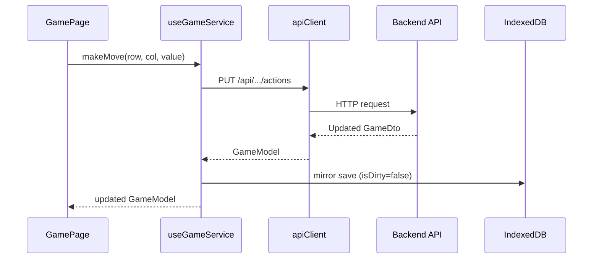
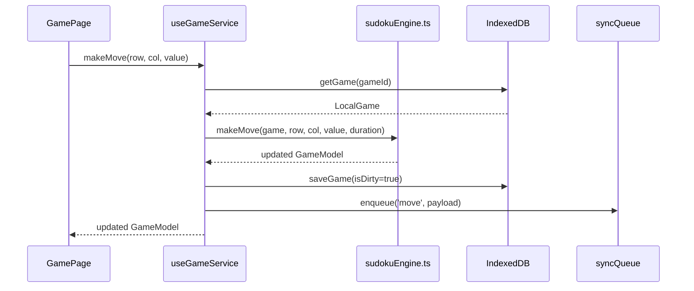
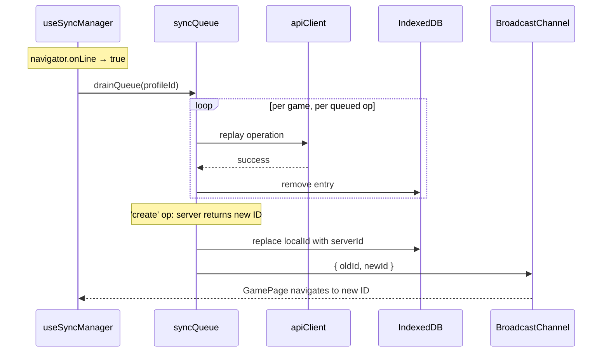

# Offline Mode Specification

## 1. Overview

**Feature Name:** Full Offline Gameplay

**Problem Statement:**
Every gameplay action — creating a game, making moves, undo, reset, pause/resume, pencil marks — requires a live backend connection. Players who lose network access mid-game cannot continue playing, and players in low-connectivity environments have a degraded experience despite the app being a PWA. The app already has a service worker and caches static assets, but the game itself is entirely server-dependent.

**Goals:**
- Allow players to start new games, play moves, undo, reset, use pencil marks, and pause/resume with no network connection
- Persist game state durably across page reloads when offline (IndexedDB)
- Automatically sync local changes to the server when connectivity is restored
- Display a clear offline indicator so players know they are in offline mode

**Non-Goals:**
- Real-time multiplayer or cross-device sync (single-player only)
- Conflict resolution for simultaneous edits from multiple devices
- Porting the full puzzle solver to TypeScript (puzzle supply is handled via non-destructive pre-fetch from the existing server puzzle pool + static fallback)
- Service worker background sync (sync happens in-app on reconnect, not from a closed tab)

---

## 2. Functional Requirements

| ID | Requirement |
|----|-------------|
| FR-1 | A player can start a new game at any difficulty level while offline |
| FR-2 | A player can make moves, undo moves, and reset a game while offline |
| FR-3 | A player can add, remove, and clear pencil marks (possible values) while offline |
| FR-4 | A player can pause and resume a game while offline |
| FR-5 | Game state persists across page reloads when offline |
| FR-6 | The game list shows locally stored games when offline |
| FR-7 | The app displays an offline banner when there is no network connection |
| FR-8 | All local changes sync to the server automatically when connectivity is restored |
| FR-9 | A first-time user who opens the app offline can create a local profile and play a game |
| FR-10 | The puzzle bank is replenished in the background — by reading from the server puzzle pool — when the player is online |

---

## 3. Non-Functional Requirements

- **Performance:** Puzzle retrieval from the local bank must complete in <50ms. The offline game engine (TypeScript) must process a move in <10ms.
- **Reliability:** The IndexedDB store must not lose game state across crashes or forced reloads.
- **Storage:** Each game is ~10KB in IndexedDB. The pre-fetched bank holds up to ~10 puzzles per difficulty (~40 puzzles, ~20KB), bounded by the server pool size. Well within browser storage limits.
- **Offline first install:** 10 hardcoded fallback puzzles per difficulty (~5KB total) are bundled in the app to serve new users who are offline from first launch.
- **Sync correctness:** Operations replay in creation order per game. A sync failure on one game must not block sync of other games.
- **Security:** The new `GET /api/puzzles/{difficulty}` endpoint is authenticated identically to all existing game endpoints. The endpoint is read-only and non-destructive — it never removes puzzles from the shared pool.
- **Accessibility:** The `OfflineBanner` must not obscure game content; it uses a slim fixed banner with sufficient colour contrast (WCAG AA).
- **Observability:** Sync failures are surfaced to the player via a visual indicator on the affected game card. Sync errors are logged to the browser console.

---

## 4. Architecture Overview

### High-Level Description

The offline feature inserts a transparent routing layer inside `useGameService`. When online, the existing API paths are used unchanged; responses are mirrored into IndexedDB as a side effect. When offline, calls are routed to a pure TypeScript game engine that operates directly on `GameModel` objects stored in IndexedDB. A sync queue records every offline mutation. On reconnect, the queue drains by replaying operations against the existing REST API — no new backend mutation endpoints are needed.

Puzzle supply is solved with a two-tier bank: 10 hardcoded puzzles per difficulty bundled in the app (static fallback), plus puzzles pre-fetched into IndexedDB from a new read-only `GET /api/puzzles/{difficulty}?count=N` endpoint. That endpoint reads the **existing** seeded `sudoku-puzzles` blob pool **non-destructively** (it does not dequeue/delete), so it never drains the shared online pool. The pre-fetched bank is therefore capped at the current pool size (~10 per difficulty).

### Existing Puzzle Pool (context — already in production)

The backend already maintains a pre-generated puzzle pool that this feature reuses rather than reinvents:

- Blob container **`sudoku-puzzles`**, organized as `{difficulty}/{puzzleId}.json`, target **~10 puzzles per difficulty**.
- Seeded and replenished by the **`Sudoku.Functions`** project: a nightly `TimerTrigger` seeder, an on-demand `POST /seed-puzzle-pool` HTTP function, and an Event Grid `PuzzleReplenishFunction` that tops the pool back up whenever a puzzle blob is removed.
- `IPuzzlePoolService` exposes `GetAvailableCountAsync`, `SeedAsync`, and a **destructive** `DequeueAsync` (load + delete = exclusive claim).
- `CreateGameCommandHandler` already creates games by dequeuing from the pool, falling back to `IPuzzleGenerator.GeneratePuzzleAsync` only when the pool is empty.

The offline endpoint adds a **non-destructive** read path alongside the existing destructive dequeue, so online game creation and offline pre-fetch do not compete for the same blobs.

### Affected Projects

- **Domain:** None
- **Application:** New `GetPuzzlesQuery` + `GetPuzzlesQueryHandler` (batch)
- **Infrastructure:** New non-destructive `PeekManyAsync(difficulty, count)` on `IPuzzlePoolService` / `PuzzlePoolService` (enumerate ids, load up to N, **do not delete**); reuses existing `IPuzzleBlobStorage.GetPuzzleIdsAsync` + `LoadAsync`
- **API:** New `PuzzlesController` with one endpoint
- **Functions:** None — the existing pool seeders/replenisher are unchanged
- **React/Vite:** New engine, offline store, sync queue, network status hook, sync manager hook, offline banner

### Sequence Diagram — Online Path (unchanged)



### Sequence Diagram — Offline Path (new)



### Sequence Diagram — Sync on Reconnect



---

## 5. Data Models & Contracts

### New: LocalGame (IndexedDB only, never sent to API)

```typescript
interface LocalGame extends GameModel {
  isDirty: boolean;        // true = has unsynced local changes
  locallyCreated: boolean; // true = was created offline, not yet POSTed to API
  syncError: string | null;
}
```

### New: SyncQueueEntry (IndexedDB only)

```typescript
interface SyncQueueEntry {
  id?: number;  // auto-increment primary key
  gameId: string;
  operation: 'create' | 'move' | 'undo' | 'reset' | 'pause' | 'resume'
           | 'addPossibleValue' | 'removePossibleValue' | 'clearPossibleValues' | 'delete';
  payload: Record<string, unknown>;
  createdAt: string;  // ISO 8601
  attempts: number;
}
```

### New: PuzzleBankEntry (IndexedDB only)

```typescript
interface PuzzleBankEntry {
  id?: number;       // auto-increment
  difficulty: string;
  cells: CellModel[]; // 81 cells
}
```

### New API Response: `CellDto[][]`

The new `GET /api/puzzles/{difficulty}?count=N` endpoint returns a batch of up to N puzzles, each an 81-element `CellDto[]` — i.e. `CellDto[][]`. It reuses the existing `CellDto` type, so no new DTO is required.

### Persistence Changes

- **IndexedDB database name:** `sudoku-offline`
- **Schema v1 stores:**
  - `games` — indexed on `id, profileId, status, isDirty`
  - `syncQueue` — `++id, gameId, operation, createdAt`
  - `puzzleBank` — `++id, difficulty`
- No CosmosDB schema changes. No EF migrations. No new backend tables.

---

## 6. CQRS Components

### New Query: `GetPuzzlesQuery`

- **Purpose:** Return a batch of pre-generated puzzles (each 81 cells) from the server pool to fill the client's offline bank, without creating a game record
- **Input:** `GameDifficulty Difficulty, int Count`
- **Output:** `Result<IReadOnlyList<IReadOnlyList<CellDto>>>` (up to `Count` puzzles)
- **Handler:** Calls `IPuzzlePoolService.PeekManyAsync(difficulty, count)` (non-destructive read of the `sudoku-puzzles` pool), maps each `Cell[]` → `CellDto[]`
- **Side effects:** None — explicitly no dequeue, no delete, no on-demand generation, no persistence, no domain events
- **Empty/short pool:** Returns fewer than `Count` (possibly zero); the client falls back to its bundled hardcoded puzzles. The handler does not generate puzzles to top up.
- **File locations:**
  - `src/backend/Sudoku.Application/Queries/GetPuzzlesQuery.cs`
  - `src/backend/Sudoku.Application/Handlers/GetPuzzlesQueryHandler.cs`

---

## 7. Domain Events

None. The offline engine operates on plain `GameModel` objects and does not raise domain events — those are a server-side concern. Sync operations trigger the server to raise its own events on replay.

---

## 8. UI/UX Flow

**Frontend Target:** React/Vite

### New Components

| Component | Location | Purpose |
|-----------|----------|---------|
| `OfflineBanner` | `src/components/OfflineBanner.tsx` | Slim amber banner shown when `!isOnline` |

### Updated Components

| Component | Change |
|-----------|--------|
| `Layout.tsx` | Add `<OfflineBanner />` above children |
| `App.tsx` | Mount `useSyncManager()` at the root |
| `CreateProfilePage.tsx` | Fallback to local UUID profile on API failure |

### User Flow — Offline Game Creation

```
Player opens app (offline)
  → OfflineBanner appears
  → Player selects difficulty
  → NewGamePage: "Creating puzzle..." spinner
  → puzzleBank.getPuzzleForDifficulty() resolves (<50ms from IndexedDB or fallback)
  → GamePage loads with local UUID game ID
  → Player plays normally; all moves persist to IndexedDB
```

### User Flow — Reconnect and Sync

```
Player comes back online
  → OfflineBanner disappears
  → useSyncManager detects isOnline=true
  → syncQueue drains silently in background
  → If game was locally created: URL updates to server ID via BroadcastChannel
  → Game cards no longer show sync-error indicator
```

### State Management

- **Network status:** `useNetworkStatus` hook (subscribes to `window` online/offline events)
- **Local game state:** `useGameService` reads from/writes to IndexedDB when offline; in-memory React state mirrors IndexedDB
- **Sync state:** `syncQueue.ts` + `useSyncManager` hook
- **Error handling:** `syncError` field on `LocalGame`; displayed as warning icon on game card after 3 failed sync attempts

---

## 9. API Endpoints

| Method | Route | Auth | Request | Response | Notes |
|--------|-------|------|---------|----------|-------|
| GET | `/api/puzzles/{difficulty}?count=N` | Required | — | `CellDto[][]` (≤ N puzzles, 81 cells each) | New endpoint; non-destructive read of the server pool; difficulty is `Easy\|Medium\|Hard\|Expert` |

All existing mutation endpoints are unchanged. Sync replays against existing endpoints.

---

## 10. Testing Strategy

### Unit Tests (React/Vite)

- `src/engine/sudokuEngine.test.ts` — covers all 8 exported engine functions:
  - `makeMove` with valid value, invalid value, erase
  - `undoLastMove` with and without history
  - `resetGame` restores fixed cells, clears history, zeros stats
  - `pauseGame` / `resumeGame` toggle status correctly
  - `addPossibleValue` / `removePossibleValue` / `clearPossibleValues`
- `src/hooks/useNetworkStatus.test.ts` — fire `online`/`offline` events, assert state updates

### Unit Tests (Backend)

- `GetPuzzlesQueryHandlerTests.cs` — verifies handler returns up to N puzzles (81 cells each), the pool count is unchanged after the call (non-destructive), the result is capped at pool size, correct difficulty mapping, and an empty pool returns an empty result

### Integration Tests

- Manual offline test (Phase 4 gate): Set DevTools Network to Offline; create game, play 10 moves, undo 3, use pencil marks, reset; reload; verify persistence. See Verification section.
- Sync test (Phase 5 gate): Create game offline, reconnect, inspect `syncQueue` drains and server game matches local state.

### Test Data / Fixtures

- `src/offline/fallbackPuzzles.ts` contains 10 pre-generated valid puzzles per difficulty — these also serve as test fixtures for engine tests.

---

## 11. Risks & Considerations

| Risk | Likelihood | Impact | Mitigation |
|------|-----------|--------|-----------|
| Fallback puzzle bank exhausts (user plays many offline games before ever going online) | Low | Medium | Bank is bounded by the server pool size (~10 per difficulty), plus 10 hardcoded fallbacks ≈ ~20 games per difficulty; bank replenishes on every online session. Raise the pool target (`PuzzlePoolSeeder.TargetPoolSize`) or expand the static bank if needed. |
| Non-destructive read returns the same puzzle set to every offline client (shared pool, not per-user) | Certain | Low | Puzzles are not secret and the game is single-player; cross-user repetition is acceptable. Per-user uniqueness would require a larger pool and per-client tracking — out of scope. |
| Sync ID reconciliation race (user navigates away during sync) | Low | Low | `BroadcastChannel` message is fire-and-forget; missed messages mean URL stays on local ID until next navigation, which re-resolves from IndexedDB. |
| `navigator.onLine` false positive (captive portal) | Medium | Low | API call failure in "online" path falls back to offline routing automatically. |
| Dexie adds bundle size (~23KB gzipped) | Certain | Low | Acceptable trade-off; already precached by service worker. |
| Sync failure leaves games in dirty state indefinitely | Low | Medium | After 3 attempts, `syncError` is set and shown to player. Manual retry UI is a future enhancement. |
| TypeScript engine diverges from C# domain over time | Medium | Medium | Engine unit tests use same invariants as domain tests. Any change to `SudokuGame.cs` must be mirrored in `sudokuEngine.ts`. |

---

## 12. Implementation Plan

**Phase 1 — Foundation** (additive only, no behaviour change)
1. `npm install dexie`
2. Create `src/offline/db.ts` (Dexie schema v1)
3. Create `src/offline/gameRepository.ts` (CRUD wrappers)
4. Create `src/hooks/useNetworkStatus.ts`
5. Modify `useGameService.ts` to mirror API responses to IndexedDB (online path only)
6. Verify with DevTools IndexedDB inspector

**Phase 2 — Engine**
7. Create `src/engine/sudokuEngine.ts` (8 exported pure functions, port of `SudokuGame.cs`)
8. Create `src/engine/sudokuEngine.test.ts`
9. `npm test` — all tests pass

**Phase 3 — Puzzle Bank**
10. Add `PeekManyAsync(difficulty, count)` to `IPuzzlePoolService` / `PuzzlePoolService` (non-destructive); add `GetPuzzlesQuery` + handler + `PuzzlesController` to backend; add tests
11. Create `src/offline/puzzleBank.ts` (`getPuzzleForDifficulty`, `replenishBank` — fetches a batch from `GET /api/puzzles/{difficulty}?count=N`)
12. Create `src/offline/fallbackPuzzles.ts` (10 puzzles × 4 difficulties, generated from backend)

**Phase 4 — Offline Play** (main integration)
13. Create `src/offline/syncQueue.ts`
14. Modify `useGameService.ts` — add `isOnline` routing to all methods
15. Add `OfflineBanner` and wire into `Layout.tsx`
16. Manual offline test gate (see Verification)

**Phase 5 — Sync**
17. Create `src/hooks/useSyncManager.ts`
18. Mount in `App.tsx`
19. Implement `drainSyncQueue` with ID reconciliation + `BroadcastChannel`
20. Sync test gate

**Phase 6 — Profile + Polish**
21. Modify `CreateProfilePage.tsx` for offline profile creation
22. Add `syncError` indicator to game cards
23. Add max-3 retry logic in drain loop

---

## 13. Verification

1. **Unit tests pass:** `npm test` — all `sudokuEngine.test.ts` cases green
2. **Manual offline test:**
   - DevTools → Network → Offline
   - Amber `OfflineBanner` appears
   - Start new game at any difficulty → puzzle loads from bank
   - Play 10 moves, undo 3, toggle pencil marks, reset → all work
   - Reload page → game resumes from IndexedDB with correct state
3. **Sync test:**
   - Create game offline, play moves
   - Inspect `syncQueue` table in DevTools IndexedDB → entries present
   - Re-enable network → entries drain, `syncQueue` empty
   - `GET /api/players/{profileId}/games/{newServerId}` matches local state
4. **Fresh install offline:**
   - Clear all storage, disable network, open app
   - Create local profile → start game → play → reload → state persists
5. **Puzzle endpoint is non-destructive:**
   - Note the pool count via `GET /seed-puzzle-pool` logs or the blob container
   - Call `GET /api/puzzles/{difficulty}?count=10` → returns up to 10 puzzles
   - Confirm the `sudoku-puzzles` pool count is **unchanged** (no puzzles dequeued/deleted)

---

## Resolved Decisions

- **How should the offline puzzle endpoint source puzzles?** *Resolved: non-destructive read of the existing seeded `sudoku-puzzles` blob pool (new `PeekManyAsync`), never dequeuing. This reuses already-generated puzzles and avoids draining the shared online pool or paying per-request generation cost.*
- **What shape should the endpoint take?** *Resolved: batch — `GET /api/puzzles/{difficulty}?count=N` returns up to N puzzles in one round-trip to fill the offline bank.*

## Open Questions

- Should the `GET /api/puzzles/{difficulty}` endpoint be rate-limited or require authentication to prevent abuse? *(Recommendation: yes, same JWT auth as all other endpoints)*
- How many fallback puzzles per difficulty provides a reasonable first-offline experience? *(Recommendation: 10; covers ~10 sessions before replenishment is needed)*
- Should completed offline games sync to the server, or be treated as local-only? *(Recommendation: sync — the player's statistics should reflect offline games)*
